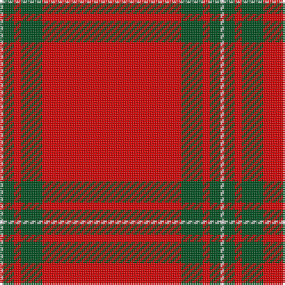

In pattern [RGRGW](/stripes/rgrgw/).

This was sourced from register-of-tartans.  It is a [5 stripe tartan](/stripes/stripes5/).

Original link https://www.tartanregister.gov.uk/tartanDetails.aspx?ref=2450

## Also known as

This cloth is also recorded under:

- MacGregor #2

## Register references

External register numbers recorded for this tartan.

- Scottish Register of Tartans: [2450](https://www.tartanregister.gov.uk/tartanDetails.aspx?ref=2450)
- Scottish Tartans World Register: 1525

## Thread count
R/78 G12 R4 G6 LN/2

## Palette
Each colour and the base-6 reference it is a variant of.

| Colour | Shade | Base |
|---|---|---|
| G | <code style="background-color:#005020;">#005020</code> `oklch(37.7% 0.105 149.6)` <small>#005020</small> | G <code style="background-color:#006100;">#006100</code> |
| LN | <code style="background-color:#E0E0E0;">#E0E0E0</code> `oklch(90.7% 0.000 89.9)` <small>#E0E0E0</small> | W <code style="background-color:#F7F7F7;">#F7F7F7</code> |
| R | <code style="background-color:#DC0000;">#DC0000</code> `oklch(56.2% 0.230 29.2)` <small>#DC0000</small> | R <code style="background-color:#CC0000;">#CC0000</code> |

# Sample pattern

## Nearest tartans

The nearest existing variants by ΔTartan distance, with this tartan at the top so the swatches line up against it.

ΔTartan

Tartan

Sett

—

<a href="/ttd/edit/#slug=r39dg6r2dg3w1~x2">MacGregor #2</a> <a class="nn-out" href="/setts/s5/r39dg6r2dg3w1~x2/" title="open its dictionary page">↗</a>

0.64

<a href="/ttd/edit/#slug=r39g6r2g3w1~x2">MacGregor</a> <a class="nn-out" href="/setts/s5/r39g6r2g3w1~x2/" title="open its dictionary page">↗</a>

1.36

<a href="/ttd/edit/#slug=r72k8r4g16r7o2~x2">MacAndrew Dress (Name)</a> <a class="nn-out" href="/setts/s6/r72k8r4g16r7o2~x2/" title="open its dictionary page">↗</a>

1.38

<a href="/ttd/edit/#slug=g4r16k5r50g4w1~x4">Chalet</a> <a class="nn-out" href="/setts/s6/g4r16k5r50g4w1~x4/" title="open its dictionary page">↗</a>

1.41

<a href="/ttd/edit/#slug=r114g10w3g16ly3g3ly3r28~x2">Duke of Sussex (Earl of Inverness)</a> <a class="nn-out" href="/setts/s8/r114g10w3g16ly3g3ly3r28~x2/" title="open its dictionary page">↗</a>

1.43

<a href="/ttd/edit/#slug=r65w1r6k8g8r6k3r11~x2">Gudbrandsdalen, Rondastakken #2</a> <a class="nn-out" href="/setts/s8/r65w1r6k8g8r6k3r11~x2/" title="open its dictionary page">↗</a>

1.44

<a href="/ttd/edit/#slug=r42db4ly1db6dg1db1dg1r12~x2">Inverness Earl of</a> <a class="nn-out" href="/setts/s8/r42db4ly1db6dg1db1dg1r12~x2/" title="open its dictionary page">↗</a>

1.45

<a href="/ttd/edit/#slug=r75g12r3k2r2k2r36~x2">MacKintosh 4</a> <a class="nn-out" href="/setts/s7/r75g12r3k2r2k2r36~x2/" title="open its dictionary page">↗</a>

1.48

<a href="/ttd/edit/#slug=r65w2r3r4dg11r3dg3r11">Gudbrandsdalen, Rondastakken</a> <a class="nn-out" href="/setts/s8/r65w2r3r4dg11r3dg3r11/" title="open its dictionary page">↗</a>

1.50

<a href="/ttd/edit/#slug=r65w2r3r4g11r3g3r11~x2">Gudbrandsdalen, Rondastakken</a> <a class="nn-out" href="/setts/s8/r65w2r3r4g11r3g3r11~x2/" title="open its dictionary page">↗</a>

1.58

<a href="/ttd/edit/#slug=r75dg12r3k2r2k2r36~x2">MacKintosh #5</a> <a class="nn-out" href="/setts/s7/r75dg12r3k2r2k2r36~x2/" title="open its dictionary page">↗</a>

## Neighbour map

Every grey dot is one of 14299 variants placed by the first two principal components of the ΔTartan feature space (44% of its variance). Red is this tartan; blue dots are its nearest — click one to open its page.

<svg viewBox="0 0 640 380" role="img" style="max-width:100%;height:auto;border:1px solid #e0e0e0;border-radius:4px;display:block" xmlns="http://www.w3.org/2000/svg"><image href="/nn/cloud.v1.png" width="640" height="380"/><a href="/setts/s5/r39g6r2g3w1~x2/"><circle cx="626.0" cy="154.7" r="4" fill="#3465a4"><title>MacGregor</title></circle></a><a href="/setts/s6/r72k8r4g16r7o2~x2/"><circle cx="563.5" cy="132.8" r="4" fill="#3465a4"><title>MacAndrew Dress (Name)</title></circle></a><a href="/setts/s6/g4r16k5r50g4w1~x4/"><circle cx="605.9" cy="114.6" r="4" fill="#3465a4"><title>Chalet</title></circle></a><a href="/setts/s8/r114g10w3g16ly3g3ly3r28~x2/"><circle cx="601.4" cy="109.6" r="4" fill="#3465a4"><title>Duke of Sussex (Earl of Inverness)</title></circle></a><a href="/setts/s8/r65w1r6k8g8r6k3r11~x2/"><circle cx="616.9" cy="101.3" r="4" fill="#3465a4"><title>Gudbrandsdalen, Rondastakken #2</title></circle></a><a href="/setts/s8/r42db4ly1db6dg1db1dg1r12~x2/"><circle cx="607.5" cy="103.0" r="4" fill="#3465a4"><title>Inverness Earl of</title></circle></a><a href="/setts/s7/r75g12r3k2r2k2r36~x2/"><circle cx="626.0" cy="146.8" r="4" fill="#3465a4"><title>MacKintosh 4</title></circle></a><a href="/setts/s8/r65w2r3r4dg11r3dg3r11/"><circle cx="613.6" cy="120.0" r="4" fill="#3465a4"><title>Gudbrandsdalen, Rondastakken</title></circle></a><a href="/setts/s8/r65w2r3r4g11r3g3r11~x2/"><circle cx="620.9" cy="122.0" r="4" fill="#3465a4"><title>Gudbrandsdalen, Rondastakken</title></circle></a><a href="/setts/s7/r75dg12r3k2r2k2r36~x2/"><circle cx="626.0" cy="144.6" r="4" fill="#3465a4"><title>MacKintosh #5</title></circle></a><circle cx="626.0" cy="145.8" r="5" fill="#c00000"/></svg>

ID: /setts/s5/r39dg6r2dg3w1~x2/
