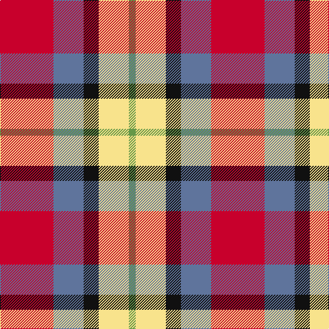

This page is one **sett** — a single exact thread-count. It belongs to the [tartan](/tartans/r39t22k11ly22g5/)
(the same proportion at any scale), whose colour order is pattern [GYKBR](/stripes/gykbr/).

Sourced from register-of-tartans.  It is a [5 stripe tartan](/stripes/stripes5/).

Original link https://www.tartanregister.gov.uk/tartanDetails.aspx?ref=11071

2 attestations — the source records this cloth was collapsed from (oldest owns this page)

<ul>
<li>29/05/2014 — Abbink, Ingmar (Personal) (register-of-tartans, <a href="https://www.tartanregister.gov.uk/tartanDetails.aspx?ref=11071">record</a>)</li>
<li>2014 — Abbink, Ingmar (Personal) (tartans-authority, <a href="http://www.tartansauthority.com/tartan-ferret/display/11071/">record</a>)</li>
</ul>

## Register references

External register numbers recorded for this tartan.

- Scottish Register of Tartans: [11071](https://www.tartanregister.gov.uk/tartanDetails?ref=11071)
- Scottish Tartans Authority (ITI): 11071

## Thread count
R/78 B44 K22 LY44 LG/10

## Palette

Palette: <strong>Tartan Register</strong>
<table><thead><tr><th>Colour</th><th>Threads</th><th>Shade</th><th>Base</th><th>OKLCh</th></tr></thead><tbody><tr><td>R/</td><td style="text-align:right;font-variant-numeric:tabular-nums">78</td><td><code style="background-color:#C8002C;">#C8002C</code> <small style="color:#888">#C8002C</small></td><td>R <code style="background-color:#CC0000;">#CC0000</code></td><td><small style="color:#888">oklch(52.6% 0.212 22.0)</small></td></tr><tr><td>B</td><td style="text-align:right;font-variant-numeric:tabular-nums">44</td><td><code style="background-color:#5F749C;">#5F749C</code> <small style="color:#888">#5F749C</small></td><td>B <code style="background-color:#2A418A;">#2A418A</code></td><td><small style="color:#888">oklch(55.8% 0.067 262.9)</small></td></tr><tr><td>K</td><td style="text-align:right;font-variant-numeric:tabular-nums">22</td><td><code style="background-color:#101010;">#101010</code> <small style="color:#888">#101010</small></td><td>K <code style="background-color:#000000;">#000000</code></td><td><small style="color:#888">oklch(17.3% 0.000 89.9)</small></td></tr><tr><td>LY</td><td style="text-align:right;font-variant-numeric:tabular-nums">44</td><td><code style="background-color:#F8E38C;">#F8E38C</code> <small style="color:#888">#F8E38C</small></td><td>Y <code style="background-color:#F2BF00;">#F2BF00</code></td><td><small style="color:#888">oklch(91.4% 0.110 96.2)</small></td></tr><tr><td>LG/</td><td style="text-align:right;font-variant-numeric:tabular-nums">10</td><td><code style="background-color:#649848;">#649848</code> <small style="color:#888">#649848</small></td><td>G <code style="background-color:#006100;">#006100</code></td><td><small style="color:#888">oklch(62.4% 0.125 135.7)</small></td></tr></tbody></table>

# Sample pattern

## Nearest tartans

The nearest existing variants by ΔTartan distance, with this tartan at the top so the swatches line up against it.

ΔTartan

Tartan

Sett

—

<a href="/ttd/edit/#slug=r39t22k11ly22g5~x2">Abbink, Ingmar (Personal)</a> <a class="nn-out" href="/setts/s5/r39t22k11ly22g5~x2/" title="open its dictionary page">↗</a>

1.07

<a href="/ttd/edit/#slug=r30db20w15lb3ly3">Siddle, New (Corporate)</a> <a class="nn-out" href="/setts/s5/r30db20w15lb3ly3/" title="open its dictionary page">↗</a>

1.22

<a href="/ttd/edit/#slug=w6r18k2r6g7k8ly6~x4">Thirkill (Dalgliesh)</a> <a class="nn-out" href="/setts/s7/w6r18k2r6g7k8ly6~x4/" title="open its dictionary page">↗</a>

1.35

<a href="/ttd/edit/#slug=w3b12k12r20g2~x2">Baillie of Polkemmet Red</a> <a class="nn-out" href="/setts/s5/w3b12k12r20g2~x2/" title="open its dictionary page">↗</a>

1.36

<a href="/ttd/edit/#slug=dp8ly6k2o1w1~x8">Ballater Victoria Week</a> <a class="nn-out" href="/setts/s5/dp8ly6k2o1w1~x8/" title="open its dictionary page">↗</a>

1.39

<a href="/ttd/edit/#slug=o12k4w2y6r3~x2">Strathblane</a> <a class="nn-out" href="/setts/s5/o12k4w2y6r3~x2/" title="open its dictionary page">↗</a>

1.39

<a href="/ttd/edit/#slug=ly32k21r16lr6dt4~x2">Scottish American Athletic Assoc</a> <a class="nn-out" href="/setts/s5/ly32k21r16lr6dt4~x2/" title="open its dictionary page">↗</a>

1.39

<a href="/ttd/edit/#slug=k6r33k18w20db6~x2">Brodie Dress</a> <a class="nn-out" href="/setts/s5/k6r33k18w20db6~x2/" title="open its dictionary page">↗</a>

1.46

<a href="/ttd/edit/#slug=y25k4w8r16~x4">Buckeye</a> <a class="nn-out" href="/setts/s4/y25k4w8r16~x4/" title="open its dictionary page">↗</a>

1.46

<a href="/ttd/edit/#slug=r22dg6k3dg16w22">Inverness Basque</a> <a class="nn-out" href="/setts/s5/r22dg6k3dg16w22/" title="open its dictionary page">↗</a>

1.48

<a href="/ttd/edit/#slug=o25k4w8r16~x4">Buckeye</a> <a class="nn-out" href="/setts/s4/o25k4w8r16~x4/" title="open its dictionary page">↗</a>

## Neighbour map

Every grey dot is one of 14359 variants placed by the first two principal components of the ΔTartan feature space (44% of its variance). Red is this tartan; blue dots are its nearest — click one to open its page.

<svg viewBox="0 0 640 380" role="img" style="max-width:100%;height:auto;border:1px solid #e0e0e0;border-radius:4px;display:block" xmlns="http://www.w3.org/2000/svg"><image href="/nn/cloud.v1.png" width="640" height="380"/><a href="/setts/s5/r30db20w15lb3ly3/"><circle cx="170.7" cy="179.5" r="4" fill="#3465a4"><title>Siddle, New (Corporate)</title></circle></a><a href="/setts/s7/w6r18k2r6g7k8ly6~x4/"><circle cx="148.6" cy="181.3" r="4" fill="#3465a4"><title>Thirkill (Dalgliesh)</title></circle></a><a href="/setts/s5/w3b12k12r20g2~x2/"><circle cx="169.9" cy="199.5" r="4" fill="#3465a4"><title>Baillie of Polkemmet Red</title></circle></a><a href="/setts/s5/dp8ly6k2o1w1~x8/"><circle cx="177.0" cy="181.8" r="4" fill="#3465a4"><title>Ballater Victoria Week</title></circle></a><a href="/setts/s5/o12k4w2y6r3~x2/"><circle cx="157.5" cy="222.7" r="4" fill="#3465a4"><title>Strathblane</title></circle></a><a href="/setts/s5/ly32k21r16lr6dt4~x2/"><circle cx="129.9" cy="198.0" r="4" fill="#3465a4"><title>Scottish American Athletic Assoc</title></circle></a><a href="/setts/s5/k6r33k18w20db6~x2/"><circle cx="135.1" cy="225.4" r="4" fill="#3465a4"><title>Brodie Dress</title></circle></a><a href="/setts/s4/y25k4w8r16~x4/"><circle cx="208.4" cy="244.5" r="4" fill="#3465a4"><title>Buckeye</title></circle></a><a href="/setts/s5/r22dg6k3dg16w22/"><circle cx="114.1" cy="217.8" r="4" fill="#3465a4"><title>Inverness Basque</title></circle></a><a href="/setts/s4/o25k4w8r16~x4/"><circle cx="204.4" cy="242.2" r="4" fill="#3465a4"><title>Buckeye</title></circle></a><circle cx="129.9" cy="204.7" r="5" fill="#c00000"/></svg>

ID: /setts/s5/r39t22k11ly22g5~x2/
