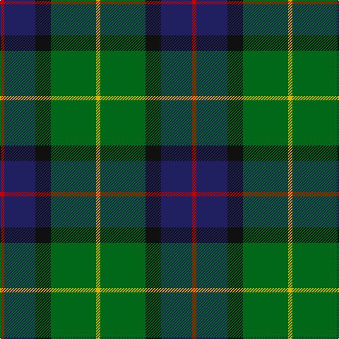

In pattern [RBKGY](/patterns/rbkgy/).

This was sourced from tartans-authority.  It is a [5 stripes tartan](/stripes/stripes5/).

Original link http://www.tartansauthority.com/tartan-ferret/display/3392/

## Thread count
R/6 DB44 K22 G64 Y/6

## Palette
Each colour and its ΔE from the base-6 reference it is a variant of.

| Colour | Shade | Base | ΔE (OKLab) |
|---|---|---|---|
| DB | <code style="background-color:#202060;">#202060</code> `#202060` | B <code style="background-color:#2A418A;">#2A418A</code> | 0.11 |
| G | <code style="background-color:#006818;">#006818</code> `#006818` | G <code style="background-color:#006100;">#006100</code> | 0.02 |
| K | <code style="background-color:#101010;">#101010</code> `#101010` | K <code style="background-color:#000000;">#000000</code> | 0.17 |
| R | <code style="background-color:#C80000;">#C80000</code> `#C80000` | R <code style="background-color:#CC0000;">#CC0000</code> | 0.01 |
| Y | <code style="background-color:#D8B000;">#D8B000</code> `#D8B000` | Y <code style="background-color:#F2BF00;">#F2BF00</code> | 0.06 |

# Sample pattern

## Nearest tartans

The nearest existing variants by ΔTartan distance.

1. [Cultoquhey Hotel](/setts/s5/r3b22k11g32y3~b202060-g006818-k101010-rc80000-ye8c000~x2/) — ΔT 0.12
1. [Simple Technology (Corporate)](/setts/s5/r3g28b9ga18w3~b2c2c80-g006818-ga003820-rc80000-we0e0e0~x2/) — ΔT 0.89
1. [Leahy (Australia) (Personal)](/setts/s6/b2k6g2k6ga12y1~b2c2c80-g289c18-ga006818-k101010-ye8c000~x4/) — ΔT 0.93
1. [Turnbull Hunting](/setts/s5/r7y3g28b28w3~b2c4084-g005020-r960000-we0e0e0-ye8c000~x2/) — ΔT 0.93
1. [Paterson (Personal)](/setts/s7/g3b12w1k12g13r2g2~b2c2c80-g006818-k101010-rc80000-wfcfcfc~x2/) — ΔT 0.95
1. [Gamba (Commemorative)](/setts/s5/g5r3ga30b30w3~b2c2c80-g003820-ga006818-rc80000-wfcfcfc~x2/) — ΔT 0.97
1. [Gorman, George (Personal)](/setts/s6/g9ga1b2ga1ba4r1~b7028c0-ba1c1c50-g006818-ga289c18-rc80000~x12/) — ΔT 0.97
1. [Highlander Highland Laddie](/setts/s5/k7r3g30b28w3~b1c0070-g006818-k101010-r880000-wc0c0c0~x2/) — ΔT 0.98
1. [Turnbull Hunting Clan Tartan Tartan Number: 1265. Earliest known date: pre 2003 An unusual dress tartan having no white. See products available Copyright © Blair Urquhart, Comrie, 2015](/setts/s5/k7y3g28b28w3~b2c2c80-g006818-k101010-we0e0e0-ye8c000~x2/) — ΔT 0.99
1. [Afternoon Tea / Darjeeling](/setts/s6/w15g98b72r25b8y15~b14283c-g005448-r800028-wf0e0c8-yffe600/) — ΔT 1.02

## Neighbour map

Every grey dot is one of 15726 variants placed by the first two principal components of the ΔTartan feature space (44% of its variance). Red is this tartan; blue dots are its nearest — click one to open its page.

<svg viewBox="0 0 640 380" role="img" style="max-width:100%;height:auto;border:1px solid #e0e0e0;border-radius:4px;display:block" xmlns="http://www.w3.org/2000/svg"><image href="/nn/cloud.v1.png" width="640" height="380"/><a href="/setts/s5/r3b22k11g32y3~b202060-g006818-k101010-rc80000-ye8c000~x2/"><circle cx="223.4" cy="214.7" r="4" fill="#3465a4"><title>Cultoquhey Hotel</title></circle></a><a href="/setts/s5/r3g28b9ga18w3~b2c2c80-g006818-ga003820-rc80000-we0e0e0~x2/"><circle cx="232.0" cy="226.3" r="4" fill="#3465a4"><title>Simple Technology (Corporate)</title></circle></a><a href="/setts/s6/b2k6g2k6ga12y1~b2c2c80-g289c18-ga006818-k101010-ye8c000~x4/"><circle cx="213.9" cy="205.3" r="4" fill="#3465a4"><title>Leahy (Australia) (Personal)</title></circle></a><a href="/setts/s5/r7y3g28b28w3~b2c4084-g005020-r960000-we0e0e0-ye8c000~x2/"><circle cx="221.9" cy="214.6" r="4" fill="#3465a4"><title>Turnbull Hunting</title></circle></a><a href="/setts/s7/g3b12w1k12g13r2g2~b2c2c80-g006818-k101010-rc80000-wfcfcfc~x2/"><circle cx="197.5" cy="190.6" r="4" fill="#3465a4"><title>Paterson (Personal)</title></circle></a><a href="/setts/s5/g5r3ga30b30w3~b2c2c80-g003820-ga006818-rc80000-wfcfcfc~x2/"><circle cx="233.1" cy="207.1" r="4" fill="#3465a4"><title>Gamba (Commemorative)</title></circle></a><a href="/setts/s6/g9ga1b2ga1ba4r1~b7028c0-ba1c1c50-g006818-ga289c18-rc80000~x12/"><circle cx="244.2" cy="199.2" r="4" fill="#3465a4"><title>Gorman, George (Personal)</title></circle></a><a href="/setts/s5/k7r3g30b28w3~b1c0070-g006818-k101010-r880000-wc0c0c0~x2/"><circle cx="218.8" cy="211.1" r="4" fill="#3465a4"><title>Highlander Highland Laddie</title></circle></a><a href="/setts/s5/k7y3g28b28w3~b2c2c80-g006818-k101010-we0e0e0-ye8c000~x2/"><circle cx="200.9" cy="209.4" r="4" fill="#3465a4"><title>Turnbull Hunting Clan Tartan Tartan Number: 1265. Earliest known date: pre 2003 An unusual dress tartan having no white. See products available Copyright © Blair Urquhart, Comrie, 2015</title></circle></a><a href="/setts/s6/w15g98b72r25b8y15~b14283c-g005448-r800028-wf0e0c8-yffe600/"><circle cx="203.2" cy="185.7" r="4" fill="#3465a4"><title>Afternoon Tea / Darjeeling</title></circle></a><circle cx="226.9" cy="216.1" r="5" fill="#c00000"/></svg>

ID: /setts/s5/r3b22k11g32y3~b202060-g006818-k101010-rc80000-yd8b000~x2/
