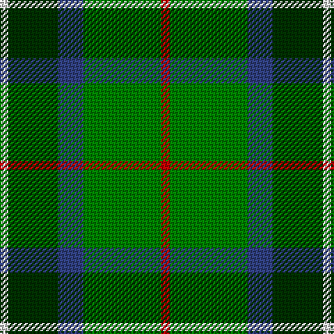

In pattern [RGBGW](/patterns/rgbgw/).

This was sourced from weddslist.  It is a [5 stripes tartan](/stripes/stripes5/).

Original link http://www.weddslist.com/cgi-bin/tartans/pg.pl?source=sts

## Thread count
LN/6 DG36 B18 G56 R/6

## Palette
Each colour and its ΔE from the base-6 reference it is a variant of.

| Colour | Shade | Base | ΔE (OKLab) |
|---|---|---|---|
| B | <code style="background-color:#304080;">#304080</code> `#304080` | B <code style="background-color:#2A418A;">#2A418A</code> | 0.02 |
| DG | <code style="background-color:#003000;">#003000</code> `#003000` | G <code style="background-color:#006100;">#006100</code> | 0.17 |
| G | <code style="background-color:#008000;">#008000</code> `#008000` | G <code style="background-color:#006100;">#006100</code> | 0.10 |
| LN | <code style="background-color:#E0E0E0;">#E0E0E0</code> `#E0E0E0` | W <code style="background-color:#F7F7F7;">#F7F7F7</code> | 0.07 |
| R | <code style="background-color:#C00000;">#C00000</code> `#C00000` | R <code style="background-color:#CC0000;">#CC0000</code> | 0.03 |

# Sample pattern

## Nearest tartans

The nearest existing variants by ΔTartan distance.

1. [Wcwm 1716](/setts/s6/g6y3g26ga10b30w3~b202020-g007c00-ga004c00-wc8c8c8-yc89800~x2/) — ΔT 0.73
1. [Simple Technology (Corporate)](/setts/s5/r3g28b9ga18w3~b2c2c80-g006818-ga003820-rc80000-we0e0e0~x2/) — ΔT 0.95
1. [MPS Emerald Society NCLEES 2012](/setts/s6/y4g30ga15b5ba10y4~b002f58-ba1977a8-g01351e-ga006217-yffe155~x2/) — ΔT 1.01
1. [MPS Emerald Society](/setts/s6/y4g30ga15b5ba10y4~b2c2c80-ba1474b4-g003820-ga006818-yfccc00~x2/) — ΔT 1.02
1. [New Mexico](/setts/s7/g10b42r5ga42g42y5g10~b304080-g008000-ga003000-rc00000-yf0c000/) — ΔT 1.04
1. [Leahy (Australia) (Personal)](/setts/s6/b2k6g2k6ga12y1~b2c2c80-g289c18-ga006818-k101010-ye8c000~x4/) — ΔT 1.20
1. [Gorman, George (Personal)](/setts/s6/g9ga1b2ga1ba4r1~b7028c0-ba1c1c50-g006818-ga289c18-rc80000~x12/) — ΔT 1.24
1. [Turnbull, hunting](/setts/s5/r7y3g28b28w3~b304080-g008000-r800000-we0e0e0-yf0c000~x2/) — ΔT 1.27
1. [MacSween Hunting (Lochs, Isle of Lew](/setts/s7/g3r3g31ga18g4k22y3~g006818-ga003820-k101010-rc80000-ye8c000/) — ΔT 1.30
1. [Cultoquhey Hotel](/setts/s5/r3b22k11g32y3~b202060-g006818-k101010-rc80000-ye8c000~x2/) — ΔT 1.30

## Neighbour map

Every grey dot is one of 15726 variants placed by the first two principal components of the ΔTartan feature space (44% of its variance). Red is this tartan; blue dots are its nearest — click one to open its page.

<svg viewBox="0 0 640 380" role="img" style="max-width:100%;height:auto;border:1px solid #e0e0e0;border-radius:4px;display:block" xmlns="http://www.w3.org/2000/svg"><image href="/nn/cloud.v1.png" width="640" height="380"/><a href="/setts/s6/g6y3g26ga10b30w3~b202020-g007c00-ga004c00-wc8c8c8-yc89800~x2/"><circle cx="213.3" cy="207.7" r="4" fill="#3465a4"><title>Wcwm 1716</title></circle></a><a href="/setts/s5/r3g28b9ga18w3~b2c2c80-g006818-ga003820-rc80000-we0e0e0~x2/"><circle cx="232.0" cy="226.3" r="4" fill="#3465a4"><title>Simple Technology (Corporate)</title></circle></a><a href="/setts/s6/y4g30ga15b5ba10y4~b002f58-ba1977a8-g01351e-ga006217-yffe155~x2/"><circle cx="171.2" cy="210.0" r="4" fill="#3465a4"><title>MPS Emerald Society NCLEES 2012</title></circle></a><a href="/setts/s6/y4g30ga15b5ba10y4~b2c2c80-ba1474b4-g003820-ga006818-yfccc00~x2/"><circle cx="175.1" cy="210.7" r="4" fill="#3465a4"><title>MPS Emerald Society</title></circle></a><a href="/setts/s7/g10b42r5ga42g42y5g10~b304080-g008000-ga003000-rc00000-yf0c000/"><circle cx="184.6" cy="212.7" r="4" fill="#3465a4"><title>New Mexico</title></circle></a><a href="/setts/s6/b2k6g2k6ga12y1~b2c2c80-g289c18-ga006818-k101010-ye8c000~x4/"><circle cx="213.9" cy="205.3" r="4" fill="#3465a4"><title>Leahy (Australia) (Personal)</title></circle></a><a href="/setts/s6/g9ga1b2ga1ba4r1~b7028c0-ba1c1c50-g006818-ga289c18-rc80000~x12/"><circle cx="244.2" cy="199.2" r="4" fill="#3465a4"><title>Gorman, George (Personal)</title></circle></a><a href="/setts/s5/r7y3g28b28w3~b304080-g008000-r800000-we0e0e0-yf0c000~x2/"><circle cx="204.2" cy="206.9" r="4" fill="#3465a4"><title>Turnbull, hunting</title></circle></a><a href="/setts/s7/g3r3g31ga18g4k22y3~g006818-ga003820-k101010-rc80000-ye8c000/"><circle cx="237.2" cy="201.9" r="4" fill="#3465a4"><title>MacSween Hunting (Lochs, Isle of Lew</title></circle></a><a href="/setts/s5/r3b22k11g32y3~b202060-g006818-k101010-rc80000-ye8c000~x2/"><circle cx="223.4" cy="214.7" r="4" fill="#3465a4"><title>Cultoquhey Hotel</title></circle></a><circle cx="212.2" cy="218.0" r="5" fill="#c00000"/></svg>

ID: /setts/s5/r3g28b9ga18w3~b304080-g008000-ga003000-rc00000-we0e0e0~x2/
