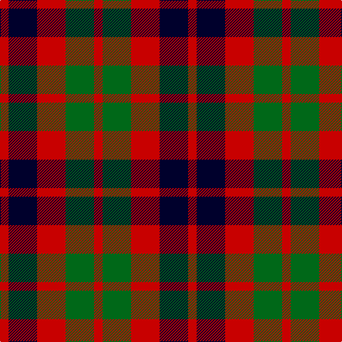

**Bands:** [RKRGR](/stripes/rkrgr/) · **Stripes:** [R K R G R](/stripes/stripes5/) R K R G R

This was sourced from tartans-authority.  It is a [5 band tartan](/bands/bands5/).

Original link http://www.tartansauthority.com/tartan-ferret/display/7873/

## Thread count
R/12 DB40 R40 G40 R/12

## Palette
Each colour and its ΔE from the base-6 reference it is a variant of.

| Colour | Shade | Base | ΔE (OKLab) |
|---|---|---|---|
| DB | <code style="background-color:#00002C;">#00002C</code> `#00002C` | K <code style="background-color:#000000;">#000000</code> | 0.16 |
| G | <code style="background-color:#006818;">#006818</code> `#006818` | G <code style="background-color:#006100;">#006100</code> | 0.02 |
| R | <code style="background-color:#C80000;">#C80000</code> `#C80000` | R <code style="background-color:#CC0000;">#CC0000</code> | 0.01 |

# Sample pattern

## Nearest tartans

The nearest existing variants by ΔTartan distance.

1. [Gow](/setts/s5/r4dg4r1db4r4~x2/) — ΔT 1.23
1. [Chivas Regal](/setts/s5/dt6k6dt6r14ly3~x2/) — ΔT 1.28
1. [Chivas Regal (Corporate)](/setts/s5/dt2k2dt2r5ly1~x12/) — ΔT 1.33
1. [MacNaughton (Logan)](/setts/s7/db5r17dg16k10db10r17db5~x2/) — ΔT 1.46
1. [Gow](/setts/s5/r4dg4r1db4r4/) — ΔT 1.48
1. [MacDuff](/setts/s7/r10db6k8g10r6g3r6~x2/) — ΔT 1.48
1. [Wilson's No.113](/setts/s6/g3dp3w1dp3g3r1~x4/) — ΔT 1.50
1. [Austin / Wilson's No 137](/setts/s5/p3k3p3g6r2~x2/) — ΔT 1.53
1. [Tulsa, City of](/setts/s6/dg14db8dg14r14k3r14~x2/) — ΔT 1.54
1. [MacDuff #3](/setts/s7/r10db6k8dg10r6dg3r6~x2/) — ΔT 1.58

## Neighbour map

Every grey dot is one of 14299 variants placed by the first two principal components of the ΔTartan feature space (44% of its variance). Red is this tartan; blue dots are its nearest — click one to open its page.

<svg viewBox="0 0 640 380" role="img" style="max-width:100%;height:auto;border:1px solid #e0e0e0;border-radius:4px;display:block" xmlns="http://www.w3.org/2000/svg"><image href="/nn/cloud.v1.png" width="640" height="380"/><a href="/setts/s5/r4dg4r1db4r4~x2/"><circle cx="220.8" cy="309.4" r="4" fill="#3465a4"><title>Gow</title></circle></a><a href="/setts/s5/dt6k6dt6r14ly3~x2/"><circle cx="160.9" cy="268.3" r="4" fill="#3465a4"><title>Chivas Regal</title></circle></a><a href="/setts/s5/dt2k2dt2r5ly1~x12/"><circle cx="176.1" cy="261.3" r="4" fill="#3465a4"><title>Chivas Regal (Corporate)</title></circle></a><a href="/setts/s7/db5r17dg16k10db10r17db5~x2/"><circle cx="131.3" cy="273.2" r="4" fill="#3465a4"><title>MacNaughton (Logan)</title></circle></a><a href="/setts/s5/r4dg4r1db4r4/"><circle cx="239.2" cy="322.3" r="4" fill="#3465a4"><title>Gow</title></circle></a><a href="/setts/s7/r10db6k8g10r6g3r6~x2/"><circle cx="115.7" cy="283.1" r="4" fill="#3465a4"><title>MacDuff</title></circle></a><a href="/setts/s6/g3dp3w1dp3g3r1~x4/"><circle cx="148.9" cy="296.7" r="4" fill="#3465a4"><title>Wilson's No.113</title></circle></a><a href="/setts/s5/p3k3p3g6r2~x2/"><circle cx="85.3" cy="293.4" r="4" fill="#3465a4"><title>Austin / Wilson's No 137</title></circle></a><a href="/setts/s6/dg14db8dg14r14k3r14~x2/"><circle cx="182.4" cy="290.0" r="4" fill="#3465a4"><title>Tulsa, City of</title></circle></a><a href="/setts/s7/r10db6k8dg10r6dg3r6~x2/"><circle cx="136.2" cy="289.3" r="4" fill="#3465a4"><title>MacDuff #3</title></circle></a><circle cx="178.8" cy="296.9" r="5" fill="#c00000"/></svg>

ID: /setts/s5/r3k10r10g10r3~x4/
