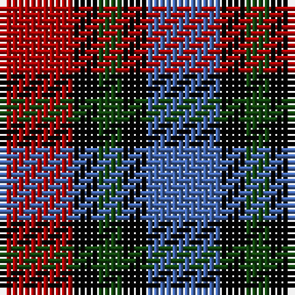

**Bands:** [RKGKB](/stripes/rkgkb/) · **Stripes:** [R K DG K B](/stripes/stripes5/) R K DG K B

This was sourced from weddslist.  It is a [5 band tartan](/bands/bands5/).

Original link http://www.weddslist.com/cgi-bin/tartans/pg.pl?source=x

## Register references

External register numbers recorded for this tartan.

- Scottish Register of Tartans: [1166](https://www.tartanregister.gov.uk/tartanDetails.aspx?ref=1166)
- Scottish Register of Tartans: [1758](https://www.tartanregister.gov.uk/tartanDetails.aspx?ref=1758)
- Scottish Register of Tartans: [2307](https://www.tartanregister.gov.uk/tartanDetails.aspx?ref=2307)
- Scottish Register of Tartans: [2540](https://www.tartanregister.gov.uk/tartanDetails.aspx?ref=2540)
- Scottish Register of Tartans: [2625](https://www.tartanregister.gov.uk/tartanDetails.aspx?ref=2625)
- Scottish Register of Tartans: [2862](https://www.tartanregister.gov.uk/tartanDetails.aspx?ref=2862)
- Scottish Register of Tartans: [982](https://www.tartanregister.gov.uk/tartanDetails.aspx?ref=982)
- Scottish Tartans Authority (ITI): 1429
- Scottish Tartans Authority (ITI): 218
- Scottish Tartans World Register: 1042
- Scottish Tartans World Register: 127
- Scottish Tartans World Register: 1429
- Scottish Tartans World Register: 218
- Scottish Tartans World Register: 2218
- Scottish Tartans World Register: 737
- Scottish Tartans World Register: 897

## Variants

Other setts woven to the same stripe pattern.

- [Clark](/setts/s5/r3k1dg1k1b3~x8/)

## Thread count
DR/12 K4 DG4 K4 B/12

## Palette
Each colour and its ΔE from the base-6 reference it is a variant of.

| Colour | Shade | Base | ΔE (OKLab) |
|---|---|---|---|
| B | <code style="background-color:#4367AE;">#4367AE</code> `#4367AE` | B <code style="background-color:#2A418A;">#2A418A</code> | 0.12 |
| DG | <code style="background-color:#11450D;">#11450D</code> `#11450D` | G <code style="background-color:#006100;">#006100</code> | 0.09 |
| DR | <code style="background-color:#AA0000;">#AA0000</code> `#AA0000` | R <code style="background-color:#CC0000;">#CC0000</code> | 0.07 |
| K | <code style="background-color:#000000;">#000000</code> `#000000` | K <code style="background-color:#000000;">#000000</code> | 0.00 |

# Sample pattern

## Nearest tartans

The nearest existing variants by ΔTartan distance.

1. [Clark](/setts/s5/r3k1dg1k1b3~x8/) — ΔT 0.00
1. [Austin / Wilson's No 137](/setts/s5/p3k3p3g6r2~x2/) — ΔT 0.93
1. [Austin (Wilson's No 173)](/setts/s5/dp3k3dp3dg6ly2~x2/) — ΔT 1.18
1. [Clark, Red](/setts/s8/db13k4y4k4r13~x4/) — ΔT 1.21
1. [Chivas Regal](/setts/s5/dt6k6dt6r14ly3~x2/) — ΔT 1.27
1. [Wilson's No.220](/setts/s4/dp5k5g5w1~x4/) — ΔT 1.29
1. [Unnamed, No 60](/setts/s4/p6k5g5r1~x2/) — ΔT 1.37
1. [MacNeil 2](/setts/s6/w2p10k10g9k3w2~x2/) — ΔT 1.38
1. [Austin / Wilson's No 173](/setts/s5/p3k3p3g6ly2~x2/) — ΔT 1.38
1. [MacKean Red (Personal)](/setts/s8/r2k4r2k4db1lb1db4r1~x4/) — ΔT 1.38

## Neighbour map

Every grey dot is one of 14299 variants placed by the first two principal components of the ΔTartan feature space (44% of its variance). Red is this tartan; blue dots are its nearest — click one to open its page.

<svg viewBox="0 0 640 380" role="img" style="max-width:100%;height:auto;border:1px solid #e0e0e0;border-radius:4px;display:block" xmlns="http://www.w3.org/2000/svg"><image href="/nn/cloud.v1.png" width="640" height="380"/><a href="/setts/s5/r3k1dg1k1b3~x8/"><circle cx="100.6" cy="277.4" r="4" fill="#3465a4"><title>Clark</title></circle></a><a href="/setts/s5/p3k3p3g6r2~x2/"><circle cx="85.3" cy="293.4" r="4" fill="#3465a4"><title>Austin / Wilson's No 137</title></circle></a><a href="/setts/s5/dp3k3dp3dg6ly2~x2/"><circle cx="93.6" cy="304.0" r="4" fill="#3465a4"><title>Austin (Wilson's No 173)</title></circle></a><a href="/setts/s8/db13k4y4k4r13~x4/"><circle cx="105.0" cy="251.6" r="4" fill="#3465a4"><title>Clark, Red</title></circle></a><a href="/setts/s5/dt6k6dt6r14ly3~x2/"><circle cx="160.9" cy="268.3" r="4" fill="#3465a4"><title>Chivas Regal</title></circle></a><a href="/setts/s4/dp5k5g5w1~x4/"><circle cx="112.5" cy="291.2" r="4" fill="#3465a4"><title>Wilson's No.220</title></circle></a><a href="/setts/s4/p6k5g5r1~x2/"><circle cx="121.7" cy="273.4" r="4" fill="#3465a4"><title>Unnamed, No 60</title></circle></a><a href="/setts/s6/w2p10k10g9k3w2~x2/"><circle cx="107.0" cy="238.0" r="4" fill="#3465a4"><title>MacNeil 2</title></circle></a><a href="/setts/s5/p3k3p3g6ly2~x2/"><circle cx="71.4" cy="288.6" r="4" fill="#3465a4"><title>Austin / Wilson's No 173</title></circle></a><a href="/setts/s8/r2k4r2k4db1lb1db4r1~x4/"><circle cx="156.7" cy="253.4" r="4" fill="#3465a4"><title>MacKean Red (Personal)</title></circle></a><circle cx="100.6" cy="277.4" r="5" fill="#c00000"/></svg>

ID: /setts/s5/r3k1dg1k1b3~x4/
