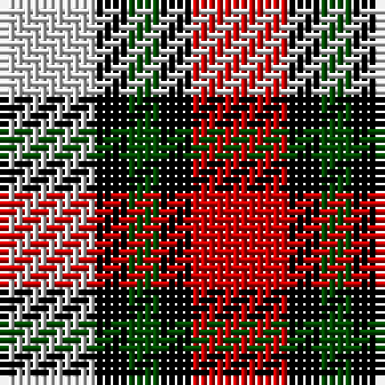

In pattern [RKGKW](/stripes/rkgkw/).

This was sourced from weddslist.  It is a [5 stripe tartan](/stripes/stripes5/).

Original link http://www.weddslist.com/cgi-bin/tartans/pg.pl?source=rb

## Thread count
N/12 K4 G4 K4 R/12

## Palette
Each colour and the base-6 reference it is a variant of.

| Colour | Shade | Base |
|---|---|---|
| G | <code style="background-color:#004C00;">#004C00</code> `oklch(36.1% 0.123 142.5)` <small>#004C00</small> | G <code style="background-color:#006100;">#006100</code> |
| K | <code style="background-color:#000000;">#000000</code> `oklch(0.0% 0.000 0.0)` <small>#000000</small> | K <code style="background-color:#000000;">#000000</code> |
| N | <code style="background-color:#D0D0D0;">#D0D0D0</code> `oklch(85.8% 0.000 89.9)` <small>#D0D0D0</small> | W <code style="background-color:#F7F7F7;">#F7F7F7</code> |
| R | <code style="background-color:#C80000;">#C80000</code> `oklch(52.3% 0.215 29.2)` <small>#C80000</small> | R <code style="background-color:#CC0000;">#CC0000</code> |

# Sample pattern

## Nearest tartans

The nearest existing variants by ΔTartan distance.

1. [SAL Glindrande Stiernan](/setts/s4/r3g1k3w1~x20/) — ΔT 0.82
1. [Brodie Dress](/setts/s5/k6r33k18w20db6~x2/) — ΔT 1.25
1. [Thomas Newcomen's Combustion Engine](/setts/s4/k7r5w3db2~x4/) — ΔT 1.25
1. [Wilson's, No 113](/setts/s4/r1g3p3w1~x4/) — ΔT 1.36
1. [Austin / Wilson's No 173](/setts/s5/p3k3p3g6ly2~x2/) — ΔT 1.47
1. [Heidrick Family (Personal)](/setts/s5/w14k30b9r8o9~x2/) — ΔT 1.56
1. [Austin / Wilson's No 137](/setts/s5/p3k3p3g6r2~x2/) — ΔT 1.56
1. [Aboyne II (Fashion)](/setts/s6/r2ly1r5k4g5w1~x4/) — ΔT 1.61
1. [Inspiration](/setts/s5/r5db12ly11n21ly5~x2/) — ΔT 1.62
1. [Chaudhri (Name)](/setts/s8/dp13r8lb5dg24lb5r10lb5r10~x2/) — ΔT 1.65

## Neighbour map

Every grey dot is one of 14299 variants placed by the first two principal components of the ΔTartan feature space (44% of its variance). Red is this tartan; blue dots are its nearest — click one to open its page.

<svg viewBox="0 0 640 380" role="img" style="max-width:100%;height:auto;border:1px solid #e0e0e0;border-radius:4px;display:block" xmlns="http://www.w3.org/2000/svg"><image href="/nn/cloud.v1.png" width="640" height="380"/><a href="/setts/s4/r3g1k3w1~x20/"><circle cx="103.2" cy="269.4" r="4" fill="#3465a4"><title>SAL Glindrande Stiernan</title></circle></a><a href="/setts/s5/k6r33k18w20db6~x2/"><circle cx="136.0" cy="223.9" r="4" fill="#3465a4"><title>Brodie Dress</title></circle></a><a href="/setts/s4/k7r5w3db2~x4/"><circle cx="104.9" cy="271.3" r="4" fill="#3465a4"><title>Thomas Newcomen's Combustion Engine</title></circle></a><a href="/setts/s4/r1g3p3w1~x4/"><circle cx="119.7" cy="284.7" r="4" fill="#3465a4"><title>Wilson's, No 113</title></circle></a><a href="/setts/s5/p3k3p3g6ly2~x2/"><circle cx="71.4" cy="288.6" r="4" fill="#3465a4"><title>Austin / Wilson's No 173</title></circle></a><a href="/setts/s5/w14k30b9r8o9~x2/"><circle cx="96.2" cy="233.6" r="4" fill="#3465a4"><title>Heidrick Family (Personal)</title></circle></a><a href="/setts/s5/p3k3p3g6r2~x2/"><circle cx="85.3" cy="293.4" r="4" fill="#3465a4"><title>Austin / Wilson's No 137</title></circle></a><a href="/setts/s6/r2ly1r5k4g5w1~x4/"><circle cx="113.6" cy="221.6" r="4" fill="#3465a4"><title>Aboyne II (Fashion)</title></circle></a><a href="/setts/s5/r5db12ly11n21ly5~x2/"><circle cx="95.1" cy="239.9" r="4" fill="#3465a4"><title>Inspiration</title></circle></a><a href="/setts/s8/dp13r8lb5dg24lb5r10lb5r10~x2/"><circle cx="120.2" cy="230.9" r="4" fill="#3465a4"><title>Chaudhri (Name)</title></circle></a><circle cx="74.4" cy="254.3" r="5" fill="#c00000"/></svg>

ID: /setts/s5/r3k1dg1k1lb3~x4/
