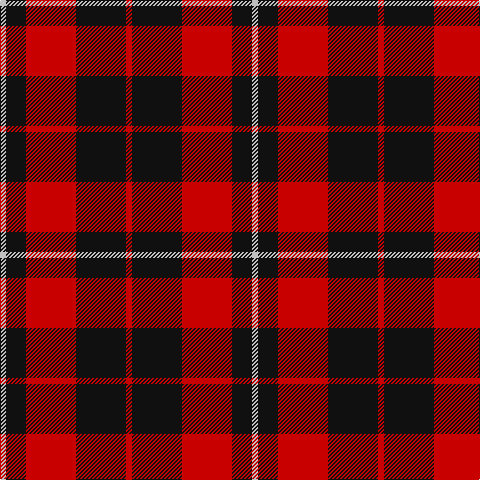

**Bands:** [RKRKW](/stripes/rkrkw/) · **Stripes:** [R K R K LB](/stripes/stripes5/) R K R K LB

This was sourced from register-of-tartans.  It is a [5 band tartan](/bands/bands5/).

Original link https://www.tartanregister.gov.uk/tartanDetails.aspx?ref=306

## Register references

External register numbers recorded for this tartan.

- Scottish Register of Tartans: [306](https://www.tartanregister.gov.uk/tartanDetails.aspx?ref=306)
- Scottish Tartans Authority (ITI): 6889

## Thread count
N/6 K20 R50 K50 R/6

## Palette
Each colour and its ΔE from the base-6 reference it is a variant of.

| Colour | Shade | Base | ΔE (OKLab) |
|---|---|---|---|
| K | <code style="background-color:#101010;">#101010</code> `#101010` | K <code style="background-color:#000000;">#000000</code> | 0.17 |
| N | <code style="background-color:#C0C0C0;">#C0C0C0</code> `#C0C0C0` | W <code style="background-color:#F7F7F7;">#F7F7F7</code> | 0.17 |
| R | <code style="background-color:#C80000;">#C80000</code> `#C80000` | R <code style="background-color:#CC0000;">#CC0000</code> | 0.01 |

# Sample pattern

## Nearest tartans

The nearest existing variants by ΔTartan distance.

1. [Wallace](/setts/s4/k1r8k8ly1~x6/) — ΔT 0.61
1. [Wallace (Clan)](/setts/s4/k1r8k8ly1~x4/) — ΔT 0.61
1. [Swanstrom (Personal)](/setts/s6/k8r1k8r11ly1r1~x4/) — ΔT 0.64
1. [Munro (Black and Red)](/setts/s5/k18r4k18r32w3~x2/) — ΔT 0.68
1. [MacQueen](/setts/s6/k2r6k2r6k12ly1~x4/) — ΔT 0.71
1. [Brodie (Clan)](/setts/s6/k3r15k11ly2k4r3~x2/) — ΔT 0.73
1. [Unidentified Plaid #3](/setts/s5/dg24r3dg16r33w4/) — ΔT 0.95
1. [Knights Breton](/setts/s6/r19k8r18k50w14k6/) — ΔT 1.00
1. [Haig & Haig Whisky (Corporate)](/setts/s5/r26k18r7k4ly4~x2/) — ΔT 1.02
1. [Tartan TV](/setts/s6/r19k3r19k32g3k8~x2/) — ΔT 1.06

## Neighbour map

Every grey dot is one of 14299 variants placed by the first two principal components of the ΔTartan feature space (44% of its variance). Red is this tartan; blue dots are its nearest — click one to open its page.

<svg viewBox="0 0 640 380" role="img" style="max-width:100%;height:auto;border:1px solid #e0e0e0;border-radius:4px;display:block" xmlns="http://www.w3.org/2000/svg"><image href="/nn/cloud.v1.png" width="640" height="380"/><a href="/setts/s4/k1r8k8ly1~x6/"><circle cx="305.8" cy="242.6" r="4" fill="#3465a4"><title>Wallace</title></circle></a><a href="/setts/s4/k1r8k8ly1~x4/"><circle cx="305.8" cy="242.6" r="4" fill="#3465a4"><title>Wallace (Clan)</title></circle></a><a href="/setts/s6/k8r1k8r11ly1r1~x4/"><circle cx="336.5" cy="214.7" r="4" fill="#3465a4"><title>Swanstrom (Personal)</title></circle></a><a href="/setts/s5/k18r4k18r32w3~x2/"><circle cx="301.7" cy="227.1" r="4" fill="#3465a4"><title>Munro (Black and Red)</title></circle></a><a href="/setts/s6/k2r6k2r6k12ly1~x4/"><circle cx="342.4" cy="216.7" r="4" fill="#3465a4"><title>MacQueen</title></circle></a><a href="/setts/s6/k3r15k11ly2k4r3~x2/"><circle cx="287.9" cy="227.7" r="4" fill="#3465a4"><title>Brodie (Clan)</title></circle></a><a href="/setts/s5/dg24r3dg16r33w4/"><circle cx="308.3" cy="231.1" r="4" fill="#3465a4"><title>Unidentified Plaid #3</title></circle></a><a href="/setts/s6/r19k8r18k50w14k6/"><circle cx="289.0" cy="223.5" r="4" fill="#3465a4"><title>Knights Breton</title></circle></a><a href="/setts/s5/r26k18r7k4ly4~x2/"><circle cx="314.1" cy="238.2" r="4" fill="#3465a4"><title>Haig &amp; Haig Whisky (Corporate)</title></circle></a><a href="/setts/s6/r19k3r19k32g3k8~x2/"><circle cx="311.4" cy="223.1" r="4" fill="#3465a4"><title>Tartan TV</title></circle></a><circle cx="317.5" cy="237.3" r="5" fill="#c00000"/></svg>

ID: /setts/s5/r3k25r25k10lb3~x2/
