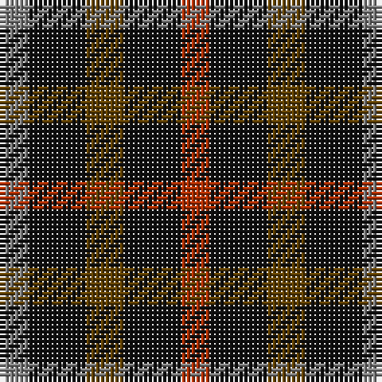

This page is one **sett** — a single exact thread-count. It belongs to the [tartan](/tartans/r3k6dy4k6y3/)
(the same proportion at any scale), whose colour order is pattern [GKGKR](/stripes/gkgkr/).

Sourced from register-of-tartans.  It is a [5 stripe tartan](/stripes/stripes5/).

Original link https://www.tartanregister.gov.uk/tartanDetails.aspx?ref=864

## Register references

External register numbers recorded for this tartan.

- Scottish Register of Tartans: [864](https://www.tartanregister.gov.uk/tartanDetails.aspx?ref=864)
- Scottish Tartans Authority (ITI): 2631
- Scottish Tartans World Register: 2631

## Thread count
N/6 K12 T8 K12 R/6

## Palette

Palette: <strong>Tartan Register</strong>
<table><thead><tr><th>Colour</th><th>Threads</th><th>Shade</th><th>Base</th><th>OKLCh</th></tr></thead><tbody><tr><td>N/</td><td style="text-align:right;font-variant-numeric:tabular-nums">6</td><td><code style="background-color:#808080;">#808080</code> <small style="color:#888">#808080</small></td><td>G <code style="background-color:#006100;">#006100</code></td><td><small style="color:#888">oklch(60.0% 0.000 89.9)</small></td></tr><tr><td>K</td><td style="text-align:right;font-variant-numeric:tabular-nums">12</td><td><code style="background-color:#101010;">#101010</code> <small style="color:#888">#101010</small></td><td>K <code style="background-color:#000000;">#000000</code></td><td><small style="color:#888">oklch(17.3% 0.000 89.9)</small></td></tr><tr><td>T</td><td style="text-align:right;font-variant-numeric:tabular-nums">8</td><td><code style="background-color:#604000;">#604000</code> <small style="color:#888">#604000</small></td><td>G <code style="background-color:#006100;">#006100</code></td><td><small style="color:#888">oklch(39.8% 0.083 76.8)</small></td></tr><tr><td>K</td><td style="text-align:right;font-variant-numeric:tabular-nums">12</td><td><code style="background-color:#101010;">#101010</code> <small style="color:#888">#101010</small></td><td>K <code style="background-color:#000000;">#000000</code></td><td><small style="color:#888">oklch(17.3% 0.000 89.9)</small></td></tr><tr><td>R/</td><td style="text-align:right;font-variant-numeric:tabular-nums">6</td><td><code style="background-color:#B03000;">#B03000</code> <small style="color:#888">#B03000</small></td><td>R <code style="background-color:#CC0000;">#CC0000</code></td><td><small style="color:#888">oklch(50.3% 0.171 36.3)</small></td></tr></tbody></table>

# Sample pattern

## Nearest tartans

The nearest existing variants by ΔTartan distance, with this tartan at the top so the swatches line up against it.

ΔTartan

Tartan

Sett

—

<a href="/ttd/edit/#slug=r3k6dy4k6y3~x2">Daks (Black)</a> <a class="nn-out" href="/setts/s5/r3k6dy4k6y3~x2/" title="open its dictionary page">↗</a>

1.33

<a href="/ttd/edit/#slug=r3k6dy4k6ly3~x2">Daks, Black (Fashion)</a> <a class="nn-out" href="/setts/s5/r3k6dy4k6ly3~x2/" title="open its dictionary page">↗</a>

1.53

<a href="/ttd/edit/#slug=dt1k2r1~x42">Allen, Nicholas (Personal)</a> <a class="nn-out" href="/setts/s3/dt1k2r1~x42/" title="open its dictionary page">↗</a>

1.66

<a href="/ttd/edit/#slug=r4k7g4~x2">Wilson's No.200</a> <a class="nn-out" href="/setts/s3/r4k7g4~x2/" title="open its dictionary page">↗</a>

1.75

<a href="/ttd/edit/#slug=g4k5g4r2~x2">Wilson's No.094</a> <a class="nn-out" href="/setts/s4/g4k5g4r2~x2/" title="open its dictionary page">↗</a>

1.76

<a href="/ttd/edit/#slug=r4dg4r1db4r4">Gow</a> <a class="nn-out" href="/setts/s5/r4dg4r1db4r4/" title="open its dictionary page">↗</a>

1.77

<a href="/ttd/edit/#slug=g3dp3w1dp3g3r1~x4">Wilson's No.113</a> <a class="nn-out" href="/setts/s6/g3dp3w1dp3g3r1~x4/" title="open its dictionary page">↗</a>

1.77

<a href="/ttd/edit/#slug=dg6dp3k3dp3k3dp3dg6k2~x2">Wilson's No.173</a> <a class="nn-out" href="/setts/s8/dg6dp3k3dp3k3dp3dg6k2~x2/" title="open its dictionary page">↗</a>

1.81

<a href="/ttd/edit/#slug=lo28r24dg55dp19~x2">Hirstwood (Name)</a> <a class="nn-out" href="/setts/s4/lo28r24dg55dp19~x2/" title="open its dictionary page">↗</a>

1.82

<a href="/ttd/edit/#slug=g6dp3k3dp3k3dp3g6r2~x2">Wilson's No.137</a> <a class="nn-out" href="/setts/s8/g6dp3k3dp3k3dp3g6r2~x2/" title="open its dictionary page">↗</a>

1.88

<a href="/ttd/edit/#slug=r4dg7t4~x2">Wilson's No.061</a> <a class="nn-out" href="/setts/s3/r4dg7t4~x2/" title="open its dictionary page">↗</a>

## Neighbour map

Every grey dot is one of 14299 variants placed by the first two principal components of the ΔTartan feature space (44% of its variance). Red is this tartan; blue dots are its nearest — click one to open its page.

<svg viewBox="0 0 640 380" role="img" style="max-width:100%;height:auto;border:1px solid #e0e0e0;border-radius:4px;display:block" xmlns="http://www.w3.org/2000/svg"><image href="/nn/cloud.v1.png" width="640" height="380"/><a href="/setts/s5/r3k6dy4k6ly3~x2/"><circle cx="147.0" cy="327.0" r="4" fill="#3465a4"><title>Daks, Black (Fashion)</title></circle></a><a href="/setts/s3/dt1k2r1~x42/"><circle cx="207.6" cy="366.0" r="4" fill="#3465a4"><title>Allen, Nicholas (Personal)</title></circle></a><a href="/setts/s3/r4k7g4~x2/"><circle cx="159.1" cy="366.0" r="4" fill="#3465a4"><title>Wilson's No.200</title></circle></a><a href="/setts/s4/g4k5g4r2~x2/"><circle cx="200.2" cy="359.2" r="4" fill="#3465a4"><title>Wilson's No.094</title></circle></a><a href="/setts/s5/r4dg4r1db4r4/"><circle cx="239.2" cy="322.3" r="4" fill="#3465a4"><title>Gow</title></circle></a><a href="/setts/s6/g3dp3w1dp3g3r1~x4/"><circle cx="148.9" cy="296.7" r="4" fill="#3465a4"><title>Wilson's No.113</title></circle></a><a href="/setts/s8/dg6dp3k3dp3k3dp3dg6k2~x2/"><circle cx="136.0" cy="300.3" r="4" fill="#3465a4"><title>Wilson's No.173</title></circle></a><a href="/setts/s4/lo28r24dg55dp19~x2/"><circle cx="163.0" cy="320.7" r="4" fill="#3465a4"><title>Hirstwood (Name)</title></circle></a><a href="/setts/s8/g6dp3k3dp3k3dp3g6r2~x2/"><circle cx="131.9" cy="295.3" r="4" fill="#3465a4"><title>Wilson's No.137</title></circle></a><a href="/setts/s3/r4dg7t4~x2/"><circle cx="161.9" cy="366.0" r="4" fill="#3465a4"><title>Wilson's No.061</title></circle></a><circle cx="184.9" cy="348.2" r="5" fill="#c00000"/></svg>

ID: /setts/s5/r3k6dy4k6y3~x2/
