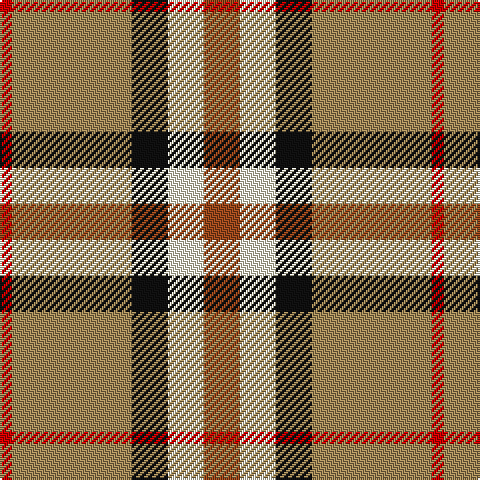

In pattern [RWKYR](/patterns/rwkyr/).

This was sourced from register-of-tartans.  It is a [5 stripes tartan](/stripes/stripes5/).

Original link https://www.tartanregister.gov.uk/tartanDetails.aspx?ref=441

## Register references

External register numbers recorded for this tartan.

- Scottish Register of Tartans: [441](https://www.tartanregister.gov.uk/tartanDetails.aspx?ref=441)
- Scottish Tartans Authority (ITI): 7049

## Thread count
R/6 LT60 K18 LYa18 T/18

## Palette
Each colour and its ΔE from the base-6 reference it is a variant of.

| Colour | Shade | Base | ΔE (OKLab) |
|---|---|---|---|
| DO | <code style="background-color:#B84C00;">#B84C00</code> `#B84C00` | R <code style="background-color:#CC0000;">#CC0000</code> | 0.08 |
| DR | <code style="background-color:#880000;">#880000</code> `#880000` | R <code style="background-color:#CC0000;">#CC0000</code> | 0.15 |
| K | <code style="background-color:#101010;">#101010</code> `#101010` | K <code style="background-color:#000000;">#000000</code> | 0.17 |
| LT | <code style="background-color:#A08858;">#A08858</code> `#A08858` | Y <code style="background-color:#F2BF00;">#F2BF00</code> | 0.21 |
| LY | <code style="background-color:#F8F4D0;">#F8F4D0</code> `#F8F4D0` | W <code style="background-color:#F7F7F7;">#F7F7F7</code> | 0.05 |
| LYa | <code style="background-color:#F8F4D0;">#F8F4D0</code> `#F8F4D0` | W <code style="background-color:#F7F7F7;">#F7F7F7</code> | 0.05 |
| N | <code style="background-color:#C0C0C0;">#C0C0C0</code> `#C0C0C0` | W <code style="background-color:#F7F7F7;">#F7F7F7</code> | 0.17 |
| R | <code style="background-color:#C80000;">#C80000</code> `#C80000` | R <code style="background-color:#CC0000;">#CC0000</code> | 0.01 |
| T | <code style="background-color:#98481C;">#98481C</code> `#98481C` | R <code style="background-color:#CC0000;">#CC0000</code> | 0.11 |

# Sample pattern

## Nearest tartans

The nearest existing variants by ΔTartan distance.

1. [Samye](/setts/s5/y25r10g10b11w2~b2c2c80-g006818-rc80000-wf8f8f8-ye8c000~x2/) — ΔT 1.10
1. [MacKintosh Dress (Dance)](/setts/s6/g3r9ga18b8w33r3~b780078-g289c18-ga285800-rc80000-we0e0e0~x2/) — ΔT 1.16
1. [Sachie Hara Scottish Check (Personal)](/setts/s5/k5b4g24r21w3~b2c2c80-g006818-k101010-rc80000-wfcfcfc~x2/) — ΔT 1.22
1. [S.I.D.E. (Corporate)](/setts/s5/y15r9b30w3ba4~b5c8ca8-ba2c2c80-rc80000-we0e0e0-ye8c000~x2/) — ΔT 1.25
1. [Rose White Dress](/setts/s6/r24b4k4g4w13k2~b447084-g006818-k101010-r880000-wf8f4d0~x4/) — ΔT 1.27
1. [Burberry Check Corporate Tartan Tartan Number: 1239. Earliest known date: 1984 Nothing See products available Copyright © Blair Urquhart, Comrie, 2015](/setts/s5/k6w6k6y21r2~k101010-rc80000-we0e0e0-ya08858~x4/) — ΔT 1.27
1. [Burberry (Genuine)](/setts/s5/k3w3k3y10r1~k101010-rc80000-wf8f4d0-yb8a47c~x6/) — ΔT 1.30
1. [ChuMac (Personal)](/setts/s5/g15y3r3b8w2~b543060-g006430-re01c18-we8e8e8-yf0c400~x6/) — ΔT 1.30
1. [Prince of Orange](/setts/s5/b6y25r16k2b3~b304080-k000000-r806050-yff8500~x2/) — ΔT 1.32
1. [ChuMac (Personal)](/setts/s5/g15y3r3b8w2~b440044-g006818-rc80000-wfcfcfc-ye8c000~x6/) — ΔT 1.32

## Neighbour map

Every grey dot is one of 15726 variants placed by the first two principal components of the ΔTartan feature space (44% of its variance). Red is this tartan; blue dots are its nearest — click one to open its page.

<svg viewBox="0 0 640 380" role="img" style="max-width:100%;height:auto;border:1px solid #e0e0e0;border-radius:4px;display:block" xmlns="http://www.w3.org/2000/svg"><image href="/nn/cloud.v1.png" width="640" height="380"/><a href="/setts/s5/y25r10g10b11w2~b2c2c80-g006818-rc80000-wf8f8f8-ye8c000~x2/"><circle cx="158.4" cy="186.8" r="4" fill="#3465a4"><title>Samye</title></circle></a><a href="/setts/s6/g3r9ga18b8w33r3~b780078-g289c18-ga285800-rc80000-we0e0e0~x2/"><circle cx="174.5" cy="161.5" r="4" fill="#3465a4"><title>MacKintosh Dress (Dance)</title></circle></a><a href="/setts/s5/k5b4g24r21w3~b2c2c80-g006818-k101010-rc80000-wfcfcfc~x2/"><circle cx="192.5" cy="203.0" r="4" fill="#3465a4"><title>Sachie Hara Scottish Check (Personal)</title></circle></a><a href="/setts/s5/y15r9b30w3ba4~b5c8ca8-ba2c2c80-rc80000-we0e0e0-ye8c000~x2/"><circle cx="229.4" cy="193.2" r="4" fill="#3465a4"><title>S.I.D.E. (Corporate)</title></circle></a><a href="/setts/s6/r24b4k4g4w13k2~b447084-g006818-k101010-r880000-wf8f4d0~x4/"><circle cx="200.8" cy="156.1" r="4" fill="#3465a4"><title>Rose White Dress</title></circle></a><a href="/setts/s5/k6w6k6y21r2~k101010-rc80000-we0e0e0-ya08858~x4/"><circle cx="243.1" cy="202.5" r="4" fill="#3465a4"><title>Burberry Check Corporate Tartan Tartan Number: 1239. Earliest known date: 1984 Nothing See products available Copyright © Blair Urquhart, Comrie, 2015</title></circle></a><a href="/setts/s5/k3w3k3y10r1~k101010-rc80000-wf8f4d0-yb8a47c~x6/"><circle cx="221.9" cy="200.5" r="4" fill="#3465a4"><title>Burberry (Genuine)</title></circle></a><a href="/setts/s5/g15y3r3b8w2~b543060-g006430-re01c18-we8e8e8-yf0c400~x6/"><circle cx="203.6" cy="210.8" r="4" fill="#3465a4"><title>ChuMac (Personal)</title></circle></a><a href="/setts/s5/b6y25r16k2b3~b304080-k000000-r806050-yff8500~x2/"><circle cx="266.1" cy="192.5" r="4" fill="#3465a4"><title>Prince of Orange</title></circle></a><a href="/setts/s5/g15y3r3b8w2~b440044-g006818-rc80000-wfcfcfc-ye8c000~x6/"><circle cx="190.1" cy="205.5" r="4" fill="#3465a4"><title>ChuMac (Personal)</title></circle></a><circle cx="211.5" cy="188.9" r="5" fill="#c00000"/></svg>

ID: /setts/s5/r3w3k3y10ra1~k101010-r98481c-rac80000-wf8f4d0-ya08858~x6/
