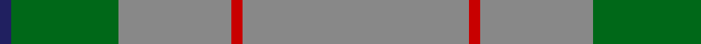

In pattern [BGRRR](/patterns/bgrrr/).

This was sourced from register-of-tartans.  It is a [5 stripes tartan](/stripes/stripes5/).

Original link https://www.tartanregister.gov.uk/tartanDetails.aspx?ref=2141

## Attestations

This cloth appears in 2 source records; the oldest owns this page.

- 01/01/2002 — Lloyd of Wales (register-of-tartans, [record](https://www.tartanregister.gov.uk/tartanDetails.aspx?ref=2141))
- undated — Lloyd Welsh Name Tartan Tartan Number: 5765. Earliest known date: 2002 The tartan for this Welsh surname and its variations, Floyd, Flood, is actually woven in Wales at the Cambrian Woollen Mill, weaving on the same site since 1830. This tartan differs from many traditional patterns in that the warp and weft differ, giving the finished worsted wool cloth more of a predominant stripe, vertically noticeable in the finished Kilt, or Cilt in Wales. See products available Copyright © Blair Urquhart, Comrie, 2015 (house-of-tartan, [record](http://www.house-of-tartan.scotland.net/house/TartanViewjs.asp?colr=Def&tnam=5765))

## Thread count
DB/2 G19 N20 R2 N/40

## Palette
Each colour and its ΔE from the base-6 reference it is a variant of.

| Colour | Shade | Base | ΔE (OKLab) |
|---|---|---|---|
| DB | <code style="background-color:#202060;">#202060</code> `#202060` | B <code style="background-color:#2A418A;">#2A418A</code> | 0.11 |
| DBa | <code style="background-color:#003C64;">#003C64</code> `#003C64` | B <code style="background-color:#2A418A;">#2A418A</code> | 0.08 |
| DG | <code style="background-color:#003820;">#003820</code> `#003820` | G <code style="background-color:#006100;">#006100</code> | 0.15 |
| G | <code style="background-color:#006818;">#006818</code> `#006818` | G <code style="background-color:#006100;">#006100</code> | 0.02 |
| N | <code style="background-color:#888888;">#888888</code> `#888888` | R <code style="background-color:#CC0000;">#CC0000</code> | 0.24 |
| R | <code style="background-color:#C80000;">#C80000</code> `#C80000` | R <code style="background-color:#CC0000;">#CC0000</code> | 0.01 |

# Sample pattern

## Nearest tartans

The nearest existing variants by ΔTartan distance.

1. [Ballantyne (Personal)](/setts/s5/g120ga26g18r16y8-g787878-ga006818-r880000-ye8c000/) — ΔT 1.00
1. [Ballantyne Personal Tartan Tartan Number: 7563. Earliest known date: 2007 Andrew Ballantyne said, l finally decided to purchase a tartan of my own design. The first kilt was made for my father and he was very pleased with it. The fabric was designed online at House of Tartan and woven by Edgars, Perth. See products available Copyright © Blair Urquhart, Comrie, 2015](/setts/s5/r120g26r18ra16y8-g245024-r8c8c8c-ra701820-yc8a438/) — ΔT 1.14
1. [Johore (District)](/setts/s5/r114w10g40r10y20-g006818-r888888-we0e0e0-yd09800/) — ΔT 1.71
1. [Farooq (Personal)](/setts/s4/b40g100w20r5-b506880-g609070-rc80000-we0e0e0/) — ΔT 1.85
1. [Jahore](/setts/s5/g57w5ga20g5y10-g808080-ga008000-we0e0e0-yf0c000/) — ΔT 1.85
1. [Jahore District Tartan Tartan Number: 1309. Earliest known date: c.1890 [50% actual count] Reputed to have been presented to the Sultan of Jahore by Queen Victoria during his visit to Balmoral around 1890. See products available Copyright © Blair Urquhart, Comrie, 2015](/setts/s5/r57w5g20r5y10-g006818-r888888-we0e0e0-ye8c000/) — ΔT 1.94
1. [Unidentified 21](/setts/s7/b26k6b40r140b40r60w6-b304080-k000000-r806050-we0e0e0/) — ΔT 1.96
1. [St. Giles Cathedral (Corporate)](/setts/s6/b8ba8w4ba72w8r8-b202060-ba5c5c5c-r880000-wc0c0c0/) — ΔT 1.97
1. [Norsemen (Corporate)](/setts/s6/b130k4b8y4b20r48-b506880-k101010-r880000-ya0a0a0/) — ΔT 1.97
1. [Puxty-Dunne (Personal)](/setts/s7/b36w4k2w8g26b80r4-b5c5c5c-g006818-k101010-rc80000-we0e0e0/) — ΔT 2.05

## Neighbour map

Every grey dot is one of 15726 variants placed by the first two principal components of the ΔTartan feature space (44% of its variance). Red is this tartan; blue dots are its nearest — click one to open its page.

<svg viewBox="0 0 640 380" role="img" style="max-width:100%;height:auto;border:1px solid #e0e0e0;border-radius:4px;display:block" xmlns="http://www.w3.org/2000/svg"><image href="/nn/cloud.v1.png" width="640" height="380"/><a href="/setts/s5/g120ga26g18r16y8-g787878-ga006818-r880000-ye8c000/"><circle cx="527.3" cy="219.9" r="4" fill="#3465a4"><title>Ballantyne (Personal)</title></circle></a><a href="/setts/s5/r120g26r18ra16y8-g245024-r8c8c8c-ra701820-yc8a438/"><circle cx="506.7" cy="208.5" r="4" fill="#3465a4"><title>Ballantyne Personal Tartan Tartan Number: 7563. Earliest known date: 2007 Andrew Ballantyne said, l finally decided to purchase a tartan of my own design. The first kilt was made for my father and he was very pleased with it. The fabric was designed online at House of Tartan and woven by Edgars, Perth. See products available Copyright © Blair Urquhart, Comrie, 2015</title></circle></a><a href="/setts/s5/r114w10g40r10y20-g006818-r888888-we0e0e0-yd09800/"><circle cx="420.7" cy="223.8" r="4" fill="#3465a4"><title>Johore (District)</title></circle></a><a href="/setts/s4/b40g100w20r5-b506880-g609070-rc80000-we0e0e0/"><circle cx="413.9" cy="225.6" r="4" fill="#3465a4"><title>Farooq (Personal)</title></circle></a><a href="/setts/s5/g57w5ga20g5y10-g808080-ga008000-we0e0e0-yf0c000/"><circle cx="409.3" cy="219.0" r="4" fill="#3465a4"><title>Jahore</title></circle></a><a href="/setts/s5/r57w5g20r5y10-g006818-r888888-we0e0e0-ye8c000/"><circle cx="402.1" cy="215.1" r="4" fill="#3465a4"><title>Jahore District Tartan Tartan Number: 1309. Earliest known date: c.1890 [50% actual count] Reputed to have been presented to the Sultan of Jahore by Queen Victoria during his visit to Balmoral around 1890. See products available Copyright © Blair Urquhart, Comrie, 2015</title></circle></a><a href="/setts/s7/b26k6b40r140b40r60w6-b304080-k000000-r806050-we0e0e0/"><circle cx="459.1" cy="196.9" r="4" fill="#3465a4"><title>Unidentified 21</title></circle></a><a href="/setts/s6/b8ba8w4ba72w8r8-b202060-ba5c5c5c-r880000-wc0c0c0/"><circle cx="520.6" cy="181.1" r="4" fill="#3465a4"><title>St. Giles Cathedral (Corporate)</title></circle></a><a href="/setts/s6/b130k4b8y4b20r48-b506880-k101010-r880000-ya0a0a0/"><circle cx="578.1" cy="179.7" r="4" fill="#3465a4"><title>Norsemen (Corporate)</title></circle></a><a href="/setts/s7/b36w4k2w8g26b80r4-b5c5c5c-g006818-k101010-rc80000-we0e0e0/"><circle cx="505.9" cy="145.0" r="4" fill="#3465a4"><title>Puxty-Dunne (Personal)</title></circle></a><circle cx="512.3" cy="227.4" r="5" fill="#c00000"/></svg>

ID: /setts/s5/r40ra2r20g19b2-b202060-g006818-r888888-rac80000/
