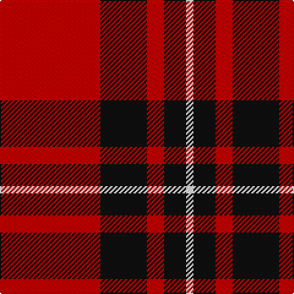

This page is one **sett** — a single exact thread-count. It belongs to the [tartan](/tartans/r41k19r7k9w3/)
(the same proportion at any scale), whose colour order is pattern [RKRKW](/stripes/rkrkw/).

Sourced from register-of-tartans.  It is a [5 stripe tartan](/stripes/stripes5/).

Original link https://www.tartanregister.gov.uk/tartanDetails.aspx?ref=2461

## Register references

External register numbers recorded for this tartan.

- Scottish Register of Tartans: [2461](https://www.tartanregister.gov.uk/tartanDetails.aspx?ref=2461)
- Scottish Tartans Authority (ITI): 6988

## Thread count
R/82 K38 R14 K18 W/6

## Palette
Each colour and the base-6 reference it is a variant of.

| Colour | Shade | Base |
|---|---|---|
| K | <code style="background-color:#101010;">#101010</code> `oklch(17.3% 0.000 89.9)` <small>#101010</small> | K <code style="background-color:#000000;">#000000</code> |
| R | <code style="background-color:#C80000;">#C80000</code> `oklch(52.3% 0.215 29.2)` <small>#C80000</small> | R <code style="background-color:#CC0000;">#CC0000</code> |
| W | <code style="background-color:#FCFCFC;">#FCFCFC</code> `oklch(99.1% 0.000 89.9)` <small>#FCFCFC</small> | W <code style="background-color:#F7F7F7;">#F7F7F7</code> |

# Sample pattern

## Nearest tartans

The nearest existing variants by ΔTartan distance, with this tartan at the top so the swatches line up against it.

ΔTartan

Tartan

Sett

—

<a href="/ttd/edit/#slug=r41k19r7k9w3~x2">MacGregor, Black (Personal)</a> <a class="nn-out" href="/setts/s5/r41k19r7k9w3~x2/" title="open its dictionary page">↗</a>

0.37

<a href="/ttd/edit/#slug=r4k8r12k1ly1~x2">MacKeane</a> <a class="nn-out" href="/setts/s5/r4k8r12k1ly1~x2/" title="open its dictionary page">↗</a>

0.52

<a href="/ttd/edit/#slug=r36k18r4k7w2~x2">Hopkins (Name)</a> <a class="nn-out" href="/setts/s5/r36k18r4k7w2~x2/" title="open its dictionary page">↗</a>

0.78

<a href="/ttd/edit/#slug=r28k4w2k13~x2">Dunbar (District)</a> <a class="nn-out" href="/setts/s4/r28k4w2k13~x2/" title="open its dictionary page">↗</a>

0.92

<a href="/ttd/edit/#slug=r20k2r2k15w1~x2">Masai Shuka 15 (Artefact)</a> <a class="nn-out" href="/setts/s5/r20k2r2k15w1~x2/" title="open its dictionary page">↗</a>

1.00

<a href="/ttd/edit/#slug=db4r3db3r22dg8r2~x2">Auld Reekie</a> <a class="nn-out" href="/setts/s6/db4r3db3r22dg8r2~x2/" title="open its dictionary page">↗</a>

1.06

<a href="/ttd/edit/#slug=k16r2k2r12w1~x2">MacIver</a> <a class="nn-out" href="/setts/s5/k16r2k2r12w1~x2/" title="open its dictionary page">↗</a>

1.08

<a href="/ttd/edit/#slug=r13lb3r1dg3lb1~x6">Glen Shiel (Fashion)</a> <a class="nn-out" href="/setts/s5/r13lb3r1dg3lb1~x6/" title="open its dictionary page">↗</a>

1.08

<a href="/ttd/edit/#slug=r8k1r8k12r1~x2">MacLeod Black &amp; Red</a> <a class="nn-out" href="/setts/s5/r8k1r8k12r1~x2/" title="open its dictionary page">↗</a>

1.13

<a href="/ttd/edit/#slug=r38w9r3k9w3~x2">Loch Morar</a> <a class="nn-out" href="/setts/s5/r38w9r3k9w3~x2/" title="open its dictionary page">↗</a>

1.19

<a href="/ttd/edit/#slug=g1r13k8ly1~x6">Billy Apple® Red</a> <a class="nn-out" href="/setts/s4/g1r13k8ly1~x6/" title="open its dictionary page">↗</a>

## Neighbour map

Every grey dot is one of 14299 variants placed by the first two principal components of the ΔTartan feature space (44% of its variance). Red is this tartan; blue dots are its nearest — click one to open its page.

<svg viewBox="0 0 640 380" role="img" style="max-width:100%;height:auto;border:1px solid #e0e0e0;border-radius:4px;display:block" xmlns="http://www.w3.org/2000/svg"><image href="/nn/cloud.v1.png" width="640" height="380"/><a href="/setts/s5/r4k8r12k1ly1~x2/"><circle cx="384.8" cy="212.9" r="4" fill="#3465a4"><title>MacKeane</title></circle></a><a href="/setts/s5/r36k18r4k7w2~x2/"><circle cx="399.6" cy="189.5" r="4" fill="#3465a4"><title>Hopkins (Name)</title></circle></a><a href="/setts/s4/r28k4w2k13~x2/"><circle cx="375.2" cy="209.8" r="4" fill="#3465a4"><title>Dunbar (District)</title></circle></a><a href="/setts/s5/r20k2r2k15w1~x2/"><circle cx="386.4" cy="183.9" r="4" fill="#3465a4"><title>Masai Shuka 15 (Artefact)</title></circle></a><a href="/setts/s6/db4r3db3r22dg8r2~x2/"><circle cx="400.1" cy="201.9" r="4" fill="#3465a4"><title>Auld Reekie</title></circle></a><a href="/setts/s5/k16r2k2r12w1~x2/"><circle cx="360.3" cy="195.2" r="4" fill="#3465a4"><title>MacIver</title></circle></a><a href="/setts/s5/r13lb3r1dg3lb1~x6/"><circle cx="418.3" cy="192.4" r="4" fill="#3465a4"><title>Glen Shiel (Fashion)</title></circle></a><a href="/setts/s5/r8k1r8k12r1~x2/"><circle cx="376.2" cy="236.1" r="4" fill="#3465a4"><title>MacLeod Black &amp; Red</title></circle></a><a href="/setts/s5/r38w9r3k9w3~x2/"><circle cx="390.4" cy="182.7" r="4" fill="#3465a4"><title>Loch Morar</title></circle></a><a href="/setts/s4/g1r13k8ly1~x6/"><circle cx="330.1" cy="191.1" r="4" fill="#3465a4"><title>Billy Apple® Red</title></circle></a><circle cx="382.7" cy="201.8" r="5" fill="#c00000"/></svg>

ID: /setts/s5/r41k19r7k9w3~x2/
