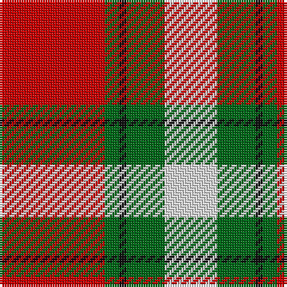

This page is one **sett** — a single exact thread-count. It belongs to the [tartan](/tartans/r44g6k3g16w22/)
(the same proportion at any scale), whose colour order is pattern [RGKGW](/stripes/rgkgw/).

Sourced from tartans-authority.  It is a [5 stripe tartan](/stripes/stripes5/).

Original link http://www.tartansauthority.com/tartan-ferret/display/8055/

## Thread count
R/44 G6 K3 G16 LN/22

## Palette

Palette: <strong>Tartan Register</strong>
<table><thead><tr><th>Colour</th><th>Threads</th><th>Shade</th><th>Base</th><th>OKLCh</th></tr></thead><tbody><tr><td>R/</td><td style="text-align:right;font-variant-numeric:tabular-nums">44</td><td><code style="background-color:#C80000;">#C80000</code> <small style="color:#888">#C80000</small></td><td>R <code style="background-color:#CC0000;">#CC0000</code></td><td><small style="color:#888">oklch(52.3% 0.215 29.2)</small></td></tr><tr><td>G</td><td style="text-align:right;font-variant-numeric:tabular-nums">6</td><td><code style="background-color:#006818;">#006818</code> <small style="color:#888">#006818</small></td><td>G <code style="background-color:#006100;">#006100</code></td><td><small style="color:#888">oklch(45.0% 0.142 145.0)</small></td></tr><tr><td>K</td><td style="text-align:right;font-variant-numeric:tabular-nums">3</td><td><code style="background-color:#101010;">#101010</code> <small style="color:#888">#101010</small></td><td>K <code style="background-color:#000000;">#000000</code></td><td><small style="color:#888">oklch(17.3% 0.000 89.9)</small></td></tr><tr><td>G</td><td style="text-align:right;font-variant-numeric:tabular-nums">16</td><td><code style="background-color:#006818;">#006818</code> <small style="color:#888">#006818</small></td><td>G <code style="background-color:#006100;">#006100</code></td><td><small style="color:#888">oklch(45.0% 0.142 145.0)</small></td></tr><tr><td>LN/</td><td style="text-align:right;font-variant-numeric:tabular-nums">22</td><td><code style="background-color:#E0E0E0;">#E0E0E0</code> <small style="color:#888">#E0E0E0</small></td><td>W <code style="background-color:#F7F7F7;">#F7F7F7</code></td><td><small style="color:#888">oklch(90.7% 0.000 89.9)</small></td></tr></tbody></table>

# Sample pattern

## Nearest tartans

The nearest existing variants by ΔTartan distance, with this tartan at the top so the swatches line up against it.

ΔTartan

Tartan

Sett

—

<a href="/ttd/edit/#slug=r44g6k3g16w22">Basque (Corporate)</a> <a class="nn-out" href="/setts/s5/r44g6k3g16w22/" title="open its dictionary page">↗</a>

0.61

<a href="/ttd/edit/#slug=db6lo25o16k2db3~x2">Prince of Orange</a> <a class="nn-out" href="/setts/s5/db6lo25o16k2db3~x2/" title="open its dictionary page">↗</a>

0.91

<a href="/ttd/edit/#slug=r6lb3r37k16lb16g4~x2">Nesbit, Rose</a> <a class="nn-out" href="/setts/s6/r6lb3r37k16lb16g4~x2/" title="open its dictionary page">↗</a>

1.14

<a href="/ttd/edit/#slug=k2r4w1r10g12r2w2~x4">Starr (1978) (Name)</a> <a class="nn-out" href="/setts/s7/k2r4w1r10g12r2w2~x4/" title="open its dictionary page">↗</a>

1.16

<a href="/ttd/edit/#slug=db6lo25dy16k2db3~x2">Prince of Orange #2</a> <a class="nn-out" href="/setts/s5/db6lo25dy16k2db3~x2/" title="open its dictionary page">↗</a>

1.28

<a href="/ttd/edit/#slug=w6g15db18r30g2r4~x2">Ruthven (V.S.)</a> <a class="nn-out" href="/setts/s6/w6g15db18r30g2r4~x2/" title="open its dictionary page">↗</a>

1.38

<a href="/ttd/edit/#slug=k3r28k10w28t3~x2">Wallace Dress, Red (Dance)</a> <a class="nn-out" href="/setts/s5/k3r28k10w28t3~x2/" title="open its dictionary page">↗</a>

1.38

<a href="/ttd/edit/#slug=r24n4k4g4w13k2~x4">Rose White Dress</a> <a class="nn-out" href="/setts/s6/r24n4k4g4w13k2~x4/" title="open its dictionary page">↗</a>

1.39

<a href="/ttd/edit/#slug=t12lo75k22w12k22w16t8">Orange Fanaticos (Corporate)</a> <a class="nn-out" href="/setts/s7/t12lo75k22w12k22w16t8/" title="open its dictionary page">↗</a>

1.40

<a href="/ttd/edit/#slug=o3w3k3lo10r1~x6">Burberry Counterfeit</a> <a class="nn-out" href="/setts/s5/o3w3k3lo10r1~x6/" title="open its dictionary page">↗</a>

1.40

<a href="/ttd/edit/#slug=r80k52w7o12">Oklahoma State University (Corporate</a> <a class="nn-out" href="/setts/s4/r80k52w7o12/" title="open its dictionary page">↗</a>

## Neighbour map

Every grey dot is one of 14299 variants placed by the first two principal components of the ΔTartan feature space (44% of its variance). Red is this tartan; blue dots are its nearest — click one to open its page.

<svg viewBox="0 0 640 380" role="img" style="max-width:100%;height:auto;border:1px solid #e0e0e0;border-radius:4px;display:block" xmlns="http://www.w3.org/2000/svg"><image href="/nn/cloud.v1.png" width="640" height="380"/><a href="/setts/s5/db6lo25o16k2db3~x2/"><circle cx="266.5" cy="189.1" r="4" fill="#3465a4"><title>Prince of Orange</title></circle></a><a href="/setts/s6/r6lb3r37k16lb16g4~x2/"><circle cx="266.8" cy="172.0" r="4" fill="#3465a4"><title>Nesbit, Rose</title></circle></a><a href="/setts/s7/k2r4w1r10g12r2w2~x4/"><circle cx="264.8" cy="177.1" r="4" fill="#3465a4"><title>Starr (1978) (Name)</title></circle></a><a href="/setts/s5/db6lo25dy16k2db3~x2/"><circle cx="277.3" cy="200.3" r="4" fill="#3465a4"><title>Prince of Orange #2</title></circle></a><a href="/setts/s6/w6g15db18r30g2r4~x2/"><circle cx="241.9" cy="184.8" r="4" fill="#3465a4"><title>Ruthven (V.S.)</title></circle></a><a href="/setts/s5/k3r28k10w28t3~x2/"><circle cx="183.6" cy="185.9" r="4" fill="#3465a4"><title>Wallace Dress, Red (Dance)</title></circle></a><a href="/setts/s6/r24n4k4g4w13k2~x4/"><circle cx="202.2" cy="151.4" r="4" fill="#3465a4"><title>Rose White Dress</title></circle></a><a href="/setts/s7/t12lo75k22w12k22w16t8/"><circle cx="198.6" cy="172.1" r="4" fill="#3465a4"><title>Orange Fanaticos (Corporate)</title></circle></a><a href="/setts/s5/o3w3k3lo10r1~x6/"><circle cx="212.7" cy="186.2" r="4" fill="#3465a4"><title>Burberry Counterfeit</title></circle></a><a href="/setts/s4/r80k52w7o12/"><circle cx="289.6" cy="205.7" r="4" fill="#3465a4"><title>Oklahoma State University (Corporate</title></circle></a><circle cx="253.5" cy="178.8" r="5" fill="#c00000"/></svg>

ID: /setts/s5/r44g6k3g16w22/
