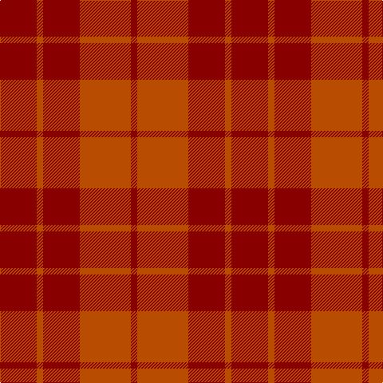

In pattern [RRRRR](/patterns/rrrrr/).

This was sourced from tartans-authority.  It is a [5 stripes tartan](/stripes/stripes5/).

Original link http://www.tartansauthority.com/tartan-ferret/display/4043/

## Thread count
DR/46 DO8 DR46 DO64 DRa/8

## Palette
Each colour and its ΔE from the base-6 reference it is a variant of.

| Colour | Shade | Base | ΔE (OKLab) |
|---|---|---|---|
| DO | <code style="background-color:#B84C00;">#B84C00</code> `#B84C00` | R <code style="background-color:#CC0000;">#CC0000</code> | 0.08 |
| DR | <code style="background-color:#880000;">#880000</code> `#880000` | R <code style="background-color:#CC0000;">#CC0000</code> | 0.15 |
| DRa | <code style="background-color:#880000;">#880000</code> `#880000` | R <code style="background-color:#CC0000;">#CC0000</code> | 0.15 |

# Sample pattern

## Nearest tartans

The nearest existing variants by ΔTartan distance.

1. [Hamilton, Red](/setts/s8/r64y8r64ra46r8ra46r8ra46-r880000-rab84c00-yd87c00/) — ΔT 1.42
1. [Bryce](/setts/s4/r10b70r92ra10-b684038-r880000-raa88000/) — ΔT 1.46
1. [Stirling of Keir (Clan)](/setts/s4/g6b60r60g6-b5c0014-g006840-r8c0020/) — ΔT 1.80
1. [Samye Sangha #2](/setts/s6/r64ra6r6ra4r6ra46-r960000-radc0000/) — ΔT 2.32
1. [Tune Hotels (Corporate)](/setts/s9/r6ra36rb12r30ra8r6ra8r14w4-rd05054-rac80000-rb880000-we0e0e0/) — ΔT 2.32
1. [Samye Sangha](/setts/s6/r64ra6r6ra4r6ra46-r880000-rac80000/) — ΔT 2.33
1. [Grelloch (Fashion)](/setts/s6/r8b4ra48rb48k4rb8-b5c8ca8-k101010-ra00048-ra901c38-rbc80000/) — ΔT 2.71
1. [Youth on The Horizon (Fashion)](/setts/s6/r16ra16rb16ra16rc48ra8-re87878-rac80000-rbcc4438-rc880000/) — ΔT 2.72
1. [MacNab 4](/setts/s5/r48g2b2g4ra48-b5480b0-g008000-r900030-rac00000/) — ΔT 2.74
1. [MacNab (Smith)](/setts/s5/r96g4b4g8ra96-b2888c4-g006818-ra00048-rac80000/) — ΔT 2.83

## Neighbour map

Every grey dot is one of 15726 variants placed by the first two principal components of the ΔTartan feature space (44% of its variance). Red is this tartan; blue dots are its nearest — click one to open its page.

<svg viewBox="0 0 640 380" role="img" style="max-width:100%;height:auto;border:1px solid #e0e0e0;border-radius:4px;display:block" xmlns="http://www.w3.org/2000/svg"><image href="/nn/cloud.v1.png" width="640" height="380"/><a href="/setts/s8/r64y8r64ra46r8ra46r8ra46-r880000-rab84c00-yd87c00/"><circle cx="442.0" cy="288.8" r="4" fill="#3465a4"><title>Hamilton, Red</title></circle></a><a href="/setts/s4/r10b70r92ra10-b684038-r880000-raa88000/"><circle cx="530.5" cy="324.5" r="4" fill="#3465a4"><title>Bryce</title></circle></a><a href="/setts/s4/g6b60r60g6-b5c0014-g006840-r8c0020/"><circle cx="453.5" cy="303.6" r="4" fill="#3465a4"><title>Stirling of Keir (Clan)</title></circle></a><a href="/setts/s6/r64ra6r6ra4r6ra46-r960000-radc0000/"><circle cx="603.9" cy="264.5" r="4" fill="#3465a4"><title>Samye Sangha #2</title></circle></a><a href="/setts/s9/r6ra36rb12r30ra8r6ra8r14w4-rd05054-rac80000-rb880000-we0e0e0/"><circle cx="391.2" cy="239.9" r="4" fill="#3465a4"><title>Tune Hotels (Corporate)</title></circle></a><a href="/setts/s6/r64ra6r6ra4r6ra46-r880000-rac80000/"><circle cx="618.4" cy="275.5" r="4" fill="#3465a4"><title>Samye Sangha</title></circle></a><a href="/setts/s6/r8b4ra48rb48k4rb8-b5c8ca8-k101010-ra00048-ra901c38-rbc80000/"><circle cx="409.5" cy="217.7" r="4" fill="#3465a4"><title>Grelloch (Fashion)</title></circle></a><a href="/setts/s6/r16ra16rb16ra16rc48ra8-re87878-rac80000-rbcc4438-rc880000/"><circle cx="304.2" cy="273.7" r="4" fill="#3465a4"><title>Youth on The Horizon (Fashion)</title></circle></a><a href="/setts/s5/r48g2b2g4ra48-b5480b0-g008000-r900030-rac00000/"><circle cx="472.7" cy="211.4" r="4" fill="#3465a4"><title>MacNab 4</title></circle></a><a href="/setts/s5/r96g4b4g8ra96-b2888c4-g006818-ra00048-rac80000/"><circle cx="474.9" cy="209.9" r="4" fill="#3465a4"><title>MacNab (Smith)</title></circle></a><circle cx="485.7" cy="318.1" r="5" fill="#c00000"/></svg>

ID: /setts/s5/r46ra8r46ra64r8-r880000-rab84c00/
