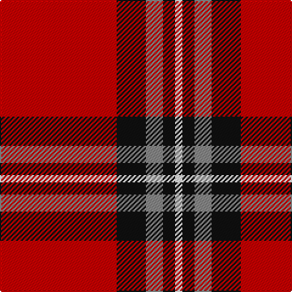

This page is one **sett** — a single exact thread-count. It belongs to the [tartan](/tartans/r48k12n7k5w3/)
(the same proportion at any scale), whose colour order is pattern [RKRKW](/stripes/rkrkw/).

Sourced from register-of-tartans.  It is a [5 stripe tartan](/stripes/stripes5/).

Original link https://www.tartanregister.gov.uk/tartanDetails.aspx?ref=4165

2 attestations — the source records this cloth was collapsed from (oldest owns this page)

<ul>
<li>01/01/2004 — Turner (Personal) (register-of-tartans, <a href="https://www.tartanregister.gov.uk/tartanDetails.aspx?ref=4165">record</a>)</li>
<li>pre 2004 — Turner (Personal) (tartans-authority, <a href="http://www.tartansauthority.com/tartan-ferret/display/6285/">record</a>)</li>
</ul>

## Register references

External register numbers recorded for this tartan.

- Scottish Register of Tartans: [4165](https://www.tartanregister.gov.uk/tartanDetails.aspx?ref=4165)
- Scottish Tartans Authority (ITI): 6285

## Thread count
R/96 K24 N14 K10 W/6

## Palette
Each colour and the base-6 reference it is a variant of.

| Colour | Shade | Base |
|---|---|---|
| K | <code style="background-color:#101010;">#101010</code> `oklch(17.3% 0.000 89.9)` <small>#101010</small> | K <code style="background-color:#000000;">#000000</code> |
| N | <code style="background-color:#888888;">#888888</code> `oklch(62.7% 0.000 89.9)` <small>#888888</small> | R <code style="background-color:#CC0000;">#CC0000</code> |
| R | <code style="background-color:#C80000;">#C80000</code> `oklch(52.3% 0.215 29.2)` <small>#C80000</small> | R <code style="background-color:#CC0000;">#CC0000</code> |
| W | <code style="background-color:#FCFCFC;">#FCFCFC</code> `oklch(99.1% 0.000 89.9)` <small>#FCFCFC</small> | W <code style="background-color:#F7F7F7;">#F7F7F7</code> |

# Sample pattern

## Nearest tartans

The nearest existing variants by ΔTartan distance, with this tartan at the top so the swatches line up against it.

ΔTartan

Tartan

Sett

—

<a href="/ttd/edit/#slug=r48k12o7k5w3~x2">Turner (Personal)</a> <a class="nn-out" href="/setts/s5/r48k12o7k5w3~x2/" title="open its dictionary page">↗</a>

0.92

<a href="/ttd/edit/#slug=r8w4r50k12r4k15g5~x2">Instakilt, Red (Fashion)</a> <a class="nn-out" href="/setts/s7/r8w4r50k12r4k15g5~x2/" title="open its dictionary page">↗</a>

0.95

<a href="/ttd/edit/#slug=r35dg16r5dg5w2k3~x2">MacGregor</a> <a class="nn-out" href="/setts/s6/r35dg16r5dg5w2k3~x2/" title="open its dictionary page">↗</a>

1.06

<a href="/ttd/edit/#slug=r50db14w6db9lo3db4r4~x2">Texas Lone Star (Fashion)</a> <a class="nn-out" href="/setts/s7/r50db14w6db9lo3db4r4~x2/" title="open its dictionary page">↗</a>

1.19

<a href="/ttd/edit/#slug=r13lb3r1dg3lb1~x6">Glen Shiel (Fashion)</a> <a class="nn-out" href="/setts/s5/r13lb3r1dg3lb1~x6/" title="open its dictionary page">↗</a>

1.19

<a href="/ttd/edit/#slug=r38w9r3dr9w3~x2">Loch Morar</a> <a class="nn-out" href="/setts/s5/r38w9r3dr9w3~x2/" title="open its dictionary page">↗</a>

1.19

<a href="/ttd/edit/#slug=r32w4dt7ly2t2~x5">Sildesalaten</a> <a class="nn-out" href="/setts/s5/r32w4dt7ly2t2~x5/" title="open its dictionary page">↗</a>

1.23

<a href="/ttd/edit/#slug=r32lb4dt7ly2t2~x5">Sildesalaten</a> <a class="nn-out" href="/setts/s5/r32lb4dt7ly2t2~x5/" title="open its dictionary page">↗</a>

1.23

<a href="/ttd/edit/#slug=g1r13k8ly1~x6">Billy Apple® Red</a> <a class="nn-out" href="/setts/s4/g1r13k8ly1~x6/" title="open its dictionary page">↗</a>

1.24

<a href="/ttd/edit/#slug=r36k18r4k7w2~x2">Hopkins (Name)</a> <a class="nn-out" href="/setts/s5/r36k18r4k7w2~x2/" title="open its dictionary page">↗</a>

1.26

<a href="/ttd/edit/#slug=r42k2w2k18w2k5~x2">Forget Family (Red)</a> <a class="nn-out" href="/setts/s6/r42k2w2k18w2k5~x2/" title="open its dictionary page">↗</a>

## Neighbour map

Every grey dot is one of 14299 variants placed by the first two principal components of the ΔTartan feature space (44% of its variance). Red is this tartan; blue dots are its nearest — click one to open its page.

<svg viewBox="0 0 640 380" role="img" style="max-width:100%;height:auto;border:1px solid #e0e0e0;border-radius:4px;display:block" xmlns="http://www.w3.org/2000/svg"><image href="/nn/cloud.v1.png" width="640" height="380"/><a href="/setts/s7/r8w4r50k12r4k15g5~x2/"><circle cx="366.4" cy="150.1" r="4" fill="#3465a4"><title>Instakilt, Red (Fashion)</title></circle></a><a href="/setts/s6/r35dg16r5dg5w2k3~x2/"><circle cx="387.6" cy="160.5" r="4" fill="#3465a4"><title>MacGregor</title></circle></a><a href="/setts/s7/r50db14w6db9lo3db4r4~x2/"><circle cx="372.5" cy="138.9" r="4" fill="#3465a4"><title>Texas Lone Star (Fashion)</title></circle></a><a href="/setts/s5/r13lb3r1dg3lb1~x6/"><circle cx="418.3" cy="192.4" r="4" fill="#3465a4"><title>Glen Shiel (Fashion)</title></circle></a><a href="/setts/s5/r38w9r3dr9w3~x2/"><circle cx="412.6" cy="182.4" r="4" fill="#3465a4"><title>Loch Morar</title></circle></a><a href="/setts/s5/r32w4dt7ly2t2~x5/"><circle cx="403.6" cy="134.6" r="4" fill="#3465a4"><title>Sildesalaten</title></circle></a><a href="/setts/s5/r32lb4dt7ly2t2~x5/"><circle cx="417.2" cy="142.4" r="4" fill="#3465a4"><title>Sildesalaten</title></circle></a><a href="/setts/s4/g1r13k8ly1~x6/"><circle cx="330.1" cy="191.1" r="4" fill="#3465a4"><title>Billy Apple® Red</title></circle></a><a href="/setts/s5/r36k18r4k7w2~x2/"><circle cx="399.6" cy="189.5" r="4" fill="#3465a4"><title>Hopkins (Name)</title></circle></a><a href="/setts/s6/r42k2w2k18w2k5~x2/"><circle cx="401.4" cy="150.9" r="4" fill="#3465a4"><title>Forget Family (Red)</title></circle></a><circle cx="395.1" cy="161.0" r="5" fill="#c00000"/></svg>

ID: /setts/s5/r48k12o7k5w3~x2/
