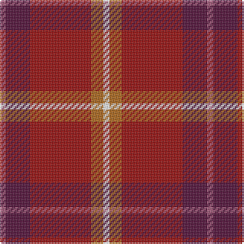

In pattern [RBRRW](/patterns/rbrrw/).

This was sourced from register-of-tartans.  It is a [5 stripes tartan](/stripes/stripes5/).

Original link https://www.tartanregister.gov.uk/tartanDetails.aspx?ref=10521

## Thread count
LP/4 DP16 DR40 LT8 W/4

## Palette
Each colour and its ΔE from the base-6 reference it is a variant of.

| Colour | Shade | Base | ΔE (OKLab) |
|---|---|---|---|
| DP | <code style="background-color:#531039;">#531039</code> `#531039` | B <code style="background-color:#2A418A;">#2A418A</code> | 0.18 |
| DR | <code style="background-color:#970F0F;">#970F0F</code> `#970F0F` | R <code style="background-color:#CC0000;">#CC0000</code> | 0.11 |
| LP | <code style="background-color:#A35879;">#A35879</code> `#A35879` | R <code style="background-color:#CC0000;">#CC0000</code> | 0.15 |
| LT | <code style="background-color:#AD681D;">#AD681D</code> `#AD681D` | R <code style="background-color:#CC0000;">#CC0000</code> | 0.14 |
| W | <code style="background-color:#FFFFFF;">#FFFFFF</code> `#FFFFFF` | W <code style="background-color:#F7F7F7;">#F7F7F7</code> | 0.02 |

# Sample pattern

## Nearest tartans

The nearest existing variants by ΔTartan distance.

1. [Stevens #3](/setts/s6/b4ba18b6r14ra38y4-b440044-ba5c8ca8-rc80000-ra901c38-ye8c000/) — ΔT 1.41
1. [Staves (Personal)](/setts/s5/r60g24ra6w6b6-b2888c4-g285800-rc80000-ra880000-wfcfcfc/) — ΔT 1.44
1. [Staves (Personal)](/setts/s5/r20g8ra2w2b2-b2888c4-g285800-rc80000-ra880000-wffffff/) — ΔT 1.45
1. [Love (Fashion)](/setts/s5/r4ra16rb40y8w4-re87878-ra880000-rbc80000-we0e0e0-ybc8c00/) — ΔT 1.48
1. [Moray of Abercairney](/setts/s6/r16ra2g8ra2g2b4-b3c82af-g005020-rdc0000-rac82828/) — ΔT 1.60
1. [Wasko (Personal)](/setts/s7/r16w4ra60g24ra6g24ra6-g006818-rc80000-raa00048-we0e0e0/) — ΔT 1.66
1. [MacNab #3](/setts/s7/g12r4ra4g8ra4r24k2-g005020-k101010-rdc0000-ra960028/) — ΔT 1.66
1. [Chisholm](/setts/s8/r24b4w2b4r6g16r6b2-b5a3094-g004c00-rc80000-wd0d0d0/) — ΔT 1.69
1. [Flowers of the Forest, The](/setts/s9/r4ra8ra4b10y6g26ra40ba4ra4-b2c2c80-ba441800-g5c6428-ra03400-rac80000-y48a4c0/) — ΔT 1.69
1. [Finnigan (Estimated threadcount)](/setts/s6/r6b30r6g16r40k4-b2c2c80-g006818-k101010-rc80000/) — ΔT 1.70

## Neighbour map

Every grey dot is one of 15726 variants placed by the first two principal components of the ΔTartan feature space (44% of its variance). Red is this tartan; blue dots are its nearest — click one to open its page.

<svg viewBox="0 0 640 380" role="img" style="max-width:100%;height:auto;border:1px solid #e0e0e0;border-radius:4px;display:block" xmlns="http://www.w3.org/2000/svg"><image href="/nn/cloud.v1.png" width="640" height="380"/><a href="/setts/s6/b4ba18b6r14ra38y4-b440044-ba5c8ca8-rc80000-ra901c38-ye8c000/"><circle cx="244.5" cy="192.3" r="4" fill="#3465a4"><title>Stevens #3</title></circle></a><a href="/setts/s5/r60g24ra6w6b6-b2888c4-g285800-rc80000-ra880000-wfcfcfc/"><circle cx="329.1" cy="175.9" r="4" fill="#3465a4"><title>Staves (Personal)</title></circle></a><a href="/setts/s5/r20g8ra2w2b2-b2888c4-g285800-rc80000-ra880000-wffffff/"><circle cx="328.2" cy="175.5" r="4" fill="#3465a4"><title>Staves (Personal)</title></circle></a><a href="/setts/s5/r4ra16rb40y8w4-re87878-ra880000-rbc80000-we0e0e0-ybc8c00/"><circle cx="350.3" cy="195.1" r="4" fill="#3465a4"><title>Love (Fashion)</title></circle></a><a href="/setts/s6/r16ra2g8ra2g2b4-b3c82af-g005020-rdc0000-rac82828/"><circle cx="271.5" cy="207.6" r="4" fill="#3465a4"><title>Moray of Abercairney</title></circle></a><a href="/setts/s7/r16w4ra60g24ra6g24ra6-g006818-rc80000-raa00048-we0e0e0/"><circle cx="331.0" cy="184.9" r="4" fill="#3465a4"><title>Wasko (Personal)</title></circle></a><a href="/setts/s7/g12r4ra4g8ra4r24k2-g005020-k101010-rdc0000-ra960028/"><circle cx="297.9" cy="191.0" r="4" fill="#3465a4"><title>MacNab #3</title></circle></a><a href="/setts/s8/r24b4w2b4r6g16r6b2-b5a3094-g004c00-rc80000-wd0d0d0/"><circle cx="330.3" cy="178.2" r="4" fill="#3465a4"><title>Chisholm</title></circle></a><a href="/setts/s9/r4ra8ra4b10y6g26ra40ba4ra4-b2c2c80-ba441800-g5c6428-ra03400-rac80000-y48a4c0/"><circle cx="289.7" cy="151.3" r="4" fill="#3465a4"><title>Flowers of the Forest, The</title></circle></a><a href="/setts/s6/r6b30r6g16r40k4-b2c2c80-g006818-k101010-rc80000/"><circle cx="286.3" cy="207.4" r="4" fill="#3465a4"><title>Finnigan (Estimated threadcount)</title></circle></a><circle cx="325.9" cy="194.3" r="5" fill="#c00000"/></svg>

ID: /setts/s5/r4b16ra40rb8w4-b531039-ra35879-ra970f0f-rbad681d-wffffff/
