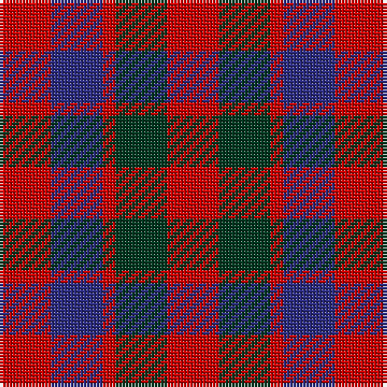

In pattern [RBRGR](/patterns/rbrgr/).

This was sourced from house-of-tartan.  It is a [5 stripes tartan](/stripes/stripes5/).

Original link http://www.house-of-tartan.scotland.net/house/TartanViewjs.asp?colr=Def&tnam=1390

## Thread count
R/16 DB16 R4 DG16 R/16

## Palette
Each colour and its ΔE from the base-6 reference it is a variant of.

| Colour | Shade | Base | ΔE (OKLab) |
|---|---|---|---|
| DB | <code style="background-color:#2C2C80;">#2C2C80</code> `#2C2C80` | B <code style="background-color:#2A418A;">#2A418A</code> | 0.06 |
| DG | <code style="background-color:#003820;">#003820</code> `#003820` | G <code style="background-color:#006100;">#006100</code> | 0.15 |
| R | <code style="background-color:#C80000;">#C80000</code> `#C80000` | R <code style="background-color:#CC0000;">#CC0000</code> | 0.01 |

# Sample pattern

## Nearest tartans

The nearest existing variants by ΔTartan distance.

1. [Gow](/setts/s5/r4b4r1g4r4x4~b304080-g003000-rc00000/) — ΔT 0.35
1. [MacGowan](/setts/s5/r4b4r1g4r4x6~b2c2c80-g006818-rc80000/) — ΔT 0.48
1. [Gow](/setts/s5/r4b4r1g4r4x2~b000052-g11450d-raa0000/) — ΔT 0.68
1. [Gow](/setts/s5/r4b4r1g4r4x2~b00004c-g004c00-rc80000/) — ΔT 0.84
1. [Gow (Portrait)](/setts/s5/r3b3r1g3r3x12~b1c1c50-g285800-rb40000/) — ΔT 0.86
1. [Menzies](/setts/s5/r5g5y1b2r5x2~b4367ae-g11450d-raa0000-yaaaaaa/) — ΔT 1.49
1. [Menzies](/setts/s5/r5g5y1b2r5~b4367ae-g11450d-raa0000-yaaaaaa/) — ΔT 1.49
1. [Tulsa, City of](/setts/s6/g14b8g14r14k3r14x2~b2c2c80-g003820-k101010-rc80000/) — ΔT 1.56
1. [Fiddes (Corrected)](/setts/s7/g12r11b12ra3b8g8b8x2~b780078-g289c18-rc80000-racc4438/) — ΔT 1.64
1. [MacDuff #3](/setts/s7/r10b6k8g10r6g3r6x2~b2c4084-g005020-k101010-rdc0000/) — ΔT 1.68

## Neighbour map

Every grey dot is one of 15726 variants placed by the first two principal components of the ΔTartan feature space (44% of its variance). Red is this tartan; blue dots are its nearest — click one to open its page.

<svg viewBox="0 0 640 380" role="img" style="max-width:100%;height:auto;border:1px solid #e0e0e0;border-radius:4px;display:block" xmlns="http://www.w3.org/2000/svg"><image href="/nn/cloud.v1.png" width="640" height="380"/><a href="/setts/s5/r4b4r1g4r4x4~b304080-g003000-rc00000/"><circle cx="245.3" cy="322.3" r="4" fill="#3465a4"><title>Gow</title></circle></a><a href="/setts/s5/r4b4r1g4r4x6~b2c2c80-g006818-rc80000/"><circle cx="239.0" cy="318.5" r="4" fill="#3465a4"><title>MacGowan</title></circle></a><a href="/setts/s5/r4b4r1g4r4x2~b000052-g11450d-raa0000/"><circle cx="238.4" cy="324.4" r="4" fill="#3465a4"><title>Gow</title></circle></a><a href="/setts/s5/r4b4r1g4r4x2~b00004c-g004c00-rc80000/"><circle cx="220.1" cy="314.0" r="4" fill="#3465a4"><title>Gow</title></circle></a><a href="/setts/s5/r3b3r1g3r3x12~b1c1c50-g285800-rb40000/"><circle cx="240.8" cy="343.7" r="4" fill="#3465a4"><title>Gow (Portrait)</title></circle></a><a href="/setts/s5/r5g5y1b2r5x2~b4367ae-g11450d-raa0000-yaaaaaa/"><circle cx="275.4" cy="284.2" r="4" fill="#3465a4"><title>Menzies</title></circle></a><a href="/setts/s5/r5g5y1b2r5~b4367ae-g11450d-raa0000-yaaaaaa/"><circle cx="275.4" cy="284.2" r="4" fill="#3465a4"><title>Menzies</title></circle></a><a href="/setts/s6/g14b8g14r14k3r14x2~b2c2c80-g003820-k101010-rc80000/"><circle cx="181.3" cy="289.9" r="4" fill="#3465a4"><title>Tulsa, City of</title></circle></a><a href="/setts/s7/g12r11b12ra3b8g8b8x2~b780078-g289c18-rc80000-racc4438/"><circle cx="149.1" cy="282.8" r="4" fill="#3465a4"><title>Fiddes (Corrected)</title></circle></a><a href="/setts/s7/r10b6k8g10r6g3r6x2~b2c4084-g005020-k101010-rdc0000/"><circle cx="135.3" cy="290.9" r="4" fill="#3465a4"><title>MacDuff #3</title></circle></a><circle cx="241.2" cy="319.6" r="5" fill="#c00000"/></svg>

ID: /setts/s5/r4b4r1g4r4x4~b2c2c80-g003820-rc80000/
