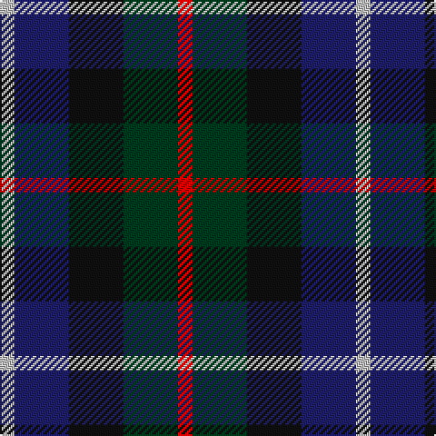

**Bands:** [RGKBW](/stripes/rgkbw/) · **Stripes:** [R DG K DB LB](/stripes/stripes5/) R DG K DB LB

This was sourced from register-of-tartans.  It is a [5 band tartan](/bands/bands5/).

Original link https://www.tartanregister.gov.uk/tartanDetails.aspx?ref=879

## Also known as

This cloth is also recorded under:

- Dalmeny #1

## Attestations

This cloth appears in 2 source records; the oldest owns this page.

- 01/01/1840 — Dalmeny #1 (register-of-tartans, [record](https://www.tartanregister.gov.uk/tartanDetails.aspx?ref=879))
- 1840 — Dalmeny - 1840 (Name) (tartans-authority, [record](http://www.tartansauthority.com/tartan-ferret/display/1480/))

## Register references

External register numbers recorded for this tartan.

- Scottish Register of Tartans: [879](https://www.tartanregister.gov.uk/tartanDetails.aspx?ref=879)
- Scottish Tartans Authority (ITI): 1480
- Scottish Tartans World Register: 1480

## Thread count
N/8 DB30 K30 DG30 R/8

## Palette
Each colour and its ΔE from the base-6 reference it is a variant of.

| Colour | Shade | Base | ΔE (OKLab) |
|---|---|---|---|
| DB | <code style="background-color:#202060;">#202060</code> `#202060` | B <code style="background-color:#2A418A;">#2A418A</code> | 0.11 |
| DG | <code style="background-color:#003820;">#003820</code> `#003820` | G <code style="background-color:#006100;">#006100</code> | 0.15 |
| K | <code style="background-color:#101010;">#101010</code> `#101010` | K <code style="background-color:#000000;">#000000</code> | 0.17 |
| N | <code style="background-color:#C0C0C0;">#C0C0C0</code> `#C0C0C0` | W <code style="background-color:#F7F7F7;">#F7F7F7</code> | 0.17 |
| R | <code style="background-color:#C80000;">#C80000</code> `#C80000` | R <code style="background-color:#CC0000;">#CC0000</code> | 0.01 |

# Sample pattern

## Nearest tartans

The nearest existing variants by ΔTartan distance.

1. [Scots Heritage](/setts/s5/r4db14k15dg14ly4~x2/) — ΔT 0.65
1. [MacEachain (Clan)](/setts/s6/r2k1db6k2g6m2~x4/) — ΔT 1.22
1. [Birse](/setts/s6/k4g16k14lo3n16r4~x2/) — ΔT 1.25
1. [Selkirk (Personal)](/setts/s5/dp27db4k27g27lo4~x2/) — ΔT 1.31
1. [Williamson (Personal)](/setts/s6/o7k20o4k18y20dp5~x2/) — ΔT 1.31
1. [Mitchell Family Tartan Tartan Number: 2142. Earliest known date: 1816-20 Named in honour of General Billy Mitchell when it was adopted as the tartan of the United States Air Force pipe band. The sett is also known as Russell, Hunter and Galbraith. The earliest reference to the tartan is in the collection of the Highland Society of London where it is labelled Galbraith. See products available Copyright © Blair Urquhart, Comrie, 2015](/setts/s6/k3g8k8r2db8w2~x2/) — ΔT 1.32
1. [Durham District Tartan Tartan Number: 1089. Earliest known date: 1819 It was Wilson's practice to give the names of towns to many of his new designs. Maybe because the order came from there or because it was the name of the purchaser. There was a family of Durhams associated with the Royal Court in Edinburgh prior to the Union of the Crowns. Wilson was also a collector of tartans, receiving samples from his agents in the Highlands and from purchase orders from around the world. See 'Denholme' and 'Urquhart'. See products available Copyright © Blair Urquhart, Comrie, 2015](/setts/s5/k1g3k3db3r1~x4/) — ΔT 1.32
1. [Selkirk (Name)](/setts/s5/dp11y2k10g10lo2~x2/) — ΔT 1.34
1. [Cooke (Personal)](/setts/s7/k6t2db12g8r5k2g3~x4/) — ΔT 1.35
1. [Heritage (Corporate)](/setts/s7/r5db8k5db24k24y24y5~x2/) — ΔT 1.37

## Neighbour map

Every grey dot is one of 14299 variants placed by the first two principal components of the ΔTartan feature space (44% of its variance). Red is this tartan; blue dots are its nearest — click one to open its page.

<svg viewBox="0 0 640 380" role="img" style="max-width:100%;height:auto;border:1px solid #e0e0e0;border-radius:4px;display:block" xmlns="http://www.w3.org/2000/svg"><image href="/nn/cloud.v1.png" width="640" height="380"/><a href="/setts/s5/r4db14k15dg14ly4~x2/"><circle cx="93.4" cy="290.2" r="4" fill="#3465a4"><title>Scots Heritage</title></circle></a><a href="/setts/s6/r2k1db6k2g6m2~x4/"><circle cx="118.5" cy="240.6" r="4" fill="#3465a4"><title>MacEachain (Clan)</title></circle></a><a href="/setts/s6/k4g16k14lo3n16r4~x2/"><circle cx="127.2" cy="254.5" r="4" fill="#3465a4"><title>Birse</title></circle></a><a href="/setts/s5/dp27db4k27g27lo4~x2/"><circle cx="136.1" cy="243.2" r="4" fill="#3465a4"><title>Selkirk (Personal)</title></circle></a><a href="/setts/s6/o7k20o4k18y20dp5~x2/"><circle cx="76.7" cy="251.0" r="4" fill="#3465a4"><title>Williamson (Personal)</title></circle></a><a href="/setts/s6/k3g8k8r2db8w2~x2/"><circle cx="94.8" cy="256.0" r="4" fill="#3465a4"><title>Mitchell Family Tartan Tartan Number: 2142. Earliest known date: 1816-20 Named in honour of General Billy Mitchell when it was adopted as the tartan of the United States Air Force pipe band. The sett is also known as Russell, Hunter and Galbraith. The earliest reference to the tartan is in the collection of the Highland Society of London where it is labelled Galbraith. See products available Copyright © Blair Urquhart, Comrie, 2015</title></circle></a><a href="/setts/s5/k1g3k3db3r1~x4/"><circle cx="130.2" cy="317.5" r="4" fill="#3465a4"><title>Durham District Tartan Tartan Number: 1089. Earliest known date: 1819 It was Wilson's practice to give the names of towns to many of his new designs. Maybe because the order came from there or because it was the name of the purchaser. There was a family of Durhams associated with the Royal Court in Edinburgh prior to the Union of the Crowns. Wilson was also a collector of tartans, receiving samples from his agents in the Highlands and from purchase orders from around the world. See 'Denholme' and 'Urquhart'. See products available Copyright © Blair Urquhart, Comrie, 2015</title></circle></a><a href="/setts/s5/dp11y2k10g10lo2~x2/"><circle cx="111.8" cy="246.7" r="4" fill="#3465a4"><title>Selkirk (Name)</title></circle></a><a href="/setts/s7/k6t2db12g8r5k2g3~x4/"><circle cx="114.2" cy="235.2" r="4" fill="#3465a4"><title>Cooke (Personal)</title></circle></a><a href="/setts/s7/r5db8k5db24k24y24y5~x2/"><circle cx="154.4" cy="254.9" r="4" fill="#3465a4"><title>Heritage (Corporate)</title></circle></a><circle cx="89.8" cy="286.1" r="5" fill="#c00000"/></svg>

ID: /setts/s5/r4dg15k15db15lb4~x2/
