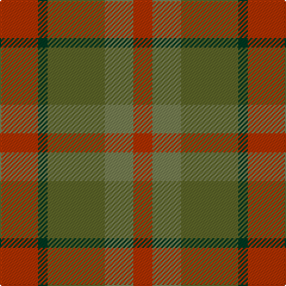

This page is one **sett** — a single exact thread-count. It belongs to the [tartan](/tartans/r4dg1yi6y3r2/)
(the same proportion at any scale), whose colour order is pattern [RGGGR](/stripes/rgggr/).

Sourced from register-of-tartans.  It is a [5 stripe tartan](/stripes/stripes5/).

Original link https://www.tartanregister.gov.uk/tartanDetails.aspx?ref=11573

## Register references

External register numbers recorded for this tartan.

- Scottish Register of Tartans: [11573](https://www.tartanregister.gov.uk/tartanDetails.aspx?ref=11573)

## Thread count
R/32 DG8 G48 Ga24 R/16

## Palette

Palette: <strong>Tartan Register</strong>
<table><thead><tr><th>Colour</th><th>Threads</th><th>Shade</th><th>Base</th><th>OKLCh</th></tr></thead><tbody><tr><td>R/</td><td style="text-align:right;font-variant-numeric:tabular-nums">32</td><td><code style="background-color:#B03000;">#B03000</code> <small style="color:#888">#B03000</small></td><td>R <code style="background-color:#CC0000;">#CC0000</code></td><td><small style="color:#888">oklch(50.3% 0.171 36.3)</small></td></tr><tr><td>DG</td><td style="text-align:right;font-variant-numeric:tabular-nums">8</td><td><code style="background-color:#003820;">#003820</code> <small style="color:#888">#003820</small></td><td>G <code style="background-color:#006100;">#006100</code></td><td><small style="color:#888">oklch(30.0% 0.070 158.3)</small></td></tr><tr><td>G</td><td style="text-align:right;font-variant-numeric:tabular-nums">48</td><td><code style="background-color:#5C6428;">#5C6428</code> <small style="color:#888">#5C6428</small></td><td>G <code style="background-color:#006100;">#006100</code></td><td><small style="color:#888">oklch(48.3% 0.084 116.0)</small></td></tr><tr><td>Ga</td><td style="text-align:right;font-variant-numeric:tabular-nums">24</td><td><code style="background-color:#767E52;">#767E52</code> <small style="color:#888">#767E52</small></td><td>G <code style="background-color:#006100;">#006100</code></td><td><small style="color:#888">oklch(57.5% 0.064 116.8)</small></td></tr><tr><td>R/</td><td style="text-align:right;font-variant-numeric:tabular-nums">16</td><td><code style="background-color:#B03000;">#B03000</code> <small style="color:#888">#B03000</small></td><td>R <code style="background-color:#CC0000;">#CC0000</code></td><td><small style="color:#888">oklch(50.3% 0.171 36.3)</small></td></tr></tbody></table>

# Sample pattern

## Nearest tartans

The nearest existing variants by ΔTartan distance, with this tartan at the top so the swatches line up against it.

ΔTartan

Tartan

Sett

—

<a href="/ttd/edit/#slug=r4dg1yi6y3r2~x8">Belladrum Estate</a> <a class="nn-out" href="/setts/s5/r4dg1yi6y3r2~x8/" title="open its dictionary page">↗</a>

1.84

<a href="/ttd/edit/#slug=r11dg1r3y7dg7dy5o3~x4">Caledonian Maple (Fashion)</a> <a class="nn-out" href="/setts/s7/r11dg1r3y7dg7dy5o3~x4/" title="open its dictionary page">↗</a>

1.89

<a href="/ttd/edit/#slug=dy4lg11dy14o30r4~x2">Trinity Bicycles</a> <a class="nn-out" href="/setts/s5/dy4lg11dy14o30r4~x2/" title="open its dictionary page">↗</a>

1.89

<a href="/ttd/edit/#slug=do10y24r3y3r24dg3y6do6~x2">Earle's Flame (Fashion)</a> <a class="nn-out" href="/setts/s8/do10y24r3y3r24dg3y6do6~x2/" title="open its dictionary page">↗</a>

1.90

<a href="/ttd/edit/#slug=dt1dy1dt7dy5y7lr1~x4">Dewar (WCWM)</a> <a class="nn-out" href="/setts/s6/dt1dy1dt7dy5y7lr1~x4/" title="open its dictionary page">↗</a>

1.95

<a href="/ttd/edit/#slug=dy1db3dy1dg3dy4r1~x2">Fraser Hunting #2</a> <a class="nn-out" href="/setts/s6/dy1db3dy1dg3dy4r1~x2/" title="open its dictionary page">↗</a>

1.97

<a href="/ttd/edit/#slug=dg2dp10dy15dg10dp2~x4">Harmony 6</a> <a class="nn-out" href="/setts/s5/dg2dp10dy15dg10dp2~x4/" title="open its dictionary page">↗</a>

2.02

<a href="/ttd/edit/#slug=o9oi9y9oii1t1oi9t1oii1~x4">Jardine of Castlemilk Family Tartan Tartan Number: 1432. Earliest known date: c.1978 The chiefly house is Jardine of Applegirth, a baronetcy created in 1672. The Jardines of Castlemilk in Dumfriesshire settled there in the early fourteenth century. The tartan is approved by Col Jardine. The darker brown is recorded as &quot;J.Br&quot;, and the lighter as &quot;Olive Br&quot; in the Lyon Books. See products available Copyright © Blair Urquhart, Comrie, 2015</a> <a class="nn-out" href="/setts/s8/o9oi9y9oii1t1oi9t1oii1~x4/" title="open its dictionary page">↗</a>

2.09

<a href="/ttd/edit/#slug=g7y6n7y1n2~x6">Bright of Garth (Personal)</a> <a class="nn-out" href="/setts/s5/g7y6n7y1n2~x6/" title="open its dictionary page">↗</a>

2.14

<a href="/ttd/edit/#slug=r3o23y8g6y8t6y10t12y3~x2">Lawrence's Seven Pillars of Khaki</a> <a class="nn-out" href="/setts/s9/r3o23y8g6y8t6y10t12y3~x2/" title="open its dictionary page">↗</a>

2.20

<a href="/ttd/edit/#slug=dg15r3n11b2~x2">MacNab WI 2</a> <a class="nn-out" href="/setts/s4/dg15r3n11b2~x2/" title="open its dictionary page">↗</a>

## Neighbour map

Every grey dot is one of 14359 variants placed by the first two principal components of the ΔTartan feature space (44% of its variance). Red is this tartan; blue dots are its nearest — click one to open its page.

<svg viewBox="0 0 640 380" role="img" style="max-width:100%;height:auto;border:1px solid #e0e0e0;border-radius:4px;display:block" xmlns="http://www.w3.org/2000/svg"><image href="/nn/cloud.v1.png" width="640" height="380"/><a href="/setts/s7/r11dg1r3y7dg7dy5o3~x4/"><circle cx="241.5" cy="251.2" r="4" fill="#3465a4"><title>Caledonian Maple (Fashion)</title></circle></a><a href="/setts/s5/dy4lg11dy14o30r4~x2/"><circle cx="317.1" cy="270.9" r="4" fill="#3465a4"><title>Trinity Bicycles</title></circle></a><a href="/setts/s8/do10y24r3y3r24dg3y6do6~x2/"><circle cx="341.5" cy="262.0" r="4" fill="#3465a4"><title>Earle's Flame (Fashion)</title></circle></a><a href="/setts/s6/dt1dy1dt7dy5y7lr1~x4/"><circle cx="256.3" cy="273.3" r="4" fill="#3465a4"><title>Dewar (WCWM)</title></circle></a><a href="/setts/s6/dy1db3dy1dg3dy4r1~x2/"><circle cx="271.2" cy="324.7" r="4" fill="#3465a4"><title>Fraser Hunting #2</title></circle></a><a href="/setts/s5/dg2dp10dy15dg10dp2~x4/"><circle cx="304.9" cy="310.3" r="4" fill="#3465a4"><title>Harmony 6</title></circle></a><a href="/setts/s8/o9oi9y9oii1t1oi9t1oii1~x4/"><circle cx="315.5" cy="241.3" r="4" fill="#3465a4"><title>Jardine of Castlemilk Family Tartan Tartan Number: 1432. Earliest known date: c.1978 The chiefly house is Jardine of Applegirth, a baronetcy created in 1672. The Jardines of Castlemilk in Dumfriesshire settled there in the early fourteenth century. The tartan is approved by Col Jardine. The darker brown is recorded as &quot;J.Br&quot;, and the lighter as &quot;Olive Br&quot; in the Lyon Books. See products available Copyright © Blair Urquhart, Comrie, 2015</title></circle></a><a href="/setts/s5/g7y6n7y1n2~x6/"><circle cx="302.2" cy="335.8" r="4" fill="#3465a4"><title>Bright of Garth (Personal)</title></circle></a><a href="/setts/s9/r3o23y8g6y8t6y10t12y3~x2/"><circle cx="256.8" cy="261.8" r="4" fill="#3465a4"><title>Lawrence's Seven Pillars of Khaki</title></circle></a><a href="/setts/s4/dg15r3n11b2~x2/"><circle cx="335.6" cy="300.7" r="4" fill="#3465a4"><title>MacNab WI 2</title></circle></a><circle cx="273.9" cy="316.0" r="5" fill="#c00000"/></svg>

ID: /setts/s5/r4dg1yi6y3r2~x8/
