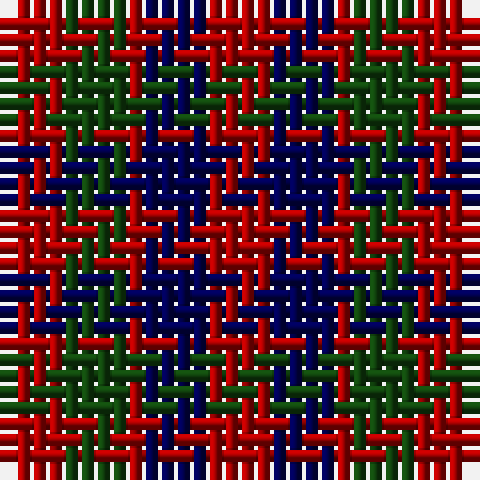

In pattern [RBRGR](/stripes/rbrgr/).

This was sourced from weddslist.  It is a [5 stripe tartan](/stripes/stripes5/).

Original link http://www.weddslist.com/cgi-bin/tartans/pg.pl?source=x

## Register references

External register numbers recorded for this tartan.

- Scottish Register of Tartans: [1166](https://www.tartanregister.gov.uk/tartanDetails.aspx?ref=1166)
- Scottish Register of Tartans: [1758](https://www.tartanregister.gov.uk/tartanDetails.aspx?ref=1758)
- Scottish Register of Tartans: [2307](https://www.tartanregister.gov.uk/tartanDetails.aspx?ref=2307)
- Scottish Register of Tartans: [2540](https://www.tartanregister.gov.uk/tartanDetails.aspx?ref=2540)
- Scottish Register of Tartans: [2625](https://www.tartanregister.gov.uk/tartanDetails.aspx?ref=2625)
- Scottish Register of Tartans: [2862](https://www.tartanregister.gov.uk/tartanDetails.aspx?ref=2862)
- Scottish Register of Tartans: [982](https://www.tartanregister.gov.uk/tartanDetails.aspx?ref=982)
- Scottish Tartans Authority (ITI): 1429
- Scottish Tartans Authority (ITI): 218
- Scottish Tartans World Register: 1042
- Scottish Tartans World Register: 127
- Scottish Tartans World Register: 1429
- Scottish Tartans World Register: 218
- Scottish Tartans World Register: 2218
- Scottish Tartans World Register: 737
- Scottish Tartans World Register: 897

## Thread count
DR/4 DG4 DR1 DB4 DR/4

## Palette
Each colour and its ΔE from the base-6 reference it is a variant of.

| Colour | Shade | Base | ΔE (OKLab) |
|---|---|---|---|
| DB | <code style="background-color:#000052;">#000052</code> `#000052` | B <code style="background-color:#2A418A;">#2A418A</code> | 0.20 |
| DG | <code style="background-color:#11450D;">#11450D</code> `#11450D` | G <code style="background-color:#006100;">#006100</code> | 0.09 |
| DR | <code style="background-color:#AA0000;">#AA0000</code> `#AA0000` | R <code style="background-color:#CC0000;">#CC0000</code> | 0.07 |

# Sample pattern

## Nearest tartans

The nearest existing variants by ΔTartan distance.

1. [Gow](/setts/s5/r4dg4r1db4r4~x4/) — ΔT 0.60
1. [Gow](/setts/s5/r4dg4r1db4r4~x2/) — ΔT 0.75
1. [MacGowan](/setts/s5/r4db4r1g4r4~x6/) — ΔT 0.84
1. [Gow (Portrait)](/setts/s5/r3dg3r1db3r3~x12/) — ΔT 0.93
1. [Tulsa, City of](/setts/s6/dg14db8dg14r14k3r14~x2/) — ΔT 1.37
1. [Unidentified (Gow-like)](/setts/s5/r3k10r10g10r3~x4/) — ΔT 1.48
1. [Menzies](/setts/s5/r5dg5lr1b2r5~x2/) — ΔT 1.58
1. [MacDuff #3](/setts/s7/r10db6k8dg10r6dg3r6~x2/) — ΔT 1.66
1. [Gow](/setts/s8/r4dg4r1db4r4~x12/) — ΔT 1.73
1. [Daks (Black)](/setts/s5/r3k6dy4k6y3~x2/) — ΔT 1.76

## Neighbour map

Every grey dot is one of 14299 variants placed by the first two principal components of the ΔTartan feature space (44% of its variance). Red is this tartan; blue dots are its nearest — click one to open its page.

<svg viewBox="0 0 640 380" role="img" style="max-width:100%;height:auto;border:1px solid #e0e0e0;border-radius:4px;display:block" xmlns="http://www.w3.org/2000/svg"><image href="/nn/cloud.v1.png" width="640" height="380"/><a href="/setts/s5/r4dg4r1db4r4~x4/"><circle cx="245.5" cy="320.3" r="4" fill="#3465a4"><title>Gow</title></circle></a><a href="/setts/s5/r4dg4r1db4r4~x2/"><circle cx="220.8" cy="309.4" r="4" fill="#3465a4"><title>Gow</title></circle></a><a href="/setts/s5/r4db4r1g4r4~x6/"><circle cx="239.2" cy="315.8" r="4" fill="#3465a4"><title>MacGowan</title></circle></a><a href="/setts/s5/r3dg3r1db3r3~x12/"><circle cx="240.9" cy="342.4" r="4" fill="#3465a4"><title>Gow (Portrait)</title></circle></a><a href="/setts/s6/dg14db8dg14r14k3r14~x2/"><circle cx="182.4" cy="290.0" r="4" fill="#3465a4"><title>Tulsa, City of</title></circle></a><a href="/setts/s5/r3k10r10g10r3~x4/"><circle cx="178.8" cy="296.9" r="4" fill="#3465a4"><title>Unidentified (Gow-like)</title></circle></a><a href="/setts/s5/r5dg5lr1b2r5~x2/"><circle cx="275.5" cy="283.8" r="4" fill="#3465a4"><title>Menzies</title></circle></a><a href="/setts/s7/r10db6k8dg10r6dg3r6~x2/"><circle cx="136.2" cy="289.3" r="4" fill="#3465a4"><title>MacDuff #3</title></circle></a><a href="/setts/s8/r4dg4r1db4r4~x12/"><circle cx="170.8" cy="295.3" r="4" fill="#3465a4"><title>Gow</title></circle></a><a href="/setts/s5/r3k6dy4k6y3~x2/"><circle cx="184.9" cy="348.2" r="4" fill="#3465a4"><title>Daks (Black)</title></circle></a><circle cx="239.2" cy="322.3" r="5" fill="#c00000"/></svg>

ID: /setts/s5/r4dg4r1db4r4/
