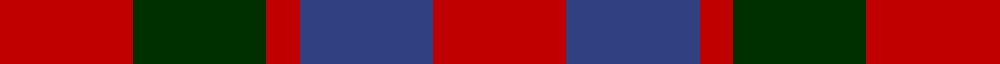
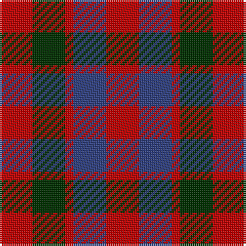

In pattern [RBRGR](/stripes/rbrgr/).

This was sourced from weddslist.  It is a [5 stripe tartan](/stripes/stripes5/).

Original link http://www.weddslist.com/cgi-bin/tartans/pg.pl?source=sts

## Attestations

This cloth appears in 2 source records; the oldest owns this page.

- undated — Gow (weddslist, [record](http://www.weddslist.com/cgi-bin/tartans/pg.pl?source=sts))
- undated — Gow Clan Tartan Tartan Number: 1390. Earliest known date: c.1815 This tartan can be seen in a portrait of Neil Gow, by Sir Henry Raeburn. Possibly the basis for the design of later tartans. The Gows or MacGowans were associated with the MacDonalds and the Clan Chattan. Gow is Gaelic for Smith meaning blacksmith. See products available Copyright © Blair Urquhart, Comrie, 2015 (house-of-tartan, [record](http://www.house-of-tartan.scotland.net/house/TartanViewjs.asp?colr=Def&tnam=1390))

## Thread count
R/16 DG16 R4 B16 R/16

## Palette
Each colour and the base-6 reference it is a variant of.

| Colour | Shade | Base |
|---|---|---|
| B | <code style="background-color:#304080;">#304080</code> `oklch(39.4% 0.109 270.2)` <small>#304080</small> | B <code style="background-color:#2A418A;">#2A418A</code> |
| DG | <code style="background-color:#003000;">#003000</code> `oklch(26.8% 0.091 142.5)` <small>#003000</small> | G <code style="background-color:#006100;">#006100</code> |
| R | <code style="background-color:#C00000;">#C00000</code> `oklch(50.7% 0.208 29.2)` <small>#C00000</small> | R <code style="background-color:#CC0000;">#CC0000</code> |

# Sample pattern

## Nearest tartans

The nearest existing variants by ΔTartan distance.

1. [MacGowan](/setts/s5/r4db4r1g4r4~x6/) — ΔT 0.39
1. [Gow](/setts/s5/r4dg4r1db4r4/) — ΔT 0.60
1. [Gow (Portrait)](/setts/s5/r3dg3r1db3r3~x12/) — ΔT 0.63
1. [Gow](/setts/s5/r4dg4r1db4r4~x2/) — ΔT 0.88
1. [Menzies](/setts/s5/r5dg5lr1b2r5~x2/) — ΔT 1.33
1. [Tulsa, City of](/setts/s6/dg14db8dg14r14k3r14~x2/) — ΔT 1.47
1. [MacDuff #3](/setts/s7/r10db6k8dg10r6dg3r6~x2/) — ΔT 1.65
1. [Unidentified (Gow-like)](/setts/s5/r3k10r10g10r3~x4/) — ΔT 1.71
1. [Fiddes (Corrected)](/setts/s7/g12r11dp12r3dp8g8dp8~x2/) — ΔT 1.72
1. [Gow](/setts/s8/r4dg4r1db4r4~x12/) — ΔT 1.75

## Neighbour map

Every grey dot is one of 14299 variants placed by the first two principal components of the ΔTartan feature space (44% of its variance). Red is this tartan; blue dots are its nearest — click one to open its page.

<svg viewBox="0 0 640 380" role="img" style="max-width:100%;height:auto;border:1px solid #e0e0e0;border-radius:4px;display:block" xmlns="http://www.w3.org/2000/svg"><image href="/nn/cloud.v1.png" width="640" height="380"/><a href="/setts/s5/r4db4r1g4r4~x6/"><circle cx="239.2" cy="315.8" r="4" fill="#3465a4"><title>MacGowan</title></circle></a><a href="/setts/s5/r4dg4r1db4r4/"><circle cx="239.2" cy="322.3" r="4" fill="#3465a4"><title>Gow</title></circle></a><a href="/setts/s5/r3dg3r1db3r3~x12/"><circle cx="240.9" cy="342.4" r="4" fill="#3465a4"><title>Gow (Portrait)</title></circle></a><a href="/setts/s5/r4dg4r1db4r4~x2/"><circle cx="220.8" cy="309.4" r="4" fill="#3465a4"><title>Gow</title></circle></a><a href="/setts/s5/r5dg5lr1b2r5~x2/"><circle cx="275.5" cy="283.8" r="4" fill="#3465a4"><title>Menzies</title></circle></a><a href="/setts/s6/dg14db8dg14r14k3r14~x2/"><circle cx="182.4" cy="290.0" r="4" fill="#3465a4"><title>Tulsa, City of</title></circle></a><a href="/setts/s7/r10db6k8dg10r6dg3r6~x2/"><circle cx="136.2" cy="289.3" r="4" fill="#3465a4"><title>MacDuff #3</title></circle></a><a href="/setts/s5/r3k10r10g10r3~x4/"><circle cx="178.8" cy="296.9" r="4" fill="#3465a4"><title>Unidentified (Gow-like)</title></circle></a><a href="/setts/s7/g12r11dp12r3dp8g8dp8~x2/"><circle cx="150.2" cy="281.0" r="4" fill="#3465a4"><title>Fiddes (Corrected)</title></circle></a><a href="/setts/s8/r4dg4r1db4r4~x12/"><circle cx="170.8" cy="295.3" r="4" fill="#3465a4"><title>Gow</title></circle></a><circle cx="245.5" cy="320.3" r="5" fill="#c00000"/></svg>

ID: /setts/s5/r4dg4r1db4r4~x4/
