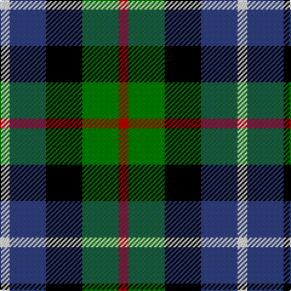

This page is one **sett** — a single exact thread-count. It belongs to the [tartan](/tartans/r4g15k15b15ln4/)
(the same proportion at any scale), whose colour order is pattern [RGKBW](/stripes/rgkbw/).

Sourced from weddslist.  It is a [5 stripe tartan](/stripes/stripes5/).

Original link http://www.weddslist.com/cgi-bin/tartans/pg.pl?source=sts

2 attestations — the source records this cloth was collapsed from (oldest owns this page)

<ul>
<li>undated — Dalmeny (weddslist, <a href="http://www.weddslist.com/cgi-bin/tartans/pg.pl?source=sts">record</a>)</li>
<li>undated — Dalmeny (Wlison's) Family Tartan Tartan Number: 1480. Earliest known date: 1819 Restricted See products available Copyright © Blair Urquhart, Comrie, 2015 (house-of-tartan, <a href="http://www.house-of-tartan.scotland.net/house/TartanViewjs.asp?colr=Def&tnam=1480">record</a>)</li>
</ul>

## Thread count
R/8 G30 K30 B30 LN/8

## Palette
Each colour and the base-6 reference it is a variant of.

| Colour | Shade | Base |
|---|---|---|
| B | <code style="background-color:#304080;">#304080</code> `oklch(39.4% 0.109 270.2)` <small>#304080</small> | B <code style="background-color:#2A418A;">#2A418A</code> |
| G | <code style="background-color:#008000;">#008000</code> `oklch(52.0% 0.177 142.5)` <small>#008000</small> | G <code style="background-color:#006100;">#006100</code> |
| K | <code style="background-color:#000000;">#000000</code> `oklch(0.0% 0.000 0.0)` <small>#000000</small> | K <code style="background-color:#000000;">#000000</code> |
| LN | <code style="background-color:#E0E0E0;">#E0E0E0</code> `oklch(90.7% 0.000 89.9)` <small>#E0E0E0</small> | W <code style="background-color:#F7F7F7;">#F7F7F7</code> |
| R | <code style="background-color:#C00000;">#C00000</code> `oklch(50.7% 0.208 29.2)` <small>#C00000</small> | R <code style="background-color:#CC0000;">#CC0000</code> |

# Sample pattern

## Nearest tartans

The nearest existing variants by ΔTartan distance, with this tartan at the top so the swatches line up against it.

ΔTartan

Tartan

Sett

—

<a href="/ttd/edit/#slug=r4g15k15db15w4~x2">Dalmeny</a> <a class="nn-out" href="/setts/s5/r4g15k15db15w4~x2/" title="open its dictionary page">↗</a>

0.72

<a href="/ttd/edit/#slug=t3g8k9db7r2db2~x2">Wellington, or Waterloo</a> <a class="nn-out" href="/setts/s6/t3g8k9db7r2db2~x2/" title="open its dictionary page">↗</a>

0.88

<a href="/ttd/edit/#slug=k3g10k10r3db8w3~x2">Russell (Clan)</a> <a class="nn-out" href="/setts/s6/k3g10k10r3db8w3~x2/" title="open its dictionary page">↗</a>

0.93

<a href="/ttd/edit/#slug=k4g16k14ly3db16r4~x2">Birse</a> <a class="nn-out" href="/setts/s6/k4g16k14ly3db16r4~x2/" title="open its dictionary page">↗</a>

0.94

<a href="/ttd/edit/#slug=r4g11k11g2db11y3~x4">Casely</a> <a class="nn-out" href="/setts/s6/r4g11k11g2db11y3~x4/" title="open its dictionary page">↗</a>

1.08

<a href="/ttd/edit/#slug=p11t2k10g10ly2~x2">Wilson's, No 217</a> <a class="nn-out" href="/setts/s5/p11t2k10g10ly2~x2/" title="open its dictionary page">↗</a>

1.16

<a href="/ttd/edit/#slug=k2g8k7db8r2~x2">Denholme</a> <a class="nn-out" href="/setts/s5/k2g8k7db8r2~x2/" title="open its dictionary page">↗</a>

1.16

<a href="/ttd/edit/#slug=lr4g17k17db17r3db3~x2">Royal Highland</a> <a class="nn-out" href="/setts/s6/lr4g17k17db17r3db3~x2/" title="open its dictionary page">↗</a>

1.18

<a href="/ttd/edit/#slug=k3r1g5k3w1p3~x2">Wilson's, No 194</a> <a class="nn-out" href="/setts/s6/k3r1g5k3w1p3~x2/" title="open its dictionary page">↗</a>

1.19

<a href="/ttd/edit/#slug=k3g8k8r2db8w2~x2">Mitchell Family Tartan Tartan Number: 2142. Earliest known date: 1816-20 Named in honour of General Billy Mitchell when it was adopted as the tartan of the United States Air Force pipe band. The sett is also known as Russell, Hunter and Galbraith. The earliest reference to the tartan is in the collection of the Highland Society of London where it is labelled Galbraith. See products available Copyright © Blair Urquhart, Comrie, 2015</a> <a class="nn-out" href="/setts/s6/k3g8k8r2db8w2~x2/" title="open its dictionary page">↗</a>

1.25

<a href="/ttd/edit/#slug=k6b2db12g8r5k2g3~x4">Cooke</a> <a class="nn-out" href="/setts/s7/k6b2db12g8r5k2g3~x4/" title="open its dictionary page">↗</a>

## Neighbour map

Every grey dot is one of 14299 variants placed by the first two principal components of the ΔTartan feature space (44% of its variance). Red is this tartan; blue dots are its nearest — click one to open its page.

<svg viewBox="0 0 640 380" role="img" style="max-width:100%;height:auto;border:1px solid #e0e0e0;border-radius:4px;display:block" xmlns="http://www.w3.org/2000/svg"><image href="/nn/cloud.v1.png" width="640" height="380"/><a href="/setts/s6/t3g8k9db7r2db2~x2/"><circle cx="57.1" cy="245.0" r="4" fill="#3465a4"><title>Wellington, or Waterloo</title></circle></a><a href="/setts/s6/k3g10k10r3db8w3~x2/"><circle cx="67.4" cy="257.5" r="4" fill="#3465a4"><title>Russell (Clan)</title></circle></a><a href="/setts/s6/k4g16k14ly3db16r4~x2/"><circle cx="77.6" cy="229.3" r="4" fill="#3465a4"><title>Birse</title></circle></a><a href="/setts/s6/r4g11k11g2db11y3~x4/"><circle cx="73.5" cy="236.1" r="4" fill="#3465a4"><title>Casely</title></circle></a><a href="/setts/s5/p11t2k10g10ly2~x2/"><circle cx="80.0" cy="232.2" r="4" fill="#3465a4"><title>Wilson's, No 217</title></circle></a><a href="/setts/s5/k2g8k7db8r2~x2/"><circle cx="98.7" cy="279.6" r="4" fill="#3465a4"><title>Denholme</title></circle></a><a href="/setts/s6/lr4g17k17db17r3db3~x2/"><circle cx="93.4" cy="223.9" r="4" fill="#3465a4"><title>Royal Highland</title></circle></a><a href="/setts/s6/k3r1g5k3w1p3~x2/"><circle cx="85.0" cy="237.5" r="4" fill="#3465a4"><title>Wilson's, No 194</title></circle></a><a href="/setts/s6/k3g8k8r2db8w2~x2/"><circle cx="94.8" cy="256.0" r="4" fill="#3465a4"><title>Mitchell Family Tartan Tartan Number: 2142. Earliest known date: 1816-20 Named in honour of General Billy Mitchell when it was adopted as the tartan of the United States Air Force pipe band. The sett is also known as Russell, Hunter and Galbraith. The earliest reference to the tartan is in the collection of the Highland Society of London where it is labelled Galbraith. See products available Copyright © Blair Urquhart, Comrie, 2015</title></circle></a><a href="/setts/s7/k6b2db12g8r5k2g3~x4/"><circle cx="81.8" cy="219.3" r="4" fill="#3465a4"><title>Cooke</title></circle></a><circle cx="36.3" cy="258.5" r="5" fill="#c00000"/></svg>

ID: /setts/s5/r4g15k15db15w4~x2/
