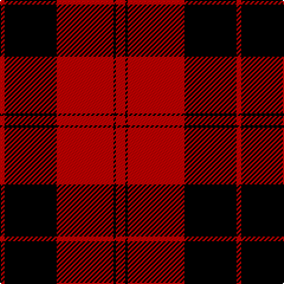

In pattern [RKRKR](/patterns/rkrkr/).

This was sourced from weddslist.  It is a [5 stripes tartan](/stripes/stripes5/).

Original link http://www.weddslist.com/cgi-bin/tartans/pg.pl?source=sts

## Thread count
R/4 K44 R48 K2 R/8

## Palette
Each colour and its ΔE from the base-6 reference it is a variant of.

| Colour | Shade | Base | ΔE (OKLab) |
|---|---|---|---|
| K | <code style="background-color:#000000;">#000000</code> `#000000` | K <code style="background-color:#000000;">#000000</code> | 0.00 |
| R | <code style="background-color:#C00000;">#C00000</code> `#C00000` | R <code style="background-color:#CC0000;">#CC0000</code> | 0.03 |

# Sample pattern

## Nearest tartans

The nearest existing variants by ΔTartan distance.

1. [Ewing](/setts/s6/k23r3k1r12k1r3x4~k101010-rdc0000/) — ΔT 1.00
1. [Campbell Red (artefact)](/setts/s5/r4k1r24k22r2x2~k101010-rdc0000/) — ΔT 1.07
1. [Aragon (Erskine)](/setts/s6/k6r1k24r28k1r4x2~k101010-rc80000/) — ΔT 1.19
1. [Campbell of Armaddie](/setts/s5/r4k1r12k12r2x2~k000000-rc80000/) — ΔT 1.22
1. [Ewing (Clan)](/setts/s6/k23r3k1r12k1r3x4~k101010-rc80000/) — ΔT 1.23
1. [MacLeod, Black & Red](/setts/s5/r8k1r8k12r1x2~k000000-rc00000/) — ΔT 1.32
1. [MacIver](/setts/s5/k16r2k2r12w1x2~k000000-rc00000-we0e0e0/) — ΔT 1.32
1. [Ramsay of Dalhousie](/setts/s6/k4w2k28r30k1r3x2~k000000-rc00000-we0e0e0/) — ΔT 1.34
1. [MacIver](/setts/s5/k16r2k2r12w1x2~k101010-rdc0000-we0e0e0/) — ΔT 1.36
1. [Masai Shuka 15 (Artefact)](/setts/s5/r20k2r2k15w1x2~k101010-rc80000-we0e0e0/) — ΔT 1.38

## Neighbour map

Every grey dot is one of 15726 variants placed by the first two principal components of the ΔTartan feature space (44% of its variance). Red is this tartan; blue dots are its nearest — click one to open its page.

<svg viewBox="0 0 640 380" role="img" style="max-width:100%;height:auto;border:1px solid #e0e0e0;border-radius:4px;display:block" xmlns="http://www.w3.org/2000/svg"><image href="/nn/cloud.v1.png" width="640" height="380"/><a href="/setts/s6/k23r3k1r12k1r3x4~k101010-rdc0000/"><circle cx="430.3" cy="190.9" r="4" fill="#3465a4"><title>Ewing</title></circle></a><a href="/setts/s5/r4k1r24k22r2x2~k101010-rdc0000/"><circle cx="421.1" cy="200.7" r="4" fill="#3465a4"><title>Campbell Red (artefact)</title></circle></a><a href="/setts/s6/k6r1k24r28k1r4x2~k101010-rc80000/"><circle cx="416.4" cy="189.3" r="4" fill="#3465a4"><title>Aragon (Erskine)</title></circle></a><a href="/setts/s5/r4k1r12k12r2x2~k000000-rc80000/"><circle cx="373.5" cy="239.6" r="4" fill="#3465a4"><title>Campbell of Armaddie</title></circle></a><a href="/setts/s6/k23r3k1r12k1r3x4~k101010-rc80000/"><circle cx="439.6" cy="196.2" r="4" fill="#3465a4"><title>Ewing (Clan)</title></circle></a><a href="/setts/s5/r8k1r8k12r1x2~k000000-rc00000/"><circle cx="363.7" cy="246.8" r="4" fill="#3465a4"><title>MacLeod, Black &amp; Red</title></circle></a><a href="/setts/s5/k16r2k2r12w1x2~k000000-rc00000-we0e0e0/"><circle cx="349.6" cy="205.4" r="4" fill="#3465a4"><title>MacIver</title></circle></a><a href="/setts/s6/k4w2k28r30k1r3x2~k000000-rc00000-we0e0e0/"><circle cx="359.7" cy="160.3" r="4" fill="#3465a4"><title>Ramsay of Dalhousie</title></circle></a><a href="/setts/s5/k16r2k2r12w1x2~k101010-rdc0000-we0e0e0/"><circle cx="359.6" cy="202.3" r="4" fill="#3465a4"><title>MacIver</title></circle></a><a href="/setts/s5/r20k2r2k15w1x2~k101010-rc80000-we0e0e0/"><circle cx="386.2" cy="190.8" r="4" fill="#3465a4"><title>Masai Shuka 15 (Artefact)</title></circle></a><circle cx="408.4" cy="202.7" r="5" fill="#c00000"/></svg>

ID: /setts/s5/r4k1r24k22r2x2~k000000-rc00000/
