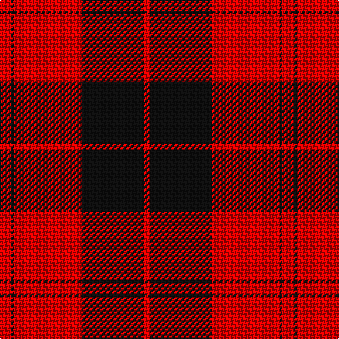

In pattern [RKRKR](/stripes/rkrkr/).

This was sourced from register-of-tartans.  It is a [5 stripe tartan](/stripes/stripes5/).

Original link https://www.tartanregister.gov.uk/tartanDetails.aspx?ref=528

## Also known as

This cloth is also recorded under:

- Campbell, Red

## Attestations

This cloth appears in 2 source records; the oldest owns this page.

- undated — Campbell Red (artefact) (register-of-tartans, [record](https://www.tartanregister.gov.uk/tartanDetails.aspx?ref=528))
- undated — Campbell, Red (weddslist, [record](http://www.weddslist.com/cgi-bin/tartans/pg.pl?source=sts))

## Register references

External register numbers recorded for this tartan.

- Scottish Register of Tartans: [528](https://www.tartanregister.gov.uk/tartanDetails.aspx?ref=528)
- Scottish Tartans World Register: 1592

## Thread count
R/8 K2 R48 K44 R/4

## Palette
Each colour and the base-6 reference it is a variant of.

| Colour | Shade | Base |
|---|---|---|
| K | <code style="background-color:#101010;">#101010</code> `oklch(17.3% 0.000 89.9)` <small>#101010</small> | K <code style="background-color:#000000;">#000000</code> |
| R | <code style="background-color:#DC0000;">#DC0000</code> `oklch(56.2% 0.230 29.2)` <small>#DC0000</small> | R <code style="background-color:#CC0000;">#CC0000</code> |

# Sample pattern

## Nearest tartans

The nearest existing variants by ΔTartan distance, with this tartan at the top so the swatches line up against it.

ΔTartan

Tartan

Sett

—

<a href="/ttd/edit/#slug=r4k1r24k22r2~x2">Campbell Red (artefact)</a> <a class="nn-out" href="/setts/s5/r4k1r24k22r2~x2/" title="open its dictionary page">↗</a>

0.88

<a href="/ttd/edit/#slug=k6r1k24r28k1r4~x2">Aragon (Erskine)</a> <a class="nn-out" href="/setts/s6/k6r1k24r28k1r4~x2/" title="open its dictionary page">↗</a>

0.98

<a href="/ttd/edit/#slug=r20k2r2k15w1~x2">Masai Shuka 15 (Artefact)</a> <a class="nn-out" href="/setts/s5/r20k2r2k15w1~x2/" title="open its dictionary page">↗</a>

1.00

<a href="/ttd/edit/#slug=r36k18r4k7w2~x2">Hopkins (Name)</a> <a class="nn-out" href="/setts/s5/r36k18r4k7w2~x2/" title="open its dictionary page">↗</a>

1.05

<a href="/setts/s6/k23r3k1r12~x4/">Ewing</a>

1.29

<a href="/ttd/edit/#slug=r42k2w2k18w2k5~x2">Forget Family (Red)</a> <a class="nn-out" href="/setts/s6/r42k2w2k18w2k5~x2/" title="open its dictionary page">↗</a>

1.29

<a href="/ttd/edit/#slug=k22w1k12r43w1~x2">Knights Templar Htg (Corporate)</a> <a class="nn-out" href="/setts/s5/k22w1k12r43w1~x2/" title="open its dictionary page">↗</a>

1.30

<a href="/ttd/edit/#slug=r41k19r7k9w3~x2">MacGregor, Black (Personal)</a> <a class="nn-out" href="/setts/s5/r41k19r7k9w3~x2/" title="open its dictionary page">↗</a>

1.32

<a href="/ttd/edit/#slug=r8k1r8k12r1~x2">MacLeod Black &amp; Red</a> <a class="nn-out" href="/setts/s5/r8k1r8k12r1~x2/" title="open its dictionary page">↗</a>

1.34

<a href="/ttd/edit/#slug=k16r2k2r12w1~x2">MacIver</a> <a class="nn-out" href="/setts/s5/k16r2k2r12w1~x2/" title="open its dictionary page">↗</a>

1.36

<a href="/ttd/edit/#slug=k4w2k28r30k1r3~x2">Ramsay of Dalhousie</a> <a class="nn-out" href="/setts/s6/k4w2k28r30k1r3~x2/" title="open its dictionary page">↗</a>

## Neighbour map

Every grey dot is one of 14299 variants placed by the first two principal components of the ΔTartan feature space (44% of its variance). Red is this tartan; blue dots are its nearest — click one to open its page.

<svg viewBox="0 0 640 380" role="img" style="max-width:100%;height:auto;border:1px solid #e0e0e0;border-radius:4px;display:block" xmlns="http://www.w3.org/2000/svg"><image href="/nn/cloud.v1.png" width="640" height="380"/><a href="/setts/s6/k6r1k24r28k1r4~x2/"><circle cx="416.7" cy="183.0" r="4" fill="#3465a4"><title>Aragon (Erskine)</title></circle></a><a href="/setts/s5/r20k2r2k15w1~x2/"><circle cx="386.4" cy="183.9" r="4" fill="#3465a4"><title>Masai Shuka 15 (Artefact)</title></circle></a><a href="/setts/s5/r36k18r4k7w2~x2/"><circle cx="399.6" cy="189.5" r="4" fill="#3465a4"><title>Hopkins (Name)</title></circle></a><a href="/setts/s6/k23r3k1r12~x4/"><circle cx="431.0" cy="183.7" r="4" fill="#3465a4"><title>Ewing</title></circle></a><a href="/setts/s6/r42k2w2k18w2k5~x2/"><circle cx="401.4" cy="150.9" r="4" fill="#3465a4"><title>Forget Family (Red)</title></circle></a><a href="/setts/s5/k22w1k12r43w1~x2/"><circle cx="410.0" cy="156.2" r="4" fill="#3465a4"><title>Knights Templar Htg (Corporate)</title></circle></a><a href="/setts/s5/r41k19r7k9w3~x2/"><circle cx="382.7" cy="201.8" r="4" fill="#3465a4"><title>MacGregor, Black (Personal)</title></circle></a><a href="/setts/s5/r8k1r8k12r1~x2/"><circle cx="376.2" cy="236.1" r="4" fill="#3465a4"><title>MacLeod Black &amp; Red</title></circle></a><a href="/setts/s5/k16r2k2r12w1~x2/"><circle cx="360.3" cy="195.2" r="4" fill="#3465a4"><title>MacIver</title></circle></a><a href="/setts/s6/k4w2k28r30k1r3~x2/"><circle cx="370.8" cy="150.7" r="4" fill="#3465a4"><title>Ramsay of Dalhousie</title></circle></a><circle cx="420.9" cy="192.1" r="5" fill="#c00000"/></svg>

ID: /setts/s5/r4k1r24k22r2~x2/
