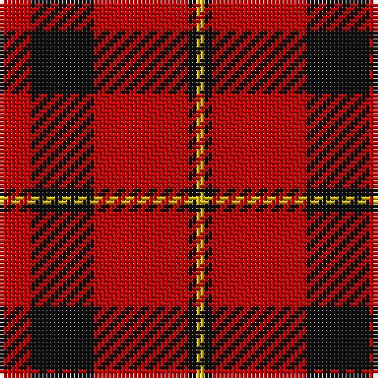

**Bands:** [RKRKY](/stripes/rkrky/) · **Stripes:** [R K R K LY](/stripes/stripes5/) R K R K LY

This was sourced from register-of-tartans.  It is a [5 band tartan](/bands/bands5/).

Original link https://www.tartanregister.gov.uk/tartanDetails.aspx?ref=2512

## Register references

External register numbers recorded for this tartan.

- Scottish Register of Tartans: [2512](https://www.tartanregister.gov.uk/tartanDetails.aspx?ref=2512)
- Scottish Tartans Authority (ITI): 1608
- Scottish Tartans World Register: 1608

## Variants

Other setts woven to the same stripe pattern.

- [Haig & Haig Whisky (Corporate)](/setts/s5/r26k18r7k4ly4~x2/)

## Thread count
R/8 K16 R24 K2 Y/2

## Palette
Each colour and its ΔE from the base-6 reference it is a variant of.

| Colour | Shade | Base | ΔE (OKLab) |
|---|---|---|---|
| K | <code style="background-color:#101010;">#101010</code> `#101010` | K <code style="background-color:#000000;">#000000</code> | 0.17 |
| R | <code style="background-color:#C80000;">#C80000</code> `#C80000` | R <code style="background-color:#CC0000;">#CC0000</code> | 0.01 |
| Y | <code style="background-color:#E8C000;">#E8C000</code> `#E8C000` | Y <code style="background-color:#F2BF00;">#F2BF00</code> | 0.02 |

# Sample pattern

## Nearest tartans

The nearest existing variants by ΔTartan distance.

1. [MacGregor, Black (Personal)](/setts/s5/r41k19r7k9w3~x2/) — ΔT 0.37
1. [Hopkins (Name)](/setts/s5/r36k18r4k7w2~x2/) — ΔT 0.77
1. [Auld Reekie](/setts/s6/db4r3db3r22dg8r2~x2/) — ΔT 0.96
1. [Dunbar (District)](/setts/s4/r28k4w2k13~x2/) — ΔT 0.97
1. [MacLeod Black & Red](/setts/s5/r8k1r8k12r1~x2/) — ΔT 1.04
1. [MacQuarrie 5](/setts/s7/r4g5r2k6r18k2r4~x2/) — ΔT 1.10
1. [Glen Shiel (Fashion)](/setts/s5/r13lb3r1dg3lb1~x6/) — ΔT 1.15
1. [MacQuarrie #7](/setts/s7/r4dg5r2k6r18k2r4~x2/) — ΔT 1.17
1. [Masai Shuka 15 (Artefact)](/setts/s5/r20k2r2k15w1~x2/) — ΔT 1.17
1. [Haig & Haig Whisky (Corporate)](/setts/s5/r26k18r7k4ly4~x2/) — ΔT 1.17

## Neighbour map

Every grey dot is one of 14299 variants placed by the first two principal components of the ΔTartan feature space (44% of its variance). Red is this tartan; blue dots are its nearest — click one to open its page.

<svg viewBox="0 0 640 380" role="img" style="max-width:100%;height:auto;border:1px solid #e0e0e0;border-radius:4px;display:block" xmlns="http://www.w3.org/2000/svg"><image href="/nn/cloud.v1.png" width="640" height="380"/><a href="/setts/s5/r41k19r7k9w3~x2/"><circle cx="382.7" cy="201.8" r="4" fill="#3465a4"><title>MacGregor, Black (Personal)</title></circle></a><a href="/setts/s5/r36k18r4k7w2~x2/"><circle cx="399.6" cy="189.5" r="4" fill="#3465a4"><title>Hopkins (Name)</title></circle></a><a href="/setts/s6/db4r3db3r22dg8r2~x2/"><circle cx="400.1" cy="201.9" r="4" fill="#3465a4"><title>Auld Reekie</title></circle></a><a href="/setts/s4/r28k4w2k13~x2/"><circle cx="375.2" cy="209.8" r="4" fill="#3465a4"><title>Dunbar (District)</title></circle></a><a href="/setts/s5/r8k1r8k12r1~x2/"><circle cx="376.2" cy="236.1" r="4" fill="#3465a4"><title>MacLeod Black &amp; Red</title></circle></a><a href="/setts/s7/r4g5r2k6r18k2r4~x2/"><circle cx="390.1" cy="200.8" r="4" fill="#3465a4"><title>MacQuarrie 5</title></circle></a><a href="/setts/s5/r13lb3r1dg3lb1~x6/"><circle cx="418.3" cy="192.4" r="4" fill="#3465a4"><title>Glen Shiel (Fashion)</title></circle></a><a href="/setts/s7/r4dg5r2k6r18k2r4~x2/"><circle cx="408.1" cy="203.4" r="4" fill="#3465a4"><title>MacQuarrie #7</title></circle></a><a href="/setts/s5/r20k2r2k15w1~x2/"><circle cx="386.4" cy="183.9" r="4" fill="#3465a4"><title>Masai Shuka 15 (Artefact)</title></circle></a><a href="/setts/s5/r26k18r7k4ly4~x2/"><circle cx="314.1" cy="238.2" r="4" fill="#3465a4"><title>Haig &amp; Haig Whisky (Corporate)</title></circle></a><circle cx="384.8" cy="212.9" r="5" fill="#c00000"/></svg>

ID: /setts/s5/r4k8r12k1ly1~x2/
