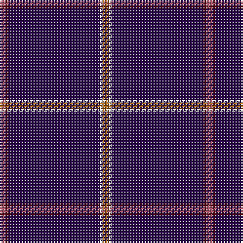

In pattern [RBBWR](/patterns/rbbwr/).

This was sourced from register-of-tartans.  It is a [5 stripes tartan](/stripes/stripes5/).

Original link https://www.tartanregister.gov.uk/tartanDetails.aspx?ref=10522

## Thread count
LT/4 DR2 DB60 W2 T/4

## Palette
Each colour and its ΔE from the base-6 reference it is a variant of.

| Colour | Shade | Base | ΔE (OKLab) |
|---|---|---|---|
| DB | <code style="background-color:#2A074B;">#2A074B</code> `#2A074B` | B <code style="background-color:#2C4084;">#2C4084</code> | 0.17 |
| DR | <code style="background-color:#530014;">#530014</code> `#530014` | B <code style="background-color:#2C4084;">#2C4084</code> | 0.22 |
| LT | <code style="background-color:#AE566C;">#AE566C</code> `#AE566C` | R <code style="background-color:#C80000;">#C80000</code> | 0.12 |
| T | <code style="background-color:#A46216;">#A46216</code> `#A46216` | R <code style="background-color:#C80000;">#C80000</code> | 0.14 |
| W | <code style="background-color:#FFFFFF;">#FFFFFF</code> `#FFFFFF` | W <code style="background-color:#F4F4F0;">#F4F4F0</code> | 0.03 |

# Sample pattern

ID: /setts/s5/r4w2b60ba2ra4-b2a074b-ba530014-ra46216-raae566c-wffffff/
