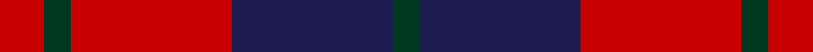

In pattern [GBRGR](/stripes/gbrgr/).

This was sourced from register-of-tartans.  It is a [5 stripe tartan](/stripes/stripes5/).

Original link https://www.tartanregister.gov.uk/tartanDetails.aspx?ref=4784

## Attestations

This cloth appears in 2 source records; the oldest owns this page.

- 01/01/1979 — Wotherspoon (register-of-tartans, [record](https://www.tartanregister.gov.uk/tartanDetails.aspx?ref=4784))
- pre 1979 — Wotherspoon (Clan) (tartans-authority, [record](http://www.tartansauthority.com/tartan-ferret/display/741/))

## Register references

External register numbers recorded for this tartan.

- Scottish Register of Tartans: [4784](https://www.tartanregister.gov.uk/tartanDetails.aspx?ref=4784)
- Scottish Tartans Authority (ITI): 741
- Scottish Tartans World Register: 741

## Thread count
R/20 DG12 R72 DB72 DG/12

## Palette
Each colour and the base-6 reference it is a variant of.

| Colour | Shade | Base |
|---|---|---|
| DB | <code style="background-color:#1C1C50;">#1C1C50</code> `oklch(26.2% 0.093 277.9)` <small>#1C1C50</small> | B <code style="background-color:#2A418A;">#2A418A</code> |
| DG | <code style="background-color:#003820;">#003820</code> `oklch(30.0% 0.070 158.3)` <small>#003820</small> | G <code style="background-color:#006100;">#006100</code> |
| R | <code style="background-color:#C80000;">#C80000</code> `oklch(52.3% 0.215 29.2)` <small>#C80000</small> | R <code style="background-color:#CC0000;">#CC0000</code> |

# Sample pattern

## Nearest tartans

The nearest existing variants by ΔTartan distance, with this tartan at the top so the swatches line up against it.

ΔTartan

Tartan

Sett

—

<a href="/ttd/edit/#slug=r5dg3r18db18dg3~x4">Wotherspoon</a> <a class="nn-out" href="/setts/s5/r5dg3r18db18dg3~x4/" title="open its dictionary page">↗</a>

1.11

<a href="/ttd/edit/#slug=db6r39db10r10db21ly5~x2">Rajput</a> <a class="nn-out" href="/setts/s6/db6r39db10r10db21ly5~x2/" title="open its dictionary page">↗</a>

1.12

<a href="/ttd/edit/#slug=r12g8r54db45g6">Wotherspoon</a> <a class="nn-out" href="/setts/s5/r12g8r54db45g6/" title="open its dictionary page">↗</a>

1.16

<a href="/ttd/edit/#slug=db8r2db8r15w2~x4">Hamilton (Clan)</a> <a class="nn-out" href="/setts/s5/db8r2db8r15w2~x4/" title="open its dictionary page">↗</a>

1.21

<a href="/ttd/edit/#slug=r12db2r12db17w2r2~x2">British European</a> <a class="nn-out" href="/setts/s6/r12db2r12db17w2r2~x2/" title="open its dictionary page">↗</a>

1.21

<a href="/ttd/edit/#slug=r12db2r12db17w2r2~x4">British European (Corporate)</a> <a class="nn-out" href="/setts/s6/r12db2r12db17w2r2~x4/" title="open its dictionary page">↗</a>

1.21

<a href="/ttd/edit/#slug=db4r30k6db13k13db3~x2">Thompson/Thomson/MacTavish (Bonner)</a> <a class="nn-out" href="/setts/s6/db4r30k6db13k13db3~x2/" title="open its dictionary page">↗</a>

1.27

<a href="/ttd/edit/#slug=dg3dp3dg19dp18r19dp3~x2">MacNab (Macgregor - Hastie)</a> <a class="nn-out" href="/setts/s6/dg3dp3dg19dp18r19dp3~x2/" title="open its dictionary page">↗</a>

1.29

<a href="/ttd/edit/#slug=db3r25db17r5g22r9db3~x2">MacFadyan (MacGregor Hastie)</a> <a class="nn-out" href="/setts/s7/db3r25db17r5g22r9db3~x2/" title="open its dictionary page">↗</a>

1.31

<a href="/ttd/edit/#slug=db6r1db6r9w1~x2">Hamilton, (Red)</a> <a class="nn-out" href="/setts/s5/db6r1db6r9w1~x2/" title="open its dictionary page">↗</a>

1.34

<a href="/ttd/edit/#slug=r3k25r25k10lb3~x2">Bodog.com</a> <a class="nn-out" href="/setts/s5/r3k25r25k10lb3~x2/" title="open its dictionary page">↗</a>

## Neighbour map

Every grey dot is one of 14299 variants placed by the first two principal components of the ΔTartan feature space (44% of its variance). Red is this tartan; blue dots are its nearest — click one to open its page.

<svg viewBox="0 0 640 380" role="img" style="max-width:100%;height:auto;border:1px solid #e0e0e0;border-radius:4px;display:block" xmlns="http://www.w3.org/2000/svg"><image href="/nn/cloud.v1.png" width="640" height="380"/><a href="/setts/s6/db6r39db10r10db21ly5~x2/"><circle cx="349.0" cy="247.3" r="4" fill="#3465a4"><title>Rajput</title></circle></a><a href="/setts/s5/r12g8r54db45g6/"><circle cx="341.4" cy="240.6" r="4" fill="#3465a4"><title>Wotherspoon</title></circle></a><a href="/setts/s5/db8r2db8r15w2~x4/"><circle cx="295.5" cy="245.1" r="4" fill="#3465a4"><title>Hamilton (Clan)</title></circle></a><a href="/setts/s6/r12db2r12db17w2r2~x2/"><circle cx="347.9" cy="235.0" r="4" fill="#3465a4"><title>British European</title></circle></a><a href="/setts/s6/r12db2r12db17w2r2~x4/"><circle cx="347.9" cy="235.0" r="4" fill="#3465a4"><title>British European (Corporate)</title></circle></a><a href="/setts/s6/db4r30k6db13k13db3~x2/"><circle cx="255.9" cy="216.2" r="4" fill="#3465a4"><title>Thompson/Thomson/MacTavish (Bonner)</title></circle></a><a href="/setts/s6/dg3dp3dg19dp18r19dp3~x2/"><circle cx="226.3" cy="251.0" r="4" fill="#3465a4"><title>MacNab (Macgregor - Hastie)</title></circle></a><a href="/setts/s7/db3r25db17r5g22r9db3~x2/"><circle cx="266.1" cy="233.3" r="4" fill="#3465a4"><title>MacFadyan (MacGregor Hastie)</title></circle></a><a href="/setts/s5/db6r1db6r9w1~x2/"><circle cx="332.6" cy="250.7" r="4" fill="#3465a4"><title>Hamilton, (Red)</title></circle></a><a href="/setts/s5/r3k25r25k10lb3~x2/"><circle cx="317.5" cy="237.3" r="4" fill="#3465a4"><title>Bodog.com</title></circle></a><circle cx="290.4" cy="255.8" r="5" fill="#c00000"/></svg>

ID: /setts/s5/r5dg3r18db18dg3~x4/
