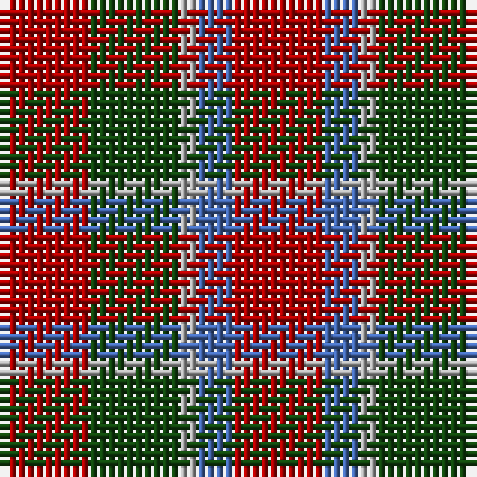

This page is one **sett** — a single exact thread-count. It belongs to the [tartan](/tartans/dr5dg5n1b2dr5/)
(the same proportion at any scale), whose colour order is pattern [RBYGR](/stripes/rbygr/).

Sourced from weddslist.  It is a [5 stripe tartan](/stripes/stripes5/).

Original link http://www.weddslist.com/cgi-bin/tartans/pg.pl?source=tinsel

2 attestations — the source records this cloth was collapsed from (oldest owns this page)

<ul>
<li>undated — Menzies (weddslist, <a href="http://www.weddslist.com/cgi-bin/tartans/pg.pl?source=tinsel">record</a>)</li>
<li>undated — Menzies (weddslist, <a href="http://www.weddslist.com/cgi-bin/tartans/pg.pl?source=x">record</a>)</li>
</ul>

## Thread count
DR/10 DG10 N2 B4 DR/10

## Palette
Each colour and the base-6 reference it is a variant of.

| Colour | Shade | Base |
|---|---|---|
| B | <code style="background-color:#4367AE;">#4367AE</code> `oklch(52.2% 0.120 262.7)` <small>#4367AE</small> | B <code style="background-color:#2A418A;">#2A418A</code> |
| DG | <code style="background-color:#11450D;">#11450D</code> `oklch(34.4% 0.101 142.1)` <small>#11450D</small> | G <code style="background-color:#006100;">#006100</code> |
| DR | <code style="background-color:#AA0000;">#AA0000</code> `oklch(46.3% 0.190 29.2)` <small>#AA0000</small> | R <code style="background-color:#CC0000;">#CC0000</code> |
| N | <code style="background-color:#AAAAAA;">#AAAAAA</code> `oklch(73.8% 0.000 89.9)` <small>#AAAAAA</small> | Y <code style="background-color:#F2BF00;">#F2BF00</code> |

# Sample pattern

## Nearest tartans

The nearest existing variants by ΔTartan distance, with this tartan at the top so the swatches line up against it.

ΔTartan

Tartan

Sett

—

<a href="/ttd/edit/#slug=r5dg5lr1b2r5~x2">Menzies</a> <a class="nn-out" href="/setts/s5/r5dg5lr1b2r5~x2/" title="open its dictionary page">↗</a>

1.28

<a href="/ttd/edit/#slug=r6g1r6db1g3k3g3~x4">MacTavish</a> <a class="nn-out" href="/setts/s7/r6g1r6db1g3k3g3~x4/" title="open its dictionary page">↗</a>

1.33

<a href="/ttd/edit/#slug=r4dg4r1db4r4~x4">Gow</a> <a class="nn-out" href="/setts/s5/r4dg4r1db4r4~x4/" title="open its dictionary page">↗</a>

1.35

<a href="/ttd/edit/#slug=r4db4r1g4r4~x6">MacGowan</a> <a class="nn-out" href="/setts/s5/r4db4r1g4r4~x6/" title="open its dictionary page">↗</a>

1.38

<a href="/ttd/edit/#slug=k13r40o13o8~x2">Maryville College</a> <a class="nn-out" href="/setts/s4/k13r40o13o8~x2/" title="open its dictionary page">↗</a>

1.41

<a href="/ttd/edit/#slug=r8db3k4g6r4k1r4~x4">MacDuff Clan Tartan Tartan Number: 2141. Earliest known date: 1831 According to D.C.Stewart, &quot;It will be observed that the MacDuff tartan is substantially the Royal Stuart with the white and yellow lines removed. Whether this indicates it as a source of the Stuart, or the association of the Earls of Fife with the Crown, remains to be determined.&quot; James Logan published this sett in his book, 'The Scottish Gael' in 1831. See products available Copyright © Blair Urquhart, Comrie, 2015</a> <a class="nn-out" href="/setts/s7/r8db3k4g6r4k1r4~x4/" title="open its dictionary page">↗</a>

1.43

<a href="/ttd/edit/#slug=r6dg13k5r20w3~x2">Ryutokukan Junior High School</a> <a class="nn-out" href="/setts/s5/r6dg13k5r20w3~x2/" title="open its dictionary page">↗</a>

1.58

<a href="/ttd/edit/#slug=r4dg4r1db4r4">Gow</a> <a class="nn-out" href="/setts/s5/r4dg4r1db4r4/" title="open its dictionary page">↗</a>

1.58

<a href="/ttd/edit/#slug=dg14db8dg14r14k3r14~x2">Tulsa, City of</a> <a class="nn-out" href="/setts/s6/dg14db8dg14r14k3r14~x2/" title="open its dictionary page">↗</a>

1.60

<a href="/ttd/edit/#slug=r3dg3r1db3r3~x12">Gow (Portrait)</a> <a class="nn-out" href="/setts/s5/r3dg3r1db3r3~x12/" title="open its dictionary page">↗</a>

1.61

<a href="/ttd/edit/#slug=r8t3k4dg6r4k1r4~x2">MacDuff #5</a> <a class="nn-out" href="/setts/s7/r8t3k4dg6r4k1r4~x2/" title="open its dictionary page">↗</a>

## Neighbour map

Every grey dot is one of 14299 variants placed by the first two principal components of the ΔTartan feature space (44% of its variance). Red is this tartan; blue dots are its nearest — click one to open its page.

<svg viewBox="0 0 640 380" role="img" style="max-width:100%;height:auto;border:1px solid #e0e0e0;border-radius:4px;display:block" xmlns="http://www.w3.org/2000/svg"><image href="/nn/cloud.v1.png" width="640" height="380"/><a href="/setts/s7/r6g1r6db1g3k3g3~x4/"><circle cx="247.0" cy="240.2" r="4" fill="#3465a4"><title>MacTavish</title></circle></a><a href="/setts/s5/r4dg4r1db4r4~x4/"><circle cx="245.5" cy="320.3" r="4" fill="#3465a4"><title>Gow</title></circle></a><a href="/setts/s5/r4db4r1g4r4~x6/"><circle cx="239.2" cy="315.8" r="4" fill="#3465a4"><title>MacGowan</title></circle></a><a href="/setts/s4/k13r40o13o8~x2/"><circle cx="276.9" cy="261.2" r="4" fill="#3465a4"><title>Maryville College</title></circle></a><a href="/setts/s7/r8db3k4g6r4k1r4~x4/"><circle cx="239.9" cy="239.5" r="4" fill="#3465a4"><title>MacDuff Clan Tartan Tartan Number: 2141. Earliest known date: 1831 According to D.C.Stewart, &quot;It will be observed that the MacDuff tartan is substantially the Royal Stuart with the white and yellow lines removed. Whether this indicates it as a source of the Stuart, or the association of the Earls of Fife with the Crown, remains to be determined.&quot; James Logan published this sett in his book, 'The Scottish Gael' in 1831. See products available Copyright © Blair Urquhart, Comrie, 2015</title></circle></a><a href="/setts/s5/r6dg13k5r20w3~x2/"><circle cx="280.7" cy="246.2" r="4" fill="#3465a4"><title>Ryutokukan Junior High School</title></circle></a><a href="/setts/s5/r4dg4r1db4r4/"><circle cx="239.2" cy="322.3" r="4" fill="#3465a4"><title>Gow</title></circle></a><a href="/setts/s6/dg14db8dg14r14k3r14~x2/"><circle cx="182.4" cy="290.0" r="4" fill="#3465a4"><title>Tulsa, City of</title></circle></a><a href="/setts/s5/r3dg3r1db3r3~x12/"><circle cx="240.9" cy="342.4" r="4" fill="#3465a4"><title>Gow (Portrait)</title></circle></a><a href="/setts/s7/r8t3k4dg6r4k1r4~x2/"><circle cx="231.8" cy="232.8" r="4" fill="#3465a4"><title>MacDuff #5</title></circle></a><circle cx="275.5" cy="283.8" r="5" fill="#c00000"/></svg>

ID: /setts/s5/r5dg5lr1b2r5~x2/
