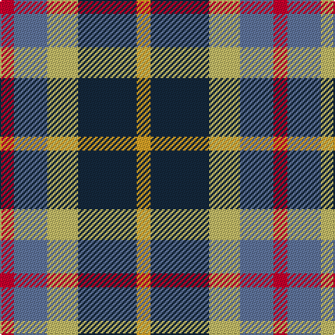

In pattern [RBYBY](/stripes/rbyby/).

This was sourced from register-of-tartans.  It is a [5 stripe tartan](/stripes/stripes5/).

Original link https://www.tartanregister.gov.uk/tartanDetails.aspx?ref=10893

## Register references

External register numbers recorded for this tartan.

- Scottish Register of Tartans: [10893](https://www.tartanregister.gov.uk/tartanDetails.aspx?ref=10893)

## Thread count
R/10 B24 LG22 DN42 Y/10

## Palette
Each colour and the base-6 reference it is a variant of.

| Colour | Shade | Base |
|---|---|---|
| B | <code style="background-color:#5F749C;">#5F749C</code> `oklch(55.8% 0.067 262.9)` <small>#5F749C</small> | B <code style="background-color:#2A418A;">#2A418A</code> |
| DN | <code style="background-color:#14283C;">#14283C</code> `oklch(27.1% 0.046 249.9)` <small>#14283C</small> | B <code style="background-color:#2A418A;">#2A418A</code> |
| LG | <code style="background-color:#C4BC68;">#C4BC68</code> `oklch(78.4% 0.107 103.7)` <small>#C4BC68</small> | Y <code style="background-color:#F2BF00;">#F2BF00</code> |
| R | <code style="background-color:#C8002C;">#C8002C</code> `oklch(52.6% 0.212 22.0)` <small>#C8002C</small> | R <code style="background-color:#CC0000;">#CC0000</code> |
| Y | <code style="background-color:#E0A126;">#E0A126</code> `oklch(75.1% 0.146 78.3)` <small>#E0A126</small> | Y <code style="background-color:#F2BF00;">#F2BF00</code> |

# Sample pattern

## Nearest tartans

The nearest existing variants by ΔTartan distance, with this tartan at the top so the swatches line up against it.

ΔTartan

Tartan

Sett

—

<a href="/ttd/edit/#slug=r5t12ly11dt21lo5~x2">Inspiration</a> <a class="nn-out" href="/setts/s5/r5t12ly11dt21lo5~x2/" title="open its dictionary page">↗</a>

0.70

<a href="/ttd/edit/#slug=r5db12ly11n21ly5~x2">Inspiration</a> <a class="nn-out" href="/setts/s5/r5db12ly11n21ly5~x2/" title="open its dictionary page">↗</a>

0.94

<a href="/ttd/edit/#slug=k19t10dp19g40ly10">Gallowater Old District Tartan Tartan Number: 1025. Earliest known date: 1819 Both 'Old' and 'New' appear in Wilson's 1819 pattern book. See products available Copyright © Blair Urquhart, Comrie, 2015</a> <a class="nn-out" href="/setts/s5/k19t10dp19g40ly10/" title="open its dictionary page">↗</a>

0.97

<a href="/ttd/edit/#slug=r13lo13g13db22w4~x2">Clan Haggis World (Corporate)</a> <a class="nn-out" href="/setts/s5/r13lo13g13db22w4~x2/" title="open its dictionary page">↗</a>

1.03

<a href="/ttd/edit/#slug=g15dg18db23w4r8~x2">Friebe (2014)</a> <a class="nn-out" href="/setts/s5/g15dg18db23w4r8~x2/" title="open its dictionary page">↗</a>

1.04

<a href="/ttd/edit/#slug=w14k30b9r8o9~x2">Heidrick Family (Personal)</a> <a class="nn-out" href="/setts/s5/w14k30b9r8o9~x2/" title="open its dictionary page">↗</a>

1.06

<a href="/ttd/edit/#slug=r1dy6db2lb4k4lb1~x6">Thompson's Fancy (Fashion)</a> <a class="nn-out" href="/setts/s6/r1dy6db2lb4k4lb1~x6/" title="open its dictionary page">↗</a>

1.16

<a href="/ttd/edit/#slug=k19t10dp19dg40ly10">Gala Water Old</a> <a class="nn-out" href="/setts/s5/k19t10dp19dg40ly10/" title="open its dictionary page">↗</a>

1.16

<a href="/ttd/edit/#slug=o12k4w2y6r3~x2">Strathblane</a> <a class="nn-out" href="/setts/s5/o12k4w2y6r3~x2/" title="open its dictionary page">↗</a>

1.16

<a href="/ttd/edit/#slug=db2g4ly1db1r2~x12">Creek Indian Nation</a> <a class="nn-out" href="/setts/s5/db2g4ly1db1r2~x12/" title="open its dictionary page">↗</a>

1.18

<a href="/ttd/edit/#slug=k4t3g12p13ly2~x2">Wilson's, No 176</a> <a class="nn-out" href="/setts/s5/k4t3g12p13ly2~x2/" title="open its dictionary page">↗</a>

## Neighbour map

Every grey dot is one of 14299 variants placed by the first two principal components of the ΔTartan feature space (44% of its variance). Red is this tartan; blue dots are its nearest — click one to open its page.

<svg viewBox="0 0 640 380" role="img" style="max-width:100%;height:auto;border:1px solid #e0e0e0;border-radius:4px;display:block" xmlns="http://www.w3.org/2000/svg"><image href="/nn/cloud.v1.png" width="640" height="380"/><a href="/setts/s5/r5db12ly11n21ly5~x2/"><circle cx="95.1" cy="239.9" r="4" fill="#3465a4"><title>Inspiration</title></circle></a><a href="/setts/s5/k19t10dp19g40ly10/"><circle cx="108.8" cy="255.8" r="4" fill="#3465a4"><title>Gallowater Old District Tartan Tartan Number: 1025. Earliest known date: 1819 Both 'Old' and 'New' appear in Wilson's 1819 pattern book. See products available Copyright © Blair Urquhart, Comrie, 2015</title></circle></a><a href="/setts/s5/r13lo13g13db22w4~x2/"><circle cx="72.6" cy="245.5" r="4" fill="#3465a4"><title>Clan Haggis World (Corporate)</title></circle></a><a href="/setts/s5/g15dg18db23w4r8~x2/"><circle cx="91.2" cy="249.9" r="4" fill="#3465a4"><title>Friebe (2014)</title></circle></a><a href="/setts/s5/w14k30b9r8o9~x2/"><circle cx="96.2" cy="233.6" r="4" fill="#3465a4"><title>Heidrick Family (Personal)</title></circle></a><a href="/setts/s6/r1dy6db2lb4k4lb1~x6/"><circle cx="87.7" cy="218.9" r="4" fill="#3465a4"><title>Thompson's Fancy (Fashion)</title></circle></a><a href="/setts/s5/k19t10dp19dg40ly10/"><circle cx="113.5" cy="261.2" r="4" fill="#3465a4"><title>Gala Water Old</title></circle></a><a href="/setts/s5/o12k4w2y6r3~x2/"><circle cx="158.1" cy="221.4" r="4" fill="#3465a4"><title>Strathblane</title></circle></a><a href="/setts/s5/db2g4ly1db1r2~x12/"><circle cx="144.5" cy="273.3" r="4" fill="#3465a4"><title>Creek Indian Nation</title></circle></a><a href="/setts/s5/k4t3g12p13ly2~x2/"><circle cx="135.6" cy="215.8" r="4" fill="#3465a4"><title>Wilson's, No 176</title></circle></a><circle cx="98.1" cy="246.4" r="5" fill="#c00000"/></svg>

ID: /setts/s5/r5t12ly11dt21lo5~x2/
