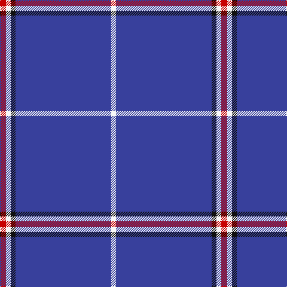

This page is one **sett** — a single exact thread-count. It belongs to the [tartan](/tartans/r5w4k4db80w4/)
(the same proportion at any scale), whose colour order is pattern [RWKBW](/stripes/rwkbw/).

Sourced from tartans-authority.  It is a [5 stripe tartan](/stripes/stripes5/).

Original link http://www.tartansauthority.com/tartan-ferret/display/8152/

## Register references

External register numbers recorded for this tartan.

- Scottish Register of Tartans: [8152](https://www.tartanregister.gov.uk/tartanDetails?ref=8152)
- Scottish Tartans Authority (ITI): 8152

## Thread count
R/10 W8 K8 B160 W/8

## Palette

Palette: <strong>Tartan Register</strong> <small style="color:#888">(3 of 4 colours)</small>
<table><thead><tr><th>Colour</th><th>Threads</th><th>Shade</th><th>Base</th><th>OKLCh</th></tr></thead><tbody><tr><td>R/</td><td style="text-align:right;font-variant-numeric:tabular-nums">10</td><td><code style="background-color:#C80000;">#C80000</code> <small style="color:#888">#C80000</small></td><td>R <code style="background-color:#CC0000;">#CC0000</code></td><td><small style="color:#888">oklch(52.3% 0.215 29.2)</small></td></tr><tr><td>W</td><td style="text-align:right;font-variant-numeric:tabular-nums">8</td><td><code style="background-color:#F8F8F8;">#F8F8F8</code> <small style="color:#888">#F8F8F8</small></td><td>W <code style="background-color:#F7F7F7;">#F7F7F7</code></td><td><small style="color:#888">oklch(97.9% 0.000 89.9)</small></td></tr><tr><td>K</td><td style="text-align:right;font-variant-numeric:tabular-nums">8</td><td><code style="background-color:#101010;">#101010</code> <small style="color:#888">#101010</small></td><td>K <code style="background-color:#000000;">#000000</code></td><td><small style="color:#888">oklch(17.3% 0.000 89.9)</small></td></tr><tr><td>B</td><td style="text-align:right;font-variant-numeric:tabular-nums">160</td><td><code style="background-color:#38409C;">#38409C</code> <small style="color:#888">#38409C</small></td><td>B <code style="background-color:#2A418A;">#2A418A</code></td><td><small style="color:#888">oklch(42.1% 0.148 274.4)</small></td></tr><tr><td>W/</td><td style="text-align:right;font-variant-numeric:tabular-nums">8</td><td><code style="background-color:#F8F8F8;">#F8F8F8</code> <small style="color:#888">#F8F8F8</small></td><td>W <code style="background-color:#F7F7F7;">#F7F7F7</code></td><td><small style="color:#888">oklch(97.9% 0.000 89.9)</small></td></tr></tbody></table>

# Sample pattern

## Nearest tartans

The nearest existing variants by ΔTartan distance, with this tartan at the top so the swatches line up against it.

ΔTartan

Tartan

Sett

—

<a href="/ttd/edit/#slug=r5w4k4db80w4~x2">Volunteer Lifesaving Corps (Corp.)</a> <a class="nn-out" href="/setts/s5/r5w4k4db80w4~x2/" title="open its dictionary page">↗</a>

1.36

<a href="/ttd/edit/#slug=db32r3db4k1ly3~x2">MacLaine of Lochbuie, hunting</a> <a class="nn-out" href="/setts/s5/db32r3db4k1ly3~x2/" title="open its dictionary page">↗</a>

1.50

<a href="/ttd/edit/#slug=db61w4db2w7p2g3ly2db16~x2">Boat of Garten (District)</a> <a class="nn-out" href="/setts/s8/db61w4db2w7p2g3ly2db16~x2/" title="open its dictionary page">↗</a>

1.53

<a href="/ttd/edit/#slug=w2db49r5ly2r5ly2~x2">Balmer (Personal)</a> <a class="nn-out" href="/setts/s6/w2db49r5ly2r5ly2~x2/" title="open its dictionary page">↗</a>

1.54

<a href="/ttd/edit/#slug=db48w2db7w2db7w2db20t11r2~x2">RAAF #4</a> <a class="nn-out" href="/setts/s9/db48w2db7w2db7w2db20t11r2~x2/" title="open its dictionary page">↗</a>

1.59

<a href="/ttd/edit/#slug=r2k6db33w2~x4">McCallie</a> <a class="nn-out" href="/setts/s4/r2k6db33w2~x4/" title="open its dictionary page">↗</a>

1.63

<a href="/ttd/edit/#slug=db35w4db10ri3r3ri3~x4">Steffen, Morris (Personal)</a> <a class="nn-out" href="/setts/s6/db35w4db10ri3r3ri3~x4/" title="open its dictionary page">↗</a>

1.68

<a href="/ttd/edit/#slug=db100t10k5t10r8">Waugh (Name)</a> <a class="nn-out" href="/setts/s5/db100t10k5t10r8/" title="open its dictionary page">↗</a>

1.71

<a href="/ttd/edit/#slug=db122r11w4r15ly4db6ly4db30">Inverness, Duke of York</a> <a class="nn-out" href="/setts/s8/db122r11w4r15ly4db6ly4db30/" title="open its dictionary page">↗</a>

1.73

<a href="/ttd/edit/#slug=db61r6w2r8lo2db3lo2db15~x2">Duke of York (Royal)</a> <a class="nn-out" href="/setts/s8/db61r6w2r8lo2db3lo2db15~x2/" title="open its dictionary page">↗</a>

1.77

<a href="/ttd/edit/#slug=db32r3db4k1ly3">MacLaine of Lochbuie Hunting</a> <a class="nn-out" href="/setts/s5/db32r3db4k1ly3/" title="open its dictionary page">↗</a>

## Neighbour map

Every grey dot is one of 14359 variants placed by the first two principal components of the ΔTartan feature space (44% of its variance). Red is this tartan; blue dots are its nearest — click one to open its page.

<svg viewBox="0 0 640 380" role="img" style="max-width:100%;height:auto;border:1px solid #e0e0e0;border-radius:4px;display:block" xmlns="http://www.w3.org/2000/svg"><image href="/nn/cloud.v1.png" width="640" height="380"/><a href="/setts/s5/db32r3db4k1ly3~x2/"><circle cx="596.1" cy="164.5" r="4" fill="#3465a4"><title>MacLaine of Lochbuie, hunting</title></circle></a><a href="/setts/s8/db61w4db2w7p2g3ly2db16~x2/"><circle cx="533.5" cy="111.6" r="4" fill="#3465a4"><title>Boat of Garten (District)</title></circle></a><a href="/setts/s6/w2db49r5ly2r5ly2~x2/"><circle cx="507.6" cy="140.8" r="4" fill="#3465a4"><title>Balmer (Personal)</title></circle></a><a href="/setts/s9/db48w2db7w2db7w2db20t11r2~x2/"><circle cx="548.7" cy="158.2" r="4" fill="#3465a4"><title>RAAF #4</title></circle></a><a href="/setts/s4/r2k6db33w2~x4/"><circle cx="506.8" cy="205.3" r="4" fill="#3465a4"><title>McCallie</title></circle></a><a href="/setts/s6/db35w4db10ri3r3ri3~x4/"><circle cx="493.9" cy="197.1" r="4" fill="#3465a4"><title>Steffen, Morris (Personal)</title></circle></a><a href="/setts/s5/db100t10k5t10r8/"><circle cx="511.7" cy="184.1" r="4" fill="#3465a4"><title>Waugh (Name)</title></circle></a><a href="/setts/s8/db122r11w4r15ly4db6ly4db30/"><circle cx="575.0" cy="137.9" r="4" fill="#3465a4"><title>Inverness, Duke of York</title></circle></a><a href="/setts/s8/db61r6w2r8lo2db3lo2db15~x2/"><circle cx="550.4" cy="141.9" r="4" fill="#3465a4"><title>Duke of York (Royal)</title></circle></a><a href="/setts/s5/db32r3db4k1ly3/"><circle cx="574.8" cy="166.1" r="4" fill="#3465a4"><title>MacLaine of Lochbuie Hunting</title></circle></a><circle cx="560.8" cy="163.3" r="5" fill="#c00000"/></svg>

ID: /setts/s5/r5w4k4db80w4~x2/
