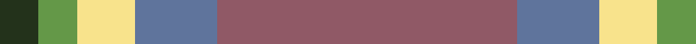

In pattern [GGYBR](/patterns/ggybr/).

This was sourced from register-of-tartans.  It is a [5 stripes tartan](/stripes/stripes5/).

Original link https://www.tartanregister.gov.uk/tartanDetails.aspx?ref=10229

## Register references

External register numbers recorded for this tartan.

- Scottish Register of Tartans: [10229](https://www.tartanregister.gov.uk/tartanDetails.aspx?ref=10229)

## Thread count
K/16 LG16 LY24 B34 LT/124

## Palette
Each colour and its ΔE from the base-6 reference it is a variant of.

| Colour | Shade | Base | ΔE (OKLab) |
|---|---|---|---|
| B | <code style="background-color:#5F749C;">#5F749C</code> `#5F749C` | B <code style="background-color:#2A418A;">#2A418A</code> | 0.17 |
| K | <code style="background-color:#23321B;">#23321B</code> `#23321B` | G <code style="background-color:#006100;">#006100</code> | 0.16 |
| LG | <code style="background-color:#649848;">#649848</code> `#649848` | G <code style="background-color:#006100;">#006100</code> | 0.20 |
| LT | <code style="background-color:#905966;">#905966</code> `#905966` | R <code style="background-color:#CC0000;">#CC0000</code> | 0.15 |
| LY | <code style="background-color:#F8E38C;">#F8E38C</code> `#F8E38C` | Y <code style="background-color:#F2BF00;">#F2BF00</code> | 0.11 |

# Sample pattern

## Nearest tartans

The nearest existing variants by ΔTartan distance.

1. [Lochnagar Plaid (District)](/setts/s6/w1b1r7ba4r1w1~b780078-ba5c5c5c-r888888-we0e0e0~x4/) — ΔT 1.30
1. [Bagpipe Shop (Switzerland)](/setts/s5/b10w3y3g1r1~b646464-g4ca412-rff0000-wf8f4d0-ya4a8a8~x10/) — ΔT 1.34
1. [Bagpipe Shop (Corporate)](/setts/s5/b10w3wa3g1r1~b5c5c5c-g289c18-rc80000-we0e0e0-wac0c0c0~x10/) — ΔT 1.38
1. [Balfour blue & brown](/setts/s6/b18y2r6y2r19ra3~b304080-r806050-rac00000-yf0c000~x2/) — ΔT 1.39
1. [Duminiak (Personal)](/setts/s6/r47w6ra24w3b5y3~b003c64-r888888-rac80000-we0e0e0-ybc8c00~x2/) — ΔT 1.42
1. [Celtic Norse Heritage Society](/setts/s5/r10k1b3g3y1~b2c2c80-g006818-k101010-r888888-yfccc00~x6/) — ΔT 1.46
1. [Duminiak (Trevose, Pennsylvania)](/setts/s6/g47w6r24w3b5y3~b433a5a-g6a5e47-rb62531-we5e0d2-ye0a126~x2/) — ΔT 1.46
1. [Un-named Dutch](/setts/s7/b2r10b10ra3r2y24w2~b5c5c5c-r880000-ra888888-wf8f8f8-ya0a0a0~x2/) — ΔT 1.56
1. [Hutcheson (Name)](/setts/s6/b8g4r30ga30y3ga4~b003c64-g789484-ga00643c-rcc4438-ydc943c~x2/) — ΔT 1.64
1. [Sterling, Rob (Florida) (Persona Name Tartan Tartan Number: 10653. Earliest known date: 10/07/2012 Designed by Rob Sterling, St. Petersburg, Florida, for use by his family and associates. See products available Copyright © Blair Urquhart, Comrie, 2015](/setts/s5/g11y10b11ba33w3~b433a5a-ba5f749c-g649848-wf9f5ef-ye0a126~x2/) — ΔT 1.67

## Neighbour map

Every grey dot is one of 15726 variants placed by the first two principal components of the ΔTartan feature space (44% of its variance). Red is this tartan; blue dots are its nearest — click one to open its page.

<svg viewBox="0 0 640 380" role="img" style="max-width:100%;height:auto;border:1px solid #e0e0e0;border-radius:4px;display:block" xmlns="http://www.w3.org/2000/svg"><image href="/nn/cloud.v1.png" width="640" height="380"/><a href="/setts/s6/w1b1r7ba4r1w1~b780078-ba5c5c5c-r888888-we0e0e0~x4/"><circle cx="310.0" cy="226.8" r="4" fill="#3465a4"><title>Lochnagar Plaid (District)</title></circle></a><a href="/setts/s5/b10w3y3g1r1~b646464-g4ca412-rff0000-wf8f4d0-ya4a8a8~x10/"><circle cx="276.6" cy="188.7" r="4" fill="#3465a4"><title>Bagpipe Shop (Switzerland)</title></circle></a><a href="/setts/s5/b10w3wa3g1r1~b5c5c5c-g289c18-rc80000-we0e0e0-wac0c0c0~x10/"><circle cx="273.4" cy="188.7" r="4" fill="#3465a4"><title>Bagpipe Shop (Corporate)</title></circle></a><a href="/setts/s6/b18y2r6y2r19ra3~b304080-r806050-rac00000-yf0c000~x2/"><circle cx="316.2" cy="222.9" r="4" fill="#3465a4"><title>Balfour blue &amp; brown</title></circle></a><a href="/setts/s6/r47w6ra24w3b5y3~b003c64-r888888-rac80000-we0e0e0-ybc8c00~x2/"><circle cx="325.2" cy="157.3" r="4" fill="#3465a4"><title>Duminiak (Personal)</title></circle></a><a href="/setts/s5/r10k1b3g3y1~b2c2c80-g006818-k101010-r888888-yfccc00~x6/"><circle cx="279.7" cy="198.0" r="4" fill="#3465a4"><title>Celtic Norse Heritage Society</title></circle></a><a href="/setts/s6/g47w6r24w3b5y3~b433a5a-g6a5e47-rb62531-we5e0d2-ye0a126~x2/"><circle cx="335.1" cy="164.4" r="4" fill="#3465a4"><title>Duminiak (Trevose, Pennsylvania)</title></circle></a><a href="/setts/s7/b2r10b10ra3r2y24w2~b5c5c5c-r880000-ra888888-wf8f8f8-ya0a0a0~x2/"><circle cx="250.2" cy="166.9" r="4" fill="#3465a4"><title>Un-named Dutch</title></circle></a><a href="/setts/s6/b8g4r30ga30y3ga4~b003c64-g789484-ga00643c-rcc4438-ydc943c~x2/"><circle cx="254.7" cy="196.1" r="4" fill="#3465a4"><title>Hutcheson (Name)</title></circle></a><a href="/setts/s5/g11y10b11ba33w3~b433a5a-ba5f749c-g649848-wf9f5ef-ye0a126~x2/"><circle cx="240.9" cy="210.9" r="4" fill="#3465a4"><title>Sterling, Rob (Florida) (Persona Name Tartan Tartan Number: 10653. Earliest known date: 10/07/2012 Designed by Rob Sterling, St. Petersburg, Florida, for use by his family and associates. See products available Copyright © Blair Urquhart, Comrie, 2015</title></circle></a><circle cx="314.7" cy="207.5" r="5" fill="#c00000"/></svg>

ID: /setts/s5/r62b17y12g8ga8~b5f749c-g649848-ga23321b-r905966-yf8e38c~x2/
