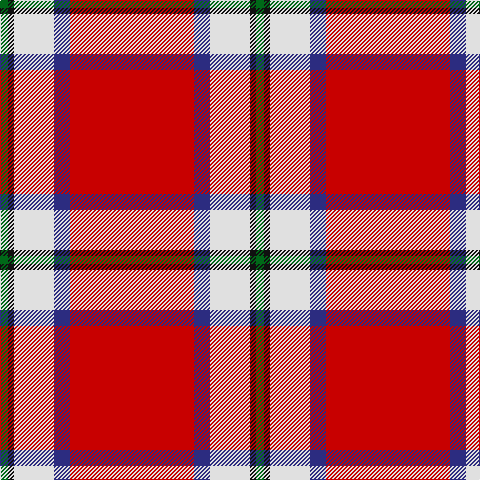

In pattern [GKWBR](/patterns/gkwbr/).

This was sourced from tartans-authority.  It is a [5 stripes tartan](/stripes/stripes5/).

Original link http://www.tartansauthority.com/tartan-ferret/display/8082/

## Thread count
G/8 K6 LN40 DB16 R/124

## Palette
Each colour and its ΔE from the base-6 reference it is a variant of.

| Colour | Shade | Base | ΔE (OKLab) |
|---|---|---|---|
| DB | <code style="background-color:#2C2C80;">#2C2C80</code> `#2C2C80` | B <code style="background-color:#2A418A;">#2A418A</code> | 0.06 |
| G | <code style="background-color:#006818;">#006818</code> `#006818` | G <code style="background-color:#006100;">#006100</code> | 0.02 |
| K | <code style="background-color:#101010;">#101010</code> `#101010` | K <code style="background-color:#000000;">#000000</code> | 0.17 |
| LN | <code style="background-color:#E0E0E0;">#E0E0E0</code> `#E0E0E0` | W <code style="background-color:#F7F7F7;">#F7F7F7</code> | 0.07 |
| R | <code style="background-color:#C80000;">#C80000</code> `#C80000` | R <code style="background-color:#CC0000;">#CC0000</code> | 0.01 |

# Sample pattern

## Nearest tartans

The nearest existing variants by ΔTartan distance.

1. [Sildesalaten](/setts/s5/r32w4b7y2ba2~b2f2f4f-ba2888c4-rc80000-wffffff-yffe600~x5/) — ΔT 0.71
1. [Sildesalaten](/setts/s5/r32w4b7y2ba2~b003c64-ba2888c4-rc80000-we8ccb8-yfccc00~x5/) — ΔT 0.92
1. [Turner (Personal)](/setts/s5/r48k12ra7k5w3~k101010-rc80000-ra888888-wfcfcfc~x2/) — ΔT 1.29
1. [Solberg-Wormald (Personal)](/setts/s7/r155w16k34b48r18y6r9~b240090-k101010-rc80000-w98c8e8-ye8c000/) — ΔT 1.29
1. [Brock University Alumni Association](/setts/s6/r52y2b16y2b3w5~b000080-rc80000-wfcfcfc-yd87c00~x2/) — ΔT 1.42
1. [Texas Lone Star (Fashion)](/setts/s7/r50b14w6b9y3b4r4~b202060-rc80000-wfcfcfc-ybc8c00~x2/) — ΔT 1.48
1. [Loch Lochy](/setts/s8/r6g14r6b11r31w2r4y3~b002699-g03522b-rd91828-wc0c0c0-ye8c000~x2/) — ΔT 1.48
1. [MacGregor](/setts/s6/r35g16r5g5w2k3~g005020-k101010-rdc0000-we0e0e0~x2/) — ΔT 1.50
1. [Bradley University](/setts/s6/r97k18w5ra26k18y14~k101010-rff0000-ra880000-wffffff-yb0b0b0/) — ΔT 1.52
1. [Drummond of Perth, dress](/setts/s9/r67y3b6w3wa25r10b6w7wa3~b505050-rc00000-wc0c0c0-wae0e0e0-yf0c000~x2/) — ΔT 1.52

## Neighbour map

Every grey dot is one of 15726 variants placed by the first two principal components of the ΔTartan feature space (44% of its variance). Red is this tartan; blue dots are its nearest — click one to open its page.

<svg viewBox="0 0 640 380" role="img" style="max-width:100%;height:auto;border:1px solid #e0e0e0;border-radius:4px;display:block" xmlns="http://www.w3.org/2000/svg"><image href="/nn/cloud.v1.png" width="640" height="380"/><a href="/setts/s5/r32w4b7y2ba2~b2f2f4f-ba2888c4-rc80000-wffffff-yffe600~x5/"><circle cx="404.6" cy="142.3" r="4" fill="#3465a4"><title>Sildesalaten</title></circle></a><a href="/setts/s5/r32w4b7y2ba2~b003c64-ba2888c4-rc80000-we8ccb8-yfccc00~x5/"><circle cx="418.2" cy="148.5" r="4" fill="#3465a4"><title>Sildesalaten</title></circle></a><a href="/setts/s5/r48k12ra7k5w3~k101010-rc80000-ra888888-wfcfcfc~x2/"><circle cx="395.7" cy="168.2" r="4" fill="#3465a4"><title>Turner (Personal)</title></circle></a><a href="/setts/s7/r155w16k34b48r18y6r9~b240090-k101010-rc80000-w98c8e8-ye8c000/"><circle cx="382.8" cy="116.5" r="4" fill="#3465a4"><title>Solberg-Wormald (Personal)</title></circle></a><a href="/setts/s6/r52y2b16y2b3w5~b000080-rc80000-wfcfcfc-yd87c00~x2/"><circle cx="420.8" cy="127.2" r="4" fill="#3465a4"><title>Brock University Alumni Association</title></circle></a><a href="/setts/s7/r50b14w6b9y3b4r4~b202060-rc80000-wfcfcfc-ybc8c00~x2/"><circle cx="372.6" cy="145.1" r="4" fill="#3465a4"><title>Texas Lone Star (Fashion)</title></circle></a><a href="/setts/s8/r6g14r6b11r31w2r4y3~b002699-g03522b-rd91828-wc0c0c0-ye8c000~x2/"><circle cx="332.7" cy="147.3" r="4" fill="#3465a4"><title>Loch Lochy</title></circle></a><a href="/setts/s6/r35g16r5g5w2k3~g005020-k101010-rdc0000-we0e0e0~x2/"><circle cx="388.0" cy="165.8" r="4" fill="#3465a4"><title>MacGregor</title></circle></a><a href="/setts/s6/r97k18w5ra26k18y14~k101010-rff0000-ra880000-wffffff-yb0b0b0/"><circle cx="299.5" cy="128.8" r="4" fill="#3465a4"><title>Bradley University</title></circle></a><a href="/setts/s9/r67y3b6w3wa25r10b6w7wa3~b505050-rc00000-wc0c0c0-wae0e0e0-yf0c000~x2/"><circle cx="351.5" cy="93.3" r="4" fill="#3465a4"><title>Drummond of Perth, dress</title></circle></a><circle cx="376.3" cy="134.4" r="5" fill="#c00000"/></svg>

ID: /setts/s5/r62b8w20k3g4~b2c2c80-g006818-k101010-rc80000-we0e0e0~x2/
