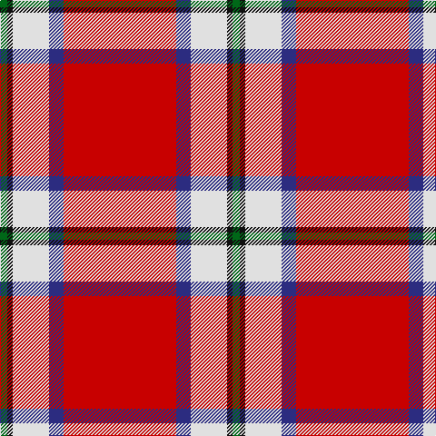

**Bands:** [GKWBR](/stripes/gkwbr/) · **Stripes:** [G K W DB R](/stripes/stripes5/) G K W DB R

This was sourced from tartans-authority.  It is a [5 band tartan](/bands/bands5/).

Original link http://www.tartansauthority.com/tartan-ferret/display/8082/

## Thread count
G/8 K6 LN40 DB16 R/124

## Palette
Each colour and its ΔE from the base-6 reference it is a variant of.

| Colour | Shade | Base | ΔE (OKLab) |
|---|---|---|---|
| DB | <code style="background-color:#2C2C80;">#2C2C80</code> `#2C2C80` | B <code style="background-color:#2A418A;">#2A418A</code> | 0.06 |
| G | <code style="background-color:#006818;">#006818</code> `#006818` | G <code style="background-color:#006100;">#006100</code> | 0.02 |
| K | <code style="background-color:#101010;">#101010</code> `#101010` | K <code style="background-color:#000000;">#000000</code> | 0.17 |
| LN | <code style="background-color:#E0E0E0;">#E0E0E0</code> `#E0E0E0` | W <code style="background-color:#F7F7F7;">#F7F7F7</code> | 0.07 |
| R | <code style="background-color:#C80000;">#C80000</code> `#C80000` | R <code style="background-color:#CC0000;">#CC0000</code> | 0.01 |

# Sample pattern

## Nearest tartans

The nearest existing variants by ΔTartan distance.

1. [Sildesalaten](/setts/s5/r32w4dt7ly2t2~x5/) — ΔT 0.71
1. [Sildesalaten](/setts/s5/r32lb4dt7ly2t2~x5/) — ΔT 0.92
1. [Turner (Personal)](/setts/s5/r48k12o7k5w3~x2/) — ΔT 1.29
1. [Solberg-Wormald (Personal)](/setts/s7/r155lb16k34db48r18ly6r9/) — ΔT 1.29
1. [Brock University Alumni Association](/setts/s6/r52lo2db16lo2db3w5~x2/) — ΔT 1.42
1. [Texas Lone Star (Fashion)](/setts/s7/r50db14w6db9lo3db4r4~x2/) — ΔT 1.48
1. [Loch Lochy](/setts/s8/r6dg14r6db11r31lb2r4ly3~x2/) — ΔT 1.48
1. [MacGregor](/setts/s6/r35dg16r5dg5w2k3~x2/) — ΔT 1.51
1. [Bradley University](/setts/s6/r97k18w5r26k18lr14/) — ΔT 1.52
1. [Texas Lone Star](/setts/s7/r50db14w6db9ly3db4r4~x2/) — ΔT 1.55

## Neighbour map

Every grey dot is one of 14313 variants placed by the first two principal components of the ΔTartan feature space (44% of its variance). Red is this tartan; blue dots are its nearest — click one to open its page.

<svg viewBox="0 0 640 380" role="img" style="max-width:100%;height:auto;border:1px solid #e0e0e0;border-radius:4px;display:block" xmlns="http://www.w3.org/2000/svg"><image href="/nn/cloud.v1.png" width="640" height="380"/><a href="/setts/s5/r32w4dt7ly2t2~x5/"><circle cx="404.1" cy="134.8" r="4" fill="#3465a4"><title>Sildesalaten</title></circle></a><a href="/setts/s5/r32lb4dt7ly2t2~x5/"><circle cx="417.7" cy="142.6" r="4" fill="#3465a4"><title>Sildesalaten</title></circle></a><a href="/setts/s5/r48k12o7k5w3~x2/"><circle cx="395.5" cy="161.2" r="4" fill="#3465a4"><title>Turner (Personal)</title></circle></a><a href="/setts/s7/r155lb16k34db48r18ly6r9/"><circle cx="382.9" cy="111.0" r="4" fill="#3465a4"><title>Solberg-Wormald (Personal)</title></circle></a><a href="/setts/s6/r52lo2db16lo2db3w5~x2/"><circle cx="421.0" cy="119.7" r="4" fill="#3465a4"><title>Brock University Alumni Association</title></circle></a><a href="/setts/s7/r50db14w6db9lo3db4r4~x2/"><circle cx="372.9" cy="139.1" r="4" fill="#3465a4"><title>Texas Lone Star (Fashion)</title></circle></a><a href="/setts/s8/r6dg14r6db11r31lb2r4ly3~x2/"><circle cx="332.9" cy="143.4" r="4" fill="#3465a4"><title>Loch Lochy</title></circle></a><a href="/setts/s6/r35dg16r5dg5w2k3~x2/"><circle cx="388.0" cy="160.7" r="4" fill="#3465a4"><title>MacGregor</title></circle></a><a href="/setts/s6/r97k18w5r26k18lr14/"><circle cx="299.2" cy="122.4" r="4" fill="#3465a4"><title>Bradley University</title></circle></a><a href="/setts/s7/r50db14w6db9ly3db4r4~x2/"><circle cx="350.6" cy="123.7" r="4" fill="#3465a4"><title>Texas Lone Star</title></circle></a><circle cx="376.1" cy="127.3" r="5" fill="#c00000"/></svg>

ID: /setts/s5/r62db8w20k3g4~x2/
