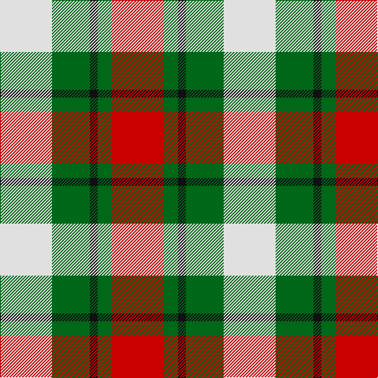

In pattern [RGKGW](/patterns/rgkgw/).

This was sourced from tartans-authority.  It is a [5 stripes tartan](/stripes/stripes5/).

Original link http://www.tartansauthority.com/tartan-ferret/display/10067/

## Thread count
LN/66 G48 K10 G18 R/66

## Palette
Each colour and its ΔE from the base-6 reference it is a variant of.

| Colour | Shade | Base | ΔE (OKLab) |
|---|---|---|---|
| G | <code style="background-color:#006818;">#006818</code> `#006818` | G <code style="background-color:#006400;">#006400</code> | 0.02 |
| K | <code style="background-color:#101010;">#101010</code> `#101010` | K <code style="background-color:#000000;">#000000</code> | 0.17 |
| LN | <code style="background-color:#E0E0E0;">#E0E0E0</code> `#E0E0E0` | W <code style="background-color:#F4F4F0;">#F4F4F0</code> | 0.06 |
| R | <code style="background-color:#C80000;">#C80000</code> `#C80000` | R <code style="background-color:#C80000;">#C80000</code> | 0.00 |

# Sample pattern

## Nearest tartans

The nearest existing variants by ΔTartan distance.

1. [Inverness Basque](/setts/s5/r22g6k3g16w22-g25571a-k101010-rda0501-wffffff/) — ΔT 0.55
1. [MacKinnon Dress Hunting (Fashion)](/setts/s4/g42b42w42r6-b480800-g285800-rc80000-we0e0e0/) — ΔT 1.05
1. [Fraser Dress](/setts/s6/r6k14r6g14w27k4-g005020-k101010-rdc0000-we0e0e0/) — ΔT 1.18
1. [MacKinnon Dress Trade Tartan Tartan Number: 921. Earliest known date: 1970-80 Canada. See products available Copyright © Blair Urquhart, Comrie, 2015](/setts/s4/g36b28w28r4-b480800-g006818-rc80000-we0e0e0/) — ΔT 1.32
1. [MacKintosh Dress (Scott Adie)](/setts/s6/r12w32b16g56r16b8-b2c2c80-g285800-rc80000-we0e0e0/) — ΔT 1.32
1. [Abbink, Ingmar (Personal)](/setts/s5/r78b44k22y44g10-b5c8ca8-g288028-k101010-ra00000-yfccc00/) — ΔT 1.34
1. [Fraser, dress](/setts/s6/r6k14r6g14w27k4-g008000-k000000-rc00000-we0e0e0/) — ΔT 1.36
1. [Fraser Red Dress Clan Tartan Tartan Number: 1427. Earliest known date: pre 2003 A sample of this tartan was recorded by the Scottish Tartans Society during the period 1970 to 1990. See products available Copyright © Blair Urquhart, Comrie, 2015](/setts/s7/r8b36r8g38w50r20w8-b2c2c80-g006818-rc80000-we0e0e0/) — ΔT 1.36
1. [MacIntosh Dress Clan Tartan Tartan Number: 538. Earliest known date: pre 2003 From an old pattern book in possesion of Messrs Scott Adie of London. See products available Copyright © Blair Urquhart, Comrie, 2015](/setts/s6/r6w16b8g28r8b4-b2c2c80-g006818-rc80000-we0e0e0/) — ΔT 1.38
1. [MacKinnon, dress](/setts/s4/g36r28w28ra4-g008000-r703000-rac00000-we0e0e0/) — ΔT 1.38

## Neighbour map

Every grey dot is one of 15726 variants placed by the first two principal components of the ΔTartan feature space (44% of its variance). Red is this tartan; blue dots are its nearest — click one to open its page.

<svg viewBox="0 0 640 380" role="img" style="max-width:100%;height:auto;border:1px solid #e0e0e0;border-radius:4px;display:block" xmlns="http://www.w3.org/2000/svg"><image href="/nn/cloud.v1.png" width="640" height="380"/><a href="/setts/s5/r22g6k3g16w22-g25571a-k101010-rda0501-wffffff/"><circle cx="115.0" cy="220.3" r="4" fill="#3465a4"><title>Inverness Basque</title></circle></a><a href="/setts/s4/g42b42w42r6-b480800-g285800-rc80000-we0e0e0/"><circle cx="107.3" cy="255.0" r="4" fill="#3465a4"><title>MacKinnon Dress Hunting (Fashion)</title></circle></a><a href="/setts/s6/r6k14r6g14w27k4-g005020-k101010-rdc0000-we0e0e0/"><circle cx="119.2" cy="210.6" r="4" fill="#3465a4"><title>Fraser Dress</title></circle></a><a href="/setts/s4/g36b28w28r4-b480800-g006818-rc80000-we0e0e0/"><circle cx="139.8" cy="245.4" r="4" fill="#3465a4"><title>MacKinnon Dress Trade Tartan Tartan Number: 921. Earliest known date: 1970-80 Canada. See products available Copyright © Blair Urquhart, Comrie, 2015</title></circle></a><a href="/setts/s6/r12w32b16g56r16b8-b2c2c80-g285800-rc80000-we0e0e0/"><circle cx="149.2" cy="215.1" r="4" fill="#3465a4"><title>MacKintosh Dress (Scott Adie)</title></circle></a><a href="/setts/s5/r78b44k22y44g10-b5c8ca8-g288028-k101010-ra00000-yfccc00/"><circle cx="130.7" cy="210.3" r="4" fill="#3465a4"><title>Abbink, Ingmar (Personal)</title></circle></a><a href="/setts/s6/r6k14r6g14w27k4-g008000-k000000-rc00000-we0e0e0/"><circle cx="111.8" cy="210.4" r="4" fill="#3465a4"><title>Fraser, dress</title></circle></a><a href="/setts/s7/r8b36r8g38w50r20w8-b2c2c80-g006818-rc80000-we0e0e0/"><circle cx="106.0" cy="208.2" r="4" fill="#3465a4"><title>Fraser Red Dress Clan Tartan Tartan Number: 1427. Earliest known date: pre 2003 A sample of this tartan was recorded by the Scottish Tartans Society during the period 1970 to 1990. See products available Copyright © Blair Urquhart, Comrie, 2015</title></circle></a><a href="/setts/s6/r6w16b8g28r8b4-b2c2c80-g006818-rc80000-we0e0e0/"><circle cx="147.6" cy="215.8" r="4" fill="#3465a4"><title>MacIntosh Dress Clan Tartan Tartan Number: 538. Earliest known date: pre 2003 From an old pattern book in possesion of Messrs Scott Adie of London. See products available Copyright © Blair Urquhart, Comrie, 2015</title></circle></a><a href="/setts/s4/g36r28w28ra4-g008000-r703000-rac00000-we0e0e0/"><circle cx="149.2" cy="248.2" r="4" fill="#3465a4"><title>MacKinnon, dress</title></circle></a><circle cx="117.7" cy="232.3" r="5" fill="#c00000"/></svg>

ID: /setts/s5/r66g18k10g48w66-g006818-k101010-rc80000-we0e0e0/
