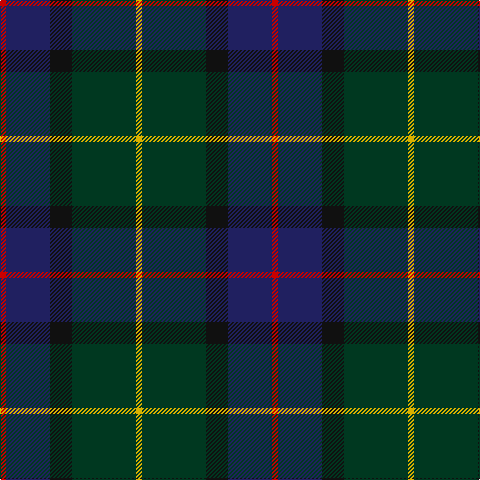

In pattern [RBKGY](/patterns/rbkgy/).

This was sourced from house-of-tartan.  It is a [5 stripes tartan](/stripes/stripes5/).

Original link http://www.house-of-tartan.scotland.net/house/TartanViewjs.asp?colr=Def&tnam=3393

## Thread count
R/6 DB44 K22 DG64 Y/6

## Palette
Each colour and its ΔE from the base-6 reference it is a variant of.

| Colour | Shade | Base | ΔE (OKLab) |
|---|---|---|---|
| DB | <code style="background-color:#202060;">#202060</code> `#202060` | B <code style="background-color:#2C4084;">#2C4084</code> | 0.11 |
| DG | <code style="background-color:#003820;">#003820</code> `#003820` | G <code style="background-color:#006400;">#006400</code> | 0.16 |
| K | <code style="background-color:#101010;">#101010</code> `#101010` | K <code style="background-color:#000000;">#000000</code> | 0.17 |
| R | <code style="background-color:#C80000;">#C80000</code> `#C80000` | R <code style="background-color:#C80000;">#C80000</code> | 0.00 |
| Y | <code style="background-color:#D8B000;">#D8B000</code> `#D8B000` | Y <code style="background-color:#E8C000;">#E8C000</code> | 0.05 |

# Sample pattern

## Nearest tartans

The nearest existing variants by ΔTartan distance.

1. [Douglas, (Brown)](/setts/s5/k14b6g60ba60w6-b3c82af-ba141e46-g503c14-k101010-we0e0e0/) — ΔT 0.83
1. [Dallard (Personal)](/setts/s5/k74g74b16ka6ba10-b5c5c5c-ba5c005c-g003820-k00002c-ka101010/) — ΔT 1.03
1. [Lyle and Scott](/setts/s6/g10b4g18ba38r18y4-b1474b4-ba003c64-g003820-ra00000-yfccc00/) — ΔT 1.12
1. [Gorman, George (Personal)](/setts/s6/g108ga12b24ga12k48r12-b450082-g003000-ga026306-k020031-rcb080c/) — ΔT 1.16
1. [Vass (Personal)](/setts/s5/b24w4g24ba48r8-b141e46-ba2a2303-g503c14-rdc0000-we0e0e0/) — ΔT 1.18
1. [Kilkenny, County (District)](/setts/s7/b8g54r4ba50y10g6r6-b480800-ba202060-g003820-rb84c00-ybc8c00/) — ΔT 1.20
1. [Dallard Personal Tartan Tartan Number: 7424. Earliest known date: 2007 The material was going towards a kilt for my wedding in June 2008. See products available Copyright © Blair Urquhart, Comrie, 2015](/setts/s5/b74g74r16k6ba10-b003c64-ba780078-g285800-k101010-r888888/) — ΔT 1.21
1. [Bobby Jones (Personal)](/setts/s6/r2g4k24g16b32y2-b202060-g604000-k101010-r880000-ybc8c00/) — ΔT 1.21
1. [Lisbon](/setts/s6/g4b24ba6ga44ba44r4-b1c0070-ba441800-g8c7038-ga006818-r880000/) — ΔT 1.22
1. [Loch Long One Design](/setts/s6/y8k56r4b44ba16b6-b3d3134-ba5f749c-k1c1714-rca2625-ye0a126/) — ΔT 1.26

## Neighbour map

Every grey dot is one of 15726 variants placed by the first two principal components of the ΔTartan feature space (44% of its variance). Red is this tartan; blue dots are its nearest — click one to open its page.

<svg viewBox="0 0 640 380" role="img" style="max-width:100%;height:auto;border:1px solid #e0e0e0;border-radius:4px;display:block" xmlns="http://www.w3.org/2000/svg"><image href="/nn/cloud.v1.png" width="640" height="380"/><a href="/setts/s5/k14b6g60ba60w6-b3c82af-ba141e46-g503c14-k101010-we0e0e0/"><circle cx="256.0" cy="223.4" r="4" fill="#3465a4"><title>Douglas, (Brown)</title></circle></a><a href="/setts/s5/k74g74b16ka6ba10-b5c5c5c-ba5c005c-g003820-k00002c-ka101010/"><circle cx="291.4" cy="236.5" r="4" fill="#3465a4"><title>Dallard (Personal)</title></circle></a><a href="/setts/s6/g10b4g18ba38r18y4-b1474b4-ba003c64-g003820-ra00000-yfccc00/"><circle cx="216.8" cy="220.4" r="4" fill="#3465a4"><title>Lyle and Scott</title></circle></a><a href="/setts/s6/g108ga12b24ga12k48r12-b450082-g003000-ga026306-k020031-rcb080c/"><circle cx="272.5" cy="215.8" r="4" fill="#3465a4"><title>Gorman, George (Personal)</title></circle></a><a href="/setts/s5/b24w4g24ba48r8-b141e46-ba2a2303-g503c14-rdc0000-we0e0e0/"><circle cx="250.1" cy="229.0" r="4" fill="#3465a4"><title>Vass (Personal)</title></circle></a><a href="/setts/s7/b8g54r4ba50y10g6r6-b480800-ba202060-g003820-rb84c00-ybc8c00/"><circle cx="278.2" cy="188.4" r="4" fill="#3465a4"><title>Kilkenny, County (District)</title></circle></a><a href="/setts/s5/b74g74r16k6ba10-b003c64-ba780078-g285800-k101010-r888888/"><circle cx="283.5" cy="228.9" r="4" fill="#3465a4"><title>Dallard Personal Tartan Tartan Number: 7424. Earliest known date: 2007 The material was going towards a kilt for my wedding in June 2008. See products available Copyright © Blair Urquhart, Comrie, 2015</title></circle></a><a href="/setts/s6/r2g4k24g16b32y2-b202060-g604000-k101010-r880000-ybc8c00/"><circle cx="281.7" cy="210.0" r="4" fill="#3465a4"><title>Bobby Jones (Personal)</title></circle></a><a href="/setts/s6/g4b24ba6ga44ba44r4-b1c0070-ba441800-g8c7038-ga006818-r880000/"><circle cx="237.3" cy="212.4" r="4" fill="#3465a4"><title>Lisbon</title></circle></a><a href="/setts/s6/y8k56r4b44ba16b6-b3d3134-ba5f749c-k1c1714-rca2625-ye0a126/"><circle cx="261.8" cy="196.3" r="4" fill="#3465a4"><title>Loch Long One Design</title></circle></a><circle cx="267.5" cy="236.0" r="5" fill="#c00000"/></svg>

ID: /setts/s5/r6b44k22g64y6-b202060-g003820-k101010-rc80000-yd8b000/
