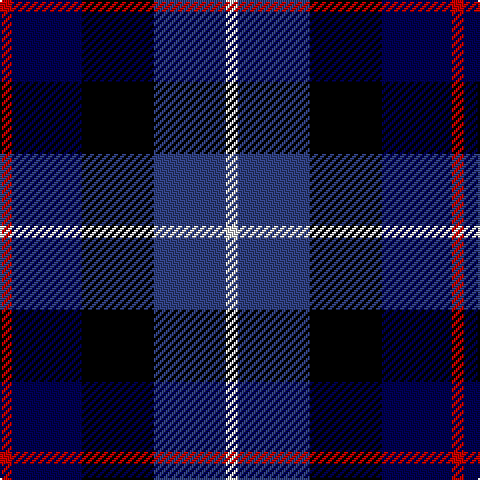

In pattern [RBKBW](/stripes/rbkbw/).

This was sourced from weddslist.  It is a [5 stripe tartan](/stripes/stripes5/).

Original link http://www.weddslist.com/cgi-bin/tartans/pg.pl?source=sts

## Attestations

This cloth appears in 2 source records; the oldest owns this page.

- undated — Davidson of Tulloch (weddslist, [record](http://www.weddslist.com/cgi-bin/tartans/pg.pl?source=sts))
- undated — Davidson of Tulloch Clan Tartan Tartan Number: 1360. Earliest known date: 1984 The Davidsons or Clan Dhai maintained a constant battle for precedence within Clan Chattan. The Davidsons of Tulloch in Ross-shire are one of the main branches of the Davidson family. See products available Copyright © Blair Urquhart, Comrie, 2015 (house-of-tartan, [record](http://www.house-of-tartan.scotland.net/house/TartanViewjs.asp?colr=Def&tnam=1360))

## Thread count
R/6 DB35 K36 B36 LN/6

## Palette
Each colour and the base-6 reference it is a variant of.

| Colour | Shade | Base |
|---|---|---|
| B | <code style="background-color:#304080;">#304080</code> `oklch(39.4% 0.109 270.2)` <small>#304080</small> | B <code style="background-color:#2A418A;">#2A418A</code> |
| DB | <code style="background-color:#000050;">#000050</code> `oklch(19.5% 0.135 264.1)` <small>#000050</small> | B <code style="background-color:#2A418A;">#2A418A</code> |
| K | <code style="background-color:#000000;">#000000</code> `oklch(0.0% 0.000 0.0)` <small>#000000</small> | K <code style="background-color:#000000;">#000000</code> |
| LN | <code style="background-color:#E0E0E0;">#E0E0E0</code> `oklch(90.7% 0.000 89.9)` <small>#E0E0E0</small> | W <code style="background-color:#F7F7F7;">#F7F7F7</code> |
| R | <code style="background-color:#C00000;">#C00000</code> `oklch(50.7% 0.208 29.2)` <small>#C00000</small> | R <code style="background-color:#CC0000;">#CC0000</code> |

# Sample pattern

## Nearest tartans

The nearest existing variants by ΔTartan distance, with this tartan at the top so the swatches line up against it.

ΔTartan

Tartan

Sett

—

<a href="/ttd/edit/#slug=r6db35k36db36w6">Davidson of Tulloch</a> <a class="nn-out" href="/setts/s5/r6db35k36db36w6/" title="open its dictionary page">↗</a>

1.19

<a href="/ttd/edit/#slug=m3db17dt13m2k20w2~x2">Commonwealth Games</a> <a class="nn-out" href="/setts/s6/m3db17dt13m2k20w2~x2/" title="open its dictionary page">↗</a>

1.33

<a href="/ttd/edit/#slug=r1db6k3dg6lr1~x2">Davidson of Tulloch</a> <a class="nn-out" href="/setts/s5/r1db6k3dg6lr1~x2/" title="open its dictionary page">↗</a>

1.36

<a href="/ttd/edit/#slug=dp4dg25k24w3db24w4~x2">Herd</a> <a class="nn-out" href="/setts/s6/dp4dg25k24w3db24w4~x2/" title="open its dictionary page">↗</a>

1.36

<a href="/ttd/edit/#slug=t3k3db17k20g20dp8p3~x2">Gracey (2013)</a> <a class="nn-out" href="/setts/s7/t3k3db17k20g20dp8p3~x2/" title="open its dictionary page">↗</a>

1.37

<a href="/ttd/edit/#slug=k4b2dg8db8lr1~x2">Dougles Green</a> <a class="nn-out" href="/setts/s5/k4b2dg8db8lr1~x2/" title="open its dictionary page">↗</a>

1.37

<a href="/ttd/edit/#slug=k4b2dg8db8lr1">Dougles Green</a> <a class="nn-out" href="/setts/s5/k4b2dg8db8lr1/" title="open its dictionary page">↗</a>

1.39

<a href="/ttd/edit/#slug=lr3db14k12dg12k2ly3~x2">MacNiel of Barra</a> <a class="nn-out" href="/setts/s6/lr3db14k12dg12k2ly3~x2/" title="open its dictionary page">↗</a>

1.39

<a href="/ttd/edit/#slug=lr3db14k12dg12k2ly3">MacNiel of Barra</a> <a class="nn-out" href="/setts/s6/lr3db14k12dg12k2ly3/" title="open its dictionary page">↗</a>

1.40

<a href="/ttd/edit/#slug=ly5db24k8db18ly6o3">CALA Homes</a> <a class="nn-out" href="/setts/s6/ly5db24k8db18ly6o3/" title="open its dictionary page">↗</a>

1.40

<a href="/ttd/edit/#slug=r2db8k8lb1dg8k1">Leslie Hunting</a> <a class="nn-out" href="/setts/s6/r2db8k8lb1dg8k1/" title="open its dictionary page">↗</a>

## Neighbour map

Every grey dot is one of 14299 variants placed by the first two principal components of the ΔTartan feature space (44% of its variance). Red is this tartan; blue dots are its nearest — click one to open its page.

<svg viewBox="0 0 640 380" role="img" style="max-width:100%;height:auto;border:1px solid #e0e0e0;border-radius:4px;display:block" xmlns="http://www.w3.org/2000/svg"><image href="/nn/cloud.v1.png" width="640" height="380"/><a href="/setts/s6/m3db17dt13m2k20w2~x2/"><circle cx="143.2" cy="200.2" r="4" fill="#3465a4"><title>Commonwealth Games</title></circle></a><a href="/setts/s5/r1db6k3dg6lr1~x2/"><circle cx="140.2" cy="249.2" r="4" fill="#3465a4"><title>Davidson of Tulloch</title></circle></a><a href="/setts/s6/dp4dg25k24w3db24w4~x2/"><circle cx="115.8" cy="217.3" r="4" fill="#3465a4"><title>Herd</title></circle></a><a href="/setts/s7/t3k3db17k20g20dp8p3~x2/"><circle cx="84.4" cy="204.7" r="4" fill="#3465a4"><title>Gracey (2013)</title></circle></a><a href="/setts/s5/k4b2dg8db8lr1~x2/"><circle cx="147.0" cy="245.0" r="4" fill="#3465a4"><title>Dougles Green</title></circle></a><a href="/setts/s5/k4b2dg8db8lr1/"><circle cx="147.0" cy="245.0" r="4" fill="#3465a4"><title>Dougles Green</title></circle></a><a href="/setts/s6/lr3db14k12dg12k2ly3~x2/"><circle cx="100.4" cy="228.5" r="4" fill="#3465a4"><title>MacNiel of Barra</title></circle></a><a href="/setts/s6/lr3db14k12dg12k2ly3/"><circle cx="100.4" cy="228.5" r="4" fill="#3465a4"><title>MacNiel of Barra</title></circle></a><a href="/setts/s6/ly5db24k8db18ly6o3/"><circle cx="123.1" cy="204.6" r="4" fill="#3465a4"><title>CALA Homes</title></circle></a><a href="/setts/s6/r2db8k8lb1dg8k1/"><circle cx="124.9" cy="219.0" r="4" fill="#3465a4"><title>Leslie Hunting</title></circle></a><circle cx="103.5" cy="246.2" r="5" fill="#c00000"/></svg>

ID: /setts/s5/r6db35k36db36w6/
