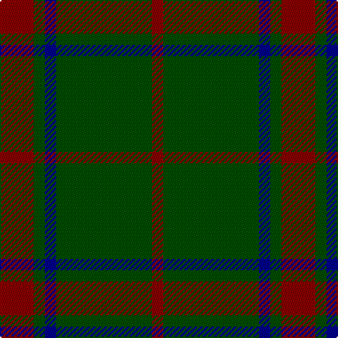

In pattern [RGBGR](/stripes/rgbgr/).

This was sourced from register-of-tartans.  It is a [5 stripe tartan](/stripes/stripes5/).

Original link https://www.tartanregister.gov.uk/tartanDetails.aspx?ref=2226

## Attestations

This cloth appears in 2 source records; the oldest owns this page.

- 01/01/2002 — Loton (Personal) (register-of-tartans, [record](https://www.tartanregister.gov.uk/tartanDetails.aspx?ref=2226))
- pre 2002 — Loton (Personal) (tartans-authority, [record](http://www.tartansauthority.com/tartan-ferret/display/5498/))

## Register references

External register numbers recorded for this tartan.

- Scottish Register of Tartans: [2226](https://www.tartanregister.gov.uk/tartanDetails.aspx?ref=2226)
- Scottish Tartans Authority (ITI): 5498

## Thread count
DR/24 G8 DB8 G68 DR/8

## Palette
Each colour and its ΔE from the base-6 reference it is a variant of.

| Colour | Shade | Base | ΔE (OKLab) |
|---|---|---|---|
| DB | <code style="background-color:#00008C;">#00008C</code> `#00008C` | B <code style="background-color:#2A418A;">#2A418A</code> | 0.13 |
| DR | <code style="background-color:#880000;">#880000</code> `#880000` | R <code style="background-color:#CC0000;">#CC0000</code> | 0.15 |
| G | <code style="background-color:#004C00;">#004C00</code> `#004C00` | G <code style="background-color:#006100;">#006100</code> | 0.07 |

# Sample pattern

## Nearest tartans

The nearest existing variants by ΔTartan distance.

1. [Glen Trool (Fashion)](/setts/s5/dg42o10dg3r10o3~x2/) — ΔT 0.90
1. [Glen Trool District Tartan Tartan Number: 914. Earliest known date: pre 1945 Glen Trool is in the Galloway Uplands in the Southwest of Scotland. The tartan began life as a trade sett - a colourful fashion fabric - and was given a name merely to identify it. It proved very popular and is now recognised as a District Tartan. See products available Copyright © Blair Urquhart, Comrie, 2015](/setts/s5/dg37dy9dg3r9dy3~x2/) — ΔT 0.97
1. [Glen Trool](/setts/s5/dg37o9dg3r9o3~x2/) — ΔT 1.03
1. [Scott Autumn (Fashion)](/setts/s7/dg16ly3dg14r16dg2r2dg3~x2/) — ΔT 1.18
1. [Maxwell Htg (Clan)](/setts/s7/g3r16g4k6g28r2g3~x2/) — ΔT 1.33
1. [MacArthur-Fox (Personal)](/setts/s5/k8g3k4g20r4~x2/) — ΔT 1.52
1. [Angle, Green (Fashion)](/setts/s7/lo1dg11k6dg3lo1dg1lo1~x4/) — ΔT 1.56
1. [O'Neill, Red (Corporate?)](/setts/s4/g9o20g46lg5~x2/) — ΔT 1.60
1. [Grey Spirit Fashion Tartan Tartan Number: 6594. Earliest known date: 01/03/2005 A fashion tartan from ACS Clothing of Glasgow for use in their kilt hire business. Woven by Lochcarron. The grey is actually a grey/black marl (mixture) which can't be shown graphically. See products available Copyright © Blair Urquhart, Comrie, 2015](/setts/s6/n6k16n6k16n45k4~x2/) — ΔT 1.63
1. [Gunn (Logan)](/setts/s6/dg2k12dg1k12dg12r2~x2/) — ΔT 1.63

## Neighbour map

Every grey dot is one of 14299 variants placed by the first two principal components of the ΔTartan feature space (44% of its variance). Red is this tartan; blue dots are its nearest — click one to open its page.

<svg viewBox="0 0 640 380" role="img" style="max-width:100%;height:auto;border:1px solid #e0e0e0;border-radius:4px;display:block" xmlns="http://www.w3.org/2000/svg"><image href="/nn/cloud.v1.png" width="640" height="380"/><a href="/setts/s5/dg42o10dg3r10o3~x2/"><circle cx="467.3" cy="240.5" r="4" fill="#3465a4"><title>Glen Trool (Fashion)</title></circle></a><a href="/setts/s5/dg37dy9dg3r9dy3~x2/"><circle cx="476.9" cy="258.4" r="4" fill="#3465a4"><title>Glen Trool District Tartan Tartan Number: 914. Earliest known date: pre 1945 Glen Trool is in the Galloway Uplands in the Southwest of Scotland. The tartan began life as a trade sett - a colourful fashion fabric - and was given a name merely to identify it. It proved very popular and is now recognised as a District Tartan. See products available Copyright © Blair Urquhart, Comrie, 2015</title></circle></a><a href="/setts/s5/dg37o9dg3r9o3~x2/"><circle cx="441.6" cy="238.4" r="4" fill="#3465a4"><title>Glen Trool</title></circle></a><a href="/setts/s7/dg16ly3dg14r16dg2r2dg3~x2/"><circle cx="406.4" cy="262.3" r="4" fill="#3465a4"><title>Scott Autumn (Fashion)</title></circle></a><a href="/setts/s7/g3r16g4k6g28r2g3~x2/"><circle cx="420.1" cy="223.3" r="4" fill="#3465a4"><title>Maxwell Htg (Clan)</title></circle></a><a href="/setts/s5/k8g3k4g20r4~x2/"><circle cx="355.9" cy="277.8" r="4" fill="#3465a4"><title>MacArthur-Fox (Personal)</title></circle></a><a href="/setts/s7/lo1dg11k6dg3lo1dg1lo1~x4/"><circle cx="396.8" cy="226.0" r="4" fill="#3465a4"><title>Angle, Green (Fashion)</title></circle></a><a href="/setts/s4/g9o20g46lg5~x2/"><circle cx="463.7" cy="288.5" r="4" fill="#3465a4"><title>O'Neill, Red (Corporate?)</title></circle></a><a href="/setts/s6/n6k16n6k16n45k4~x2/"><circle cx="460.5" cy="268.2" r="4" fill="#3465a4"><title>Grey Spirit Fashion Tartan Tartan Number: 6594. Earliest known date: 01/03/2005 A fashion tartan from ACS Clothing of Glasgow for use in their kilt hire business. Woven by Lochcarron. The grey is actually a grey/black marl (mixture) which can't be shown graphically. See products available Copyright © Blair Urquhart, Comrie, 2015</title></circle></a><a href="/setts/s6/dg2k12dg1k12dg12r2~x2/"><circle cx="403.3" cy="269.0" r="4" fill="#3465a4"><title>Gunn (Logan)</title></circle></a><circle cx="453.1" cy="267.3" r="5" fill="#c00000"/></svg>

ID: /setts/s5/r6dg2db2dg17r2~x4/
