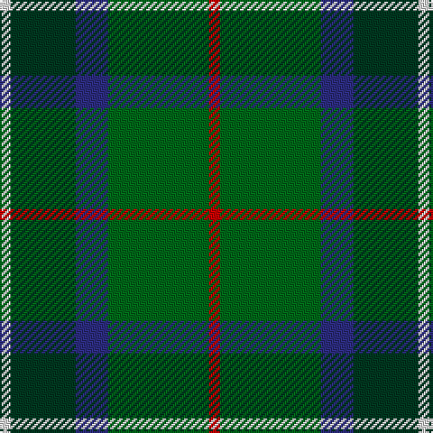

In pattern [RGBGW](/patterns/rgbgw/).

This was sourced from tartans-authority.  It is a [5 stripes tartan](/stripes/stripes5/).

Original link http://www.tartansauthority.com/tartan-ferret/display/2320/

## Thread count
LN/6 DG36 DB18 G56 R/6

## Palette
Each colour and its ΔE from the base-6 reference it is a variant of.

| Colour | Shade | Base | ΔE (OKLab) |
|---|---|---|---|
| DB | <code style="background-color:#2C2C80;">#2C2C80</code> `#2C2C80` | B <code style="background-color:#2A418A;">#2A418A</code> | 0.06 |
| DG | <code style="background-color:#003820;">#003820</code> `#003820` | G <code style="background-color:#006100;">#006100</code> | 0.15 |
| G | <code style="background-color:#006818;">#006818</code> `#006818` | G <code style="background-color:#006100;">#006100</code> | 0.02 |
| LN | <code style="background-color:#E0E0E0;">#E0E0E0</code> `#E0E0E0` | W <code style="background-color:#F7F7F7;">#F7F7F7</code> | 0.07 |
| R | <code style="background-color:#C80000;">#C80000</code> `#C80000` | R <code style="background-color:#CC0000;">#CC0000</code> | 0.01 |

# Sample pattern

## Nearest tartans

The nearest existing variants by ΔTartan distance.

1. [Cultoquhey (Corporate)](/setts/s5/r6b44k22g64y6-b202060-g006818-k101010-rc80000-yd8b000/) — ΔT 0.88
1. [Cultoquhey Hotel](/setts/s5/r6b44k22g64y6-b202060-g006818-k101010-rc80000-ye8c000/) — ΔT 0.93
1. [Simple Technology](/setts/s5/r6g56b18ga36w6-b304080-g008000-ga003000-rc00000-we0e0e0/) — ΔT 0.93
1. [Wcwm 1716](/setts/s6/g12y6g52ga20b60w6-b202020-g007c00-ga004c00-wc8c8c8-yc89800/) — ΔT 0.95
1. [Gorman, George (Personal)](/setts/s6/g108ga12b24ga12ba48r12-b7028c0-ba1c1c50-g006818-ga289c18-rc80000/) — ΔT 0.96
1. [New Mexico](/setts/s7/g10b42r5ga42g42y5g10-b304080-g008000-ga003000-rc00000-yf0c000/) — ΔT 0.96
1. [MacSween Hunting (Lochs, Isle of Lew](/setts/s7/g3r3g31ga18g4k22y3-g006818-ga003820-k101010-rc80000-ye8c000/) — ΔT 1.02
1. [Wellington (Lochcarron)](/setts/s5/k18y12b44g56ya4-b0c585c-g408060-k101010-y9ca8b0-yae8c000/) — ΔT 1.04
1. [MPS Emerald Society](/setts/s6/y8g60ga30b10ba20y8-b2c2c80-ba1474b4-g003820-ga006818-yfccc00/) — ΔT 1.09
1. [Ellan Vannin](/setts/s6/b8g52w8ba16ga32g8-b3c78c8-ba780078-g146400-ga007800-wc8c8c8/) — ΔT 1.11

## Neighbour map

Every grey dot is one of 15726 variants placed by the first two principal components of the ΔTartan feature space (44% of its variance). Red is this tartan; blue dots are its nearest — click one to open its page.

<svg viewBox="0 0 640 380" role="img" style="max-width:100%;height:auto;border:1px solid #e0e0e0;border-radius:4px;display:block" xmlns="http://www.w3.org/2000/svg"><image href="/nn/cloud.v1.png" width="640" height="380"/><a href="/setts/s5/r6b44k22g64y6-b202060-g006818-k101010-rc80000-yd8b000/"><circle cx="226.5" cy="215.9" r="4" fill="#3465a4"><title>Cultoquhey (Corporate)</title></circle></a><a href="/setts/s5/r6b44k22g64y6-b202060-g006818-k101010-rc80000-ye8c000/"><circle cx="223.1" cy="214.4" r="4" fill="#3465a4"><title>Cultoquhey Hotel</title></circle></a><a href="/setts/s5/r6g56b18ga36w6-b304080-g008000-ga003000-rc00000-we0e0e0/"><circle cx="212.1" cy="218.0" r="4" fill="#3465a4"><title>Simple Technology</title></circle></a><a href="/setts/s6/g12y6g52ga20b60w6-b202020-g007c00-ga004c00-wc8c8c8-yc89800/"><circle cx="212.7" cy="208.1" r="4" fill="#3465a4"><title>Wcwm 1716</title></circle></a><a href="/setts/s6/g108ga12b24ga12ba48r12-b7028c0-ba1c1c50-g006818-ga289c18-rc80000/"><circle cx="243.5" cy="199.1" r="4" fill="#3465a4"><title>Gorman, George (Personal)</title></circle></a><a href="/setts/s7/g10b42r5ga42g42y5g10-b304080-g008000-ga003000-rc00000-yf0c000/"><circle cx="183.9" cy="213.8" r="4" fill="#3465a4"><title>New Mexico</title></circle></a><a href="/setts/s7/g3r3g31ga18g4k22y3-g006818-ga003820-k101010-rc80000-ye8c000/"><circle cx="236.1" cy="202.7" r="4" fill="#3465a4"><title>MacSween Hunting (Lochs, Isle of Lew</title></circle></a><a href="/setts/s5/k18y12b44g56ya4-b0c585c-g408060-k101010-y9ca8b0-yae8c000/"><circle cx="226.8" cy="215.9" r="4" fill="#3465a4"><title>Wellington (Lochcarron)</title></circle></a><a href="/setts/s6/y8g60ga30b10ba20y8-b2c2c80-ba1474b4-g003820-ga006818-yfccc00/"><circle cx="174.7" cy="210.9" r="4" fill="#3465a4"><title>MPS Emerald Society</title></circle></a><a href="/setts/s6/b8g52w8ba16ga32g8-b3c78c8-ba780078-g146400-ga007800-wc8c8c8/"><circle cx="231.2" cy="234.0" r="4" fill="#3465a4"><title>Ellan Vannin</title></circle></a><circle cx="231.4" cy="226.9" r="5" fill="#c00000"/></svg>

ID: /setts/s5/r6g56b18ga36w6-b2c2c80-g006818-ga003820-rc80000-we0e0e0/
