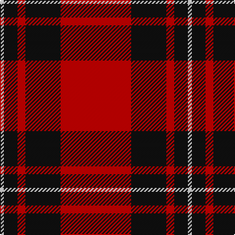

In pattern [RKRKW](/patterns/rkrkw/).

This was sourced from tartans-authority.  It is a [5 stripes tartan](/stripes/stripes5/).

Original link http://www.tartansauthority.com/tartan-ferret/display/8392/

## Thread count
LN/4 K14 R8 K36 R/72

## Palette
Each colour and its ΔE from the base-6 reference it is a variant of.

| Colour | Shade | Base | ΔE (OKLab) |
|---|---|---|---|
| K | <code style="background-color:#101010;">#101010</code> `#101010` | K <code style="background-color:#000000;">#000000</code> | 0.17 |
| LN | <code style="background-color:#E0E0E0;">#E0E0E0</code> `#E0E0E0` | W <code style="background-color:#F7F7F7;">#F7F7F7</code> | 0.07 |
| R | <code style="background-color:#C80000;">#C80000</code> `#C80000` | R <code style="background-color:#CC0000;">#CC0000</code> | 0.01 |

# Sample pattern

## Nearest tartans

The nearest existing variants by ΔTartan distance.

1. [MacGregor, Black (Personal)](/setts/s5/r82k38r14k18w6-k101010-rc80000-wfcfcfc/) — ΔT 0.52
1. [Masai Shuka 15 (Artefact)](/setts/s5/r40k4r4k30w2-k101010-rc80000-we0e0e0/) — ΔT 0.52
1. [Dunbar (Wilson's) District Tartan Tartan Number: 1236. Earliest known date: 1840 Restricted See products available Copyright © Blair Urquhart, Comrie, 2015](/setts/s4/r56k8w4k26-k101010-rc80000-we0e0e0/) — ΔT 0.64
1. [MacKeane](/setts/s5/r8k16r24k2y2-k101010-rc80000-ye8c000/) — ΔT 0.77
1. [Dunbar (District)](/setts/s4/r56k8w4k26-k101010-rcc4438-we0e0e0/) — ΔT 0.91
1. [MacIver](/setts/s5/k32r4k4r24w2-k101010-rdc0000-we0e0e0/) — ΔT 0.94
1. [Forget Family (Red)](/setts/s6/r84k4w4k36w4k10-k101010-rc80000-wffffff/) — ΔT 0.98
1. [Campbell Red (artefact)](/setts/s5/r8k2r48k44r4-k101010-rdc0000/) — ΔT 1.00
1. [MacKintosh D](/setts/s6/r44b10r4g22r6b2-b000064-g004c00-rc80000/) — ΔT 1.03
1. [MacKintosh](/setts/s6/r48b12r6g24r8b2-b000064-g004c00-rc80000/) — ΔT 1.03

## Neighbour map

Every grey dot is one of 15726 variants placed by the first two principal components of the ΔTartan feature space (44% of its variance). Red is this tartan; blue dots are its nearest — click one to open its page.

<svg viewBox="0 0 640 380" role="img" style="max-width:100%;height:auto;border:1px solid #e0e0e0;border-radius:4px;display:block" xmlns="http://www.w3.org/2000/svg"><image href="/nn/cloud.v1.png" width="640" height="380"/><a href="/setts/s5/r82k38r14k18w6-k101010-rc80000-wfcfcfc/"><circle cx="384.8" cy="205.0" r="4" fill="#3465a4"><title>MacGregor, Black (Personal)</title></circle></a><a href="/setts/s5/r40k4r4k30w2-k101010-rc80000-we0e0e0/"><circle cx="387.3" cy="186.1" r="4" fill="#3465a4"><title>Masai Shuka 15 (Artefact)</title></circle></a><a href="/setts/s4/r56k8w4k26-k101010-rc80000-we0e0e0/"><circle cx="385.5" cy="213.7" r="4" fill="#3465a4"><title>Dunbar (Wilson's) District Tartan Tartan Number: 1236. Earliest known date: 1840 Restricted See products available Copyright © Blair Urquhart, Comrie, 2015</title></circle></a><a href="/setts/s5/r8k16r24k2y2-k101010-rc80000-ye8c000/"><circle cx="387.3" cy="215.9" r="4" fill="#3465a4"><title>MacKeane</title></circle></a><a href="/setts/s4/r56k8w4k26-k101010-rcc4438-we0e0e0/"><circle cx="377.0" cy="212.8" r="4" fill="#3465a4"><title>Dunbar (District)</title></circle></a><a href="/setts/s5/k32r4k4r24w2-k101010-rdc0000-we0e0e0/"><circle cx="361.0" cy="197.5" r="4" fill="#3465a4"><title>MacIver</title></circle></a><a href="/setts/s6/r84k4w4k36w4k10-k101010-rc80000-wffffff/"><circle cx="402.1" cy="153.9" r="4" fill="#3465a4"><title>Forget Family (Red)</title></circle></a><a href="/setts/s5/r8k2r48k44r4-k101010-rdc0000/"><circle cx="422.7" cy="195.0" r="4" fill="#3465a4"><title>Campbell Red (artefact)</title></circle></a><a href="/setts/s6/r44b10r4g22r6b2-b000064-g004c00-rc80000/"><circle cx="409.4" cy="178.4" r="4" fill="#3465a4"><title>MacKintosh D</title></circle></a><a href="/setts/s6/r48b12r6g24r8b2-b000064-g004c00-rc80000/"><circle cx="411.9" cy="179.7" r="4" fill="#3465a4"><title>MacKintosh</title></circle></a><circle cx="401.2" cy="192.1" r="5" fill="#c00000"/></svg>

ID: /setts/s5/r72k36r8k14w4-k101010-rc80000-we0e0e0/
