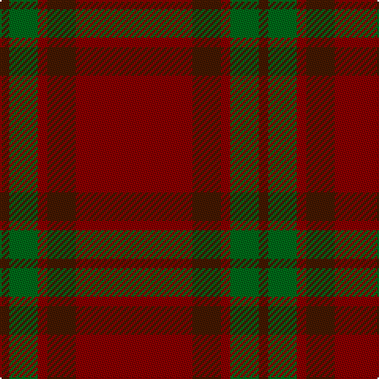

In pattern [BGRBR](/patterns/bgrbr/).

This was sourced from tartans-authority.  It is a [5 stripes tartan](/stripes/stripes5/).

Original link http://www.tartansauthority.com/tartan-ferret/display/1662/

## Thread count
DR/6 G18 DRa6 DR18 DRa/74

## Palette
Each colour and its ΔE from the base-6 reference it is a variant of.

| Colour | Shade | Base | ΔE (OKLab) |
|---|---|---|---|
| DR | <code style="background-color:#441800;">#441800</code> `#441800` | B <code style="background-color:#2C4084;">#2C4084</code> | 0.22 |
| DRa | <code style="background-color:#880000;">#880000</code> `#880000` | R <code style="background-color:#C80000;">#C80000</code> | 0.14 |
| G | <code style="background-color:#006818;">#006818</code> `#006818` | G <code style="background-color:#006400;">#006400</code> | 0.02 |

# Sample pattern

## Nearest tartans

The nearest existing variants by ΔTartan distance.

1. [Glenshee #2](/setts/s5/r74g18r6ga18g6-g503c14-ga005020-r960028/) — ΔT 0.68
1. [Glen Shee](/setts/s5/r74ra18r6g18ra6-g008000-r900030-ra806050/) — ΔT 1.18
1. [Glen Shee Trade Tartan Tartan Number: 1662. Earliest known date: pre 2003 May have been obtained from a hand made design procured in the Highlands for The Highland Society of London. See products available Copyright © Blair Urquhart, Comrie, 2015](/setts/s5/r74g18r6ga18g6-g604000-ga006818-ra00048/) — ΔT 1.22
1. [Crawford](/setts/s7/b12y4b60g24b6g24b6-b59110d-g11450d-yaaaaaa/) — ΔT 1.62
1. [Crawford](/setts/s7/b6y2b30g12b3g12b3-b59110d-g11450d-yaaaaaa/) — ΔT 1.62
1. [MacIver of Strathendry Htg (Personal](/setts/s9/r6ra56b10ra10b66ra10b10ra56y6-b441800-r880000-ra98481c-ybc8c00/) — ΔT 1.81
1. [Cairn O'Mount (Personal)](/setts/s6/r116b24r10g56r14y10-b647480-g648468-rb40000-ybc8c00/) — ΔT 1.83
1. [Waverley Care Aids Trust (Corporate)](/setts/s6/r80g20r20k10r10g20-g006818-k101010-r880000/) — ΔT 1.91
1. [Scottish Watch (Corporate)](/setts/s3/r208g78y8-g00502c-r880000-yd09800/) — ΔT 2.12
1. [Inverness Augustus](/setts/s7/r36g2k10g2k2g2r18-g005020-k101010-r781c38/) — ΔT 2.14

## Neighbour map

Every grey dot is one of 15726 variants placed by the first two principal components of the ΔTartan feature space (44% of its variance). Red is this tartan; blue dots are its nearest — click one to open its page.

<svg viewBox="0 0 640 380" role="img" style="max-width:100%;height:auto;border:1px solid #e0e0e0;border-radius:4px;display:block" xmlns="http://www.w3.org/2000/svg"><image href="/nn/cloud.v1.png" width="640" height="380"/><a href="/setts/s5/r74g18r6ga18g6-g503c14-ga005020-r960028/"><circle cx="527.0" cy="254.1" r="4" fill="#3465a4"><title>Glenshee #2</title></circle></a><a href="/setts/s5/r74ra18r6g18ra6-g008000-r900030-ra806050/"><circle cx="489.4" cy="235.5" r="4" fill="#3465a4"><title>Glen Shee</title></circle></a><a href="/setts/s5/r74g18r6ga18g6-g604000-ga006818-ra00048/"><circle cx="496.3" cy="236.9" r="4" fill="#3465a4"><title>Glen Shee Trade Tartan Tartan Number: 1662. Earliest known date: pre 2003 May have been obtained from a hand made design procured in the Highlands for The Highland Society of London. See products available Copyright © Blair Urquhart, Comrie, 2015</title></circle></a><a href="/setts/s7/b12y4b60g24b6g24b6-b59110d-g11450d-yaaaaaa/"><circle cx="491.9" cy="245.1" r="4" fill="#3465a4"><title>Crawford</title></circle></a><a href="/setts/s7/b6y2b30g12b3g12b3-b59110d-g11450d-yaaaaaa/"><circle cx="491.9" cy="245.1" r="4" fill="#3465a4"><title>Crawford</title></circle></a><a href="/setts/s9/r6ra56b10ra10b66ra10b10ra56y6-b441800-r880000-ra98481c-ybc8c00/"><circle cx="420.4" cy="211.8" r="4" fill="#3465a4"><title>MacIver of Strathendry Htg (Personal</title></circle></a><a href="/setts/s6/r116b24r10g56r14y10-b647480-g648468-rb40000-ybc8c00/"><circle cx="428.5" cy="211.5" r="4" fill="#3465a4"><title>Cairn O'Mount (Personal)</title></circle></a><a href="/setts/s6/r80g20r20k10r10g20-g006818-k101010-r880000/"><circle cx="473.3" cy="251.0" r="4" fill="#3465a4"><title>Waverley Care Aids Trust (Corporate)</title></circle></a><a href="/setts/s3/r208g78y8-g00502c-r880000-yd09800/"><circle cx="564.7" cy="252.4" r="4" fill="#3465a4"><title>Scottish Watch (Corporate)</title></circle></a><a href="/setts/s7/r36g2k10g2k2g2r18-g005020-k101010-r781c38/"><circle cx="588.7" cy="215.6" r="4" fill="#3465a4"><title>Inverness Augustus</title></circle></a><circle cx="516.1" cy="250.7" r="5" fill="#c00000"/></svg>

ID: /setts/s5/r74b18r6g18b6-b441800-g006818-r880000/
