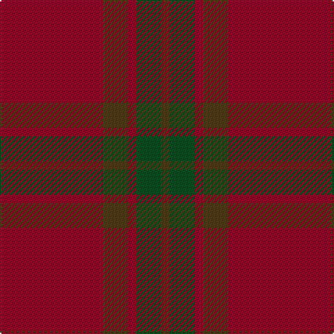

In pattern [GGRGR](/patterns/ggrgr/).

This was sourced from register-of-tartans.  It is a [5 stripes tartan](/stripes/stripes5/).

Original link https://www.tartanregister.gov.uk/tartanDetails.aspx?ref=1438

## Thread count
DR/74 T18 DR6 G18 T/6

## Palette
Each colour and its ΔE from the base-6 reference it is a variant of.

| Colour | Shade | Base | ΔE (OKLab) |
|---|---|---|---|
| DR | <code style="background-color:#960028;">#960028</code> `#960028` | R <code style="background-color:#C80000;">#C80000</code> | 0.11 |
| G | <code style="background-color:#005020;">#005020</code> `#005020` | G <code style="background-color:#006400;">#006400</code> | 0.08 |
| T | <code style="background-color:#503C14;">#503C14</code> `#503C14` | G <code style="background-color:#006400;">#006400</code> | 0.15 |

# Sample pattern

ID: /setts/s5/r74g18r6ga18g6-g503c14-ga005020-r960028/
