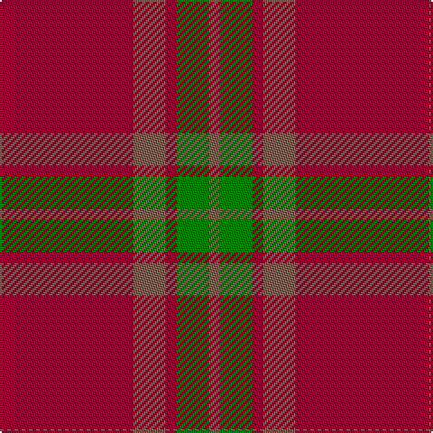

In pattern [RGRRR](/patterns/rgrrr/).

This was sourced from weddslist.  It is a [5 stripes tartan](/stripes/stripes5/).

Original link http://www.weddslist.com/cgi-bin/tartans/pg.pl?source=sts

## Thread count
DR/74 LT18 DR6 G18 LT/6

## Palette
Each colour and its ΔE from the base-6 reference it is a variant of.

| Colour | Shade | Base | ΔE (OKLab) |
|---|---|---|---|
| DR | <code style="background-color:#900030;">#900030</code> `#900030` | R <code style="background-color:#CC0000;">#CC0000</code> | 0.14 |
| G | <code style="background-color:#008000;">#008000</code> `#008000` | G <code style="background-color:#006100;">#006100</code> | 0.10 |
| LT | <code style="background-color:#806050;">#806050</code> `#806050` | R <code style="background-color:#CC0000;">#CC0000</code> | 0.17 |

# Sample pattern

## Nearest tartans

The nearest existing variants by ΔTartan distance.

1. [Glen Shee Trade Tartan Tartan Number: 1662. Earliest known date: pre 2003 May have been obtained from a hand made design procured in the Highlands for The Highland Society of London. See products available Copyright © Blair Urquhart, Comrie, 2015](/setts/s5/r74g18r6ga18g6-g604000-ga006818-ra00048/) — ΔT 0.40
1. [Glen Shee #1 (Fashion)](/setts/s5/r74b18r6g18b6-b441800-g006818-r880000/) — ΔT 1.18
1. [Cairn O'Mount (Personal)](/setts/s6/r116b24r10g56r14y10-b647480-g648468-rb40000-ybc8c00/) — ΔT 1.32
1. [Glenshee #2](/setts/s5/r74g18r6ga18g6-g503c14-ga005020-r960028/) — ΔT 1.35
1. [Hunt (Personal)](/setts/s5/r18g4r90g40y6-g789484-r901c38-ybc8c00/) — ΔT 1.47
1. [Waverley Care Aids Trust (Corporate)](/setts/s6/r80g20r20k10r10g20-g006818-k101010-r880000/) — ΔT 1.53
1. [Cameron](/setts/s6/r4g12r4g12r32y2-g11450d-raa0000-yaaaa00/) — ΔT 1.65
1. [Monica](/setts/s6/r12ra40r12ra16r80w4-r8c0000-ra8c8c8c-wc8c8c8/) — ΔT 1.70
1. [MacQuarie](/setts/s6/r32g2r2g2r8g24-g11450d-raa0000/) — ΔT 1.72
1. [Maguire, Black (Name)](/setts/s6/r116g8r8g8r24y84-g00643c-rd0002c-ybc8c00/) — ΔT 1.78

## Neighbour map

Every grey dot is one of 15726 variants placed by the first two principal components of the ΔTartan feature space (44% of its variance). Red is this tartan; blue dots are its nearest — click one to open its page.

<svg viewBox="0 0 640 380" role="img" style="max-width:100%;height:auto;border:1px solid #e0e0e0;border-radius:4px;display:block" xmlns="http://www.w3.org/2000/svg"><image href="/nn/cloud.v1.png" width="640" height="380"/><a href="/setts/s5/r74g18r6ga18g6-g604000-ga006818-ra00048/"><circle cx="496.3" cy="236.9" r="4" fill="#3465a4"><title>Glen Shee Trade Tartan Tartan Number: 1662. Earliest known date: pre 2003 May have been obtained from a hand made design procured in the Highlands for The Highland Society of London. See products available Copyright © Blair Urquhart, Comrie, 2015</title></circle></a><a href="/setts/s5/r74b18r6g18b6-b441800-g006818-r880000/"><circle cx="516.1" cy="250.7" r="4" fill="#3465a4"><title>Glen Shee #1 (Fashion)</title></circle></a><a href="/setts/s6/r116b24r10g56r14y10-b647480-g648468-rb40000-ybc8c00/"><circle cx="428.5" cy="211.5" r="4" fill="#3465a4"><title>Cairn O'Mount (Personal)</title></circle></a><a href="/setts/s5/r74g18r6ga18g6-g503c14-ga005020-r960028/"><circle cx="527.0" cy="254.1" r="4" fill="#3465a4"><title>Glenshee #2</title></circle></a><a href="/setts/s5/r18g4r90g40y6-g789484-r901c38-ybc8c00/"><circle cx="517.9" cy="206.7" r="4" fill="#3465a4"><title>Hunt (Personal)</title></circle></a><a href="/setts/s6/r80g20r20k10r10g20-g006818-k101010-r880000/"><circle cx="473.3" cy="251.0" r="4" fill="#3465a4"><title>Waverley Care Aids Trust (Corporate)</title></circle></a><a href="/setts/s6/r4g12r4g12r32y2-g11450d-raa0000-yaaaa00/"><circle cx="443.3" cy="215.3" r="4" fill="#3465a4"><title>Cameron</title></circle></a><a href="/setts/s6/r12ra40r12ra16r80w4-r8c0000-ra8c8c8c-wc8c8c8/"><circle cx="463.3" cy="198.2" r="4" fill="#3465a4"><title>Monica</title></circle></a><a href="/setts/s6/r32g2r2g2r8g24-g11450d-raa0000/"><circle cx="481.2" cy="228.5" r="4" fill="#3465a4"><title>MacQuarie</title></circle></a><a href="/setts/s6/r116g8r8g8r24y84-g00643c-rd0002c-ybc8c00/"><circle cx="456.3" cy="204.6" r="4" fill="#3465a4"><title>Maguire, Black (Name)</title></circle></a><circle cx="489.4" cy="235.5" r="5" fill="#c00000"/></svg>

ID: /setts/s5/r74ra18r6g18ra6-g008000-r900030-ra806050/
