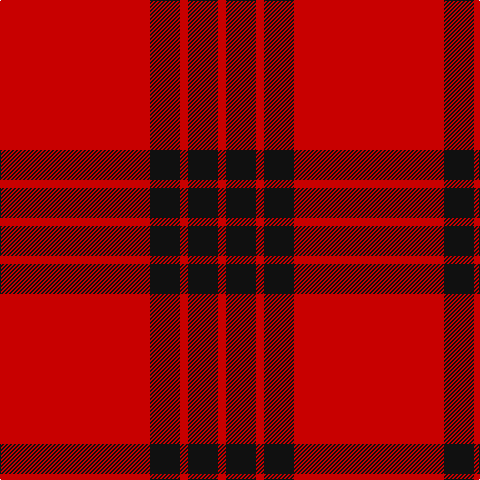

In pattern [RKRKR](/stripes/rkrkr/).

This was sourced from tartans-authority.  It is a [5 stripe tartan](/stripes/stripes5/).

Original link http://www.tartansauthority.com/tartan-ferret/display/7198/

## Thread count
R/150 K30 R8 K30 R/8

## Palette
Each colour and its ΔE from the base-6 reference it is a variant of.

| Colour | Shade | Base | ΔE (OKLab) |
|---|---|---|---|
| K | <code style="background-color:#101010;">#101010</code> `#101010` | K <code style="background-color:#000000;">#000000</code> | 0.17 |
| R | <code style="background-color:#C80000;">#C80000</code> `#C80000` | R <code style="background-color:#CC0000;">#CC0000</code> | 0.01 |

# Sample pattern

## Nearest tartans

The nearest existing variants by ΔTartan distance.

1. [Masai Shuka 12 (Artefact)](/setts/s4/r25k5r1~x4/) — ΔT 0.74
1. [Duke of Sussex](/setts/s7/r18g1k5g1k1g1r9~x2/) — ΔT 1.41
1. [Masai Shuka 21 (Artefact)](/setts/s4/r40db2r6db15~x2/) — ΔT 1.41
1. [MacDonald Lord of the Isles](/setts/s4/r38dg2r5dg16/) — ΔT 1.55
1. [Oilmens (Corporate)](/setts/s8/ly4k1r30k15r24k2r4k1~x4/) — ΔT 1.58
1. [White Stripes Dress, (Corporate)](/setts/s7/k2r1k2r14w1r1w1~x8/) — ΔT 1.64
1. [Cameron Ancient](/setts/s7/r58ly3r6dg16r12dg16r6/) — ΔT 1.64
1. [Martin, Robert N (Personal)](/setts/s5/r27w3r6w2dg3~x4/) — ΔT 1.73
1. [Virgin](/setts/s8/r51o2r6k10r2k4o3k3~x2/) — ΔT 1.76
1. [University of Chicago (Corporate)](/setts/s8/r32k2r4k2r2k8r30lb3~x2/) — ΔT 1.82

## Neighbour map

Every grey dot is one of 14299 variants placed by the first two principal components of the ΔTartan feature space (44% of its variance). Red is this tartan; blue dots are its nearest — click one to open its page.

<svg viewBox="0 0 640 380" role="img" style="max-width:100%;height:auto;border:1px solid #e0e0e0;border-radius:4px;display:block" xmlns="http://www.w3.org/2000/svg"><image href="/nn/cloud.v1.png" width="640" height="380"/><a href="/setts/s4/r25k5r1~x4/"><circle cx="536.7" cy="200.9" r="4" fill="#3465a4"><title>Masai Shuka 12 (Artefact)</title></circle></a><a href="/setts/s7/r18g1k5g1k1g1r9~x2/"><circle cx="488.6" cy="155.4" r="4" fill="#3465a4"><title>Duke of Sussex</title></circle></a><a href="/setts/s4/r40db2r6db15~x2/"><circle cx="547.7" cy="225.4" r="4" fill="#3465a4"><title>Masai Shuka 21 (Artefact)</title></circle></a><a href="/setts/s4/r38dg2r5dg16/"><circle cx="528.1" cy="231.6" r="4" fill="#3465a4"><title>MacDonald Lord of the Isles</title></circle></a><a href="/setts/s8/ly4k1r30k15r24k2r4k1~x4/"><circle cx="493.6" cy="143.9" r="4" fill="#3465a4"><title>Oilmens (Corporate)</title></circle></a><a href="/setts/s7/k2r1k2r14w1r1w1~x8/"><circle cx="475.9" cy="146.0" r="4" fill="#3465a4"><title>White Stripes Dress, (Corporate)</title></circle></a><a href="/setts/s7/r58ly3r6dg16r12dg16r6/"><circle cx="488.9" cy="173.0" r="4" fill="#3465a4"><title>Cameron Ancient</title></circle></a><a href="/setts/s5/r27w3r6w2dg3~x4/"><circle cx="549.4" cy="195.6" r="4" fill="#3465a4"><title>Martin, Robert N (Personal)</title></circle></a><a href="/setts/s8/r51o2r6k10r2k4o3k3~x2/"><circle cx="518.4" cy="117.1" r="4" fill="#3465a4"><title>Virgin</title></circle></a><a href="/setts/s8/r32k2r4k2r2k8r30lb3~x2/"><circle cx="564.6" cy="175.0" r="4" fill="#3465a4"><title>University of Chicago (Corporate)</title></circle></a><circle cx="539.8" cy="193.4" r="5" fill="#c00000"/></svg>

ID: /setts/s5/r75k15r4k15r4~x2/
