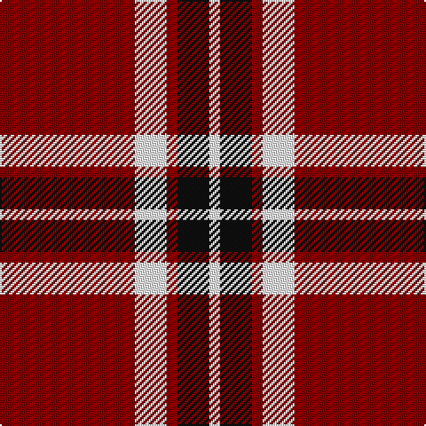

In pattern [RWRKW](/patterns/rwrkw/).

This was sourced from register-of-tartans.  It is a [5 stripes tartan](/stripes/stripes5/).

Original link https://www.tartanregister.gov.uk/tartanDetails.aspx?ref=2154

## Attestations

This cloth appears in 2 source records; the oldest owns this page.

- 01/01/2002 — Loch Morar (register-of-tartans, [record](https://www.tartanregister.gov.uk/tartanDetails.aspx?ref=2154))
- pre 2002 — Loch Morar (Fashion) (tartans-authority, [record](http://www.tartansauthority.com/tartan-ferret/display/1701/))

## Thread count
DR/76 W18 DR6 K18 W/6

## Palette
Each colour and its ΔE from the base-6 reference it is a variant of.

| Colour | Shade | Base | ΔE (OKLab) |
|---|---|---|---|
| DR | <code style="background-color:#880000;">#880000</code> `#880000` | R <code style="background-color:#CC0000;">#CC0000</code> | 0.15 |
| K | <code style="background-color:#101010;">#101010</code> `#101010` | K <code style="background-color:#000000;">#000000</code> | 0.17 |
| W | <code style="background-color:#FCFCFC;">#FCFCFC</code> `#FCFCFC` | W <code style="background-color:#F7F7F7;">#F7F7F7</code> | 0.01 |

# Sample pattern

## Nearest tartans

The nearest existing variants by ΔTartan distance.

1. [Glen Shiel (Fashion)](/setts/s5/r78w18r6g18w6-g003820-r880000-we8ccb8/) — ΔT 0.80
1. [Dunbar (District)](/setts/s4/r56k8w4k26-k101010-rcc4438-we0e0e0/) — ΔT 1.02
1. [MacGregor, Black (Personal)](/setts/s5/r82k38r14k18w6-k101010-rc80000-wfcfcfc/) — ΔT 1.12
1. [Dunbar (Wilson's) District Tartan Tartan Number: 1236. Earliest known date: 1840 Restricted See products available Copyright © Blair Urquhart, Comrie, 2015](/setts/s4/r56k8w4k26-k101010-rc80000-we0e0e0/) — ΔT 1.26
1. [Loch Morar](/setts/s5/r76w18r6b18w6-b401000-rc00000-we0e0e0/) — ΔT 1.27
1. [Hopkins (Name)](/setts/s5/r72k36r8k14w4-k101010-rc80000-we0e0e0/) — ΔT 1.28
1. [Forget Family (Red)](/setts/s6/r84k4w4k36w4k10-k101010-rc80000-wffffff/) — ΔT 1.31
1. [Dunbar Ancient](/setts/s6/k26w4k8r56k8w4-k101010-rcc4438-we0e0e0/) — ΔT 1.32
1. [Auld Reekie](/setts/s6/b8r6b6r44g16r4-b000050-g003000-rc00000/) — ΔT 1.32
1. [MacKeane](/setts/s5/r8k16r24k2y2-k101010-rc80000-ye8c000/) — ΔT 1.34

## Neighbour map

Every grey dot is one of 15726 variants placed by the first two principal components of the ΔTartan feature space (44% of its variance). Red is this tartan; blue dots are its nearest — click one to open its page.

<svg viewBox="0 0 640 380" role="img" style="max-width:100%;height:auto;border:1px solid #e0e0e0;border-radius:4px;display:block" xmlns="http://www.w3.org/2000/svg"><image href="/nn/cloud.v1.png" width="640" height="380"/><a href="/setts/s5/r78w18r6g18w6-g003820-r880000-we8ccb8/"><circle cx="420.1" cy="194.9" r="4" fill="#3465a4"><title>Glen Shiel (Fashion)</title></circle></a><a href="/setts/s4/r56k8w4k26-k101010-rcc4438-we0e0e0/"><circle cx="377.0" cy="212.8" r="4" fill="#3465a4"><title>Dunbar (District)</title></circle></a><a href="/setts/s5/r82k38r14k18w6-k101010-rc80000-wfcfcfc/"><circle cx="384.8" cy="205.0" r="4" fill="#3465a4"><title>MacGregor, Black (Personal)</title></circle></a><a href="/setts/s4/r56k8w4k26-k101010-rc80000-we0e0e0/"><circle cx="385.5" cy="213.7" r="4" fill="#3465a4"><title>Dunbar (Wilson's) District Tartan Tartan Number: 1236. Earliest known date: 1840 Restricted See products available Copyright © Blair Urquhart, Comrie, 2015</title></circle></a><a href="/setts/s5/r76w18r6b18w6-b401000-rc00000-we0e0e0/"><circle cx="415.5" cy="186.4" r="4" fill="#3465a4"><title>Loch Morar</title></circle></a><a href="/setts/s5/r72k36r8k14w4-k101010-rc80000-we0e0e0/"><circle cx="401.2" cy="192.1" r="4" fill="#3465a4"><title>Hopkins (Name)</title></circle></a><a href="/setts/s6/r84k4w4k36w4k10-k101010-rc80000-wffffff/"><circle cx="402.1" cy="153.9" r="4" fill="#3465a4"><title>Forget Family (Red)</title></circle></a><a href="/setts/s6/k26w4k8r56k8w4-k101010-rcc4438-we0e0e0/"><circle cx="334.6" cy="179.4" r="4" fill="#3465a4"><title>Dunbar Ancient</title></circle></a><a href="/setts/s6/b8r6b6r44g16r4-b000050-g003000-rc00000/"><circle cx="401.5" cy="203.4" r="4" fill="#3465a4"><title>Auld Reekie</title></circle></a><a href="/setts/s5/r8k16r24k2y2-k101010-rc80000-ye8c000/"><circle cx="387.3" cy="215.9" r="4" fill="#3465a4"><title>MacKeane</title></circle></a><circle cx="392.2" cy="186.8" r="5" fill="#c00000"/></svg>

ID: /setts/s5/r76w18r6k18w6-k101010-r880000-wfcfcfc/
