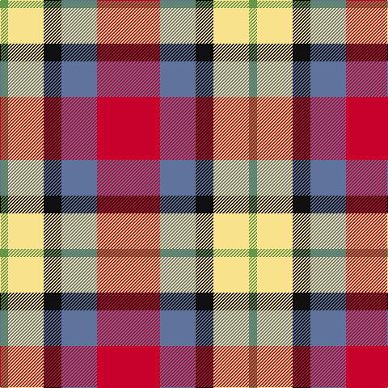

In pattern [GYKBR](/patterns/gykbr/).

This was sourced from register-of-tartans.  It is a [5 stripes tartan](/stripes/stripes5/).

Original link https://www.tartanregister.gov.uk/tartanDetails.aspx?ref=11071

## Thread count
LG/10 LY44 K22 B44 R/78

## Palette
Each colour and its ΔE from the base-6 reference it is a variant of.

| Colour | Shade | Base | ΔE (OKLab) |
|---|---|---|---|
| B | <code style="background-color:#5F749C;">#5F749C</code> `#5F749C` | B <code style="background-color:#2C4084;">#2C4084</code> | 0.17 |
| K | <code style="background-color:#101010;">#101010</code> `#101010` | K <code style="background-color:#000000;">#000000</code> | 0.17 |
| LG | <code style="background-color:#649848;">#649848</code> `#649848` | G <code style="background-color:#006400;">#006400</code> | 0.19 |
| LY | <code style="background-color:#F8E38C;">#F8E38C</code> `#F8E38C` | Y <code style="background-color:#E8C000;">#E8C000</code> | 0.11 |
| R | <code style="background-color:#C8002C;">#C8002C</code> `#C8002C` | R <code style="background-color:#C80000;">#C80000</code> | 0.03 |

# Sample pattern

ID: /setts/s5/r78b44k22y44g10-b5f749c-g649848-k101010-rc8002c-yf8e38c/
