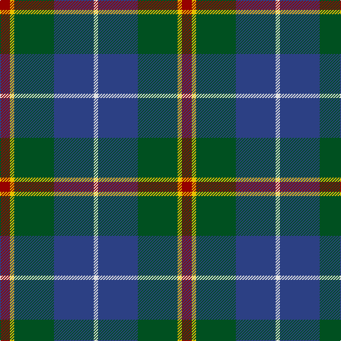

In pattern [RYGBW](/patterns/rygbw/).

This was sourced from register-of-tartans.  It is a [5 stripes tartan](/stripes/stripes5/).

Original link https://www.tartanregister.gov.uk/tartanDetails.aspx?ref=4162

## Thread count
DR/14 Y6 G56 B56 LN/6

## Palette
Each colour and its ΔE from the base-6 reference it is a variant of.

| Colour | Shade | Base | ΔE (OKLab) |
|---|---|---|---|
| B | <code style="background-color:#2C4084;">#2C4084</code> `#2C4084` | B <code style="background-color:#2A418A;">#2A418A</code> | 0.01 |
| DR | <code style="background-color:#960000;">#960000</code> `#960000` | R <code style="background-color:#CC0000;">#CC0000</code> | 0.12 |
| G | <code style="background-color:#005020;">#005020</code> `#005020` | G <code style="background-color:#006100;">#006100</code> | 0.07 |
| LN | <code style="background-color:#E0E0E0;">#E0E0E0</code> `#E0E0E0` | W <code style="background-color:#F7F7F7;">#F7F7F7</code> | 0.07 |
| Y | <code style="background-color:#E8C000;">#E8C000</code> `#E8C000` | Y <code style="background-color:#F2BF00;">#F2BF00</code> | 0.02 |

# Sample pattern

## Nearest tartans

The nearest existing variants by ΔTartan distance.

1. [Gamba (Commemorative)](/setts/s5/g5r3ga30b30w3~b2c2c80-g003820-ga006818-rc80000-wfcfcfc~x2/) — ΔT 0.60
1. [Turnbull Hunting (Name)](/setts/s5/r2y1g10b10w1~b2c2c80-g006818-rc80000-we0e0e0-ye8c000~x6/) — ΔT 0.74
1. [Canine All Dogs](/setts/s6/r5b3g24ba24r4y2~b2888c4-ba2c2c80-g006818-rc80000-ye8c000~x2/) — ΔT 0.75
1. [DeLoughery (Personal)](/setts/s6/b20k6y4b3g20w2~b38409c-g006818-k101010-wfcfcfc-ya08858~x2/) — ΔT 0.77
1. [Turnbull Hunting Clan Tartan Tartan Number: 1265. Earliest known date: pre 2003 An unusual dress tartan having no white. See products available Copyright © Blair Urquhart, Comrie, 2015](/setts/s5/k7y3g28b28w3~b2c2c80-g006818-k101010-we0e0e0-ye8c000~x2/) — ΔT 0.81
1. [Douglas Clan Tartan Tartan Number: 1032. Earliest known date: 1831 Wilson's sent a list of tartans to Logan about 1830 stating that 'No 148' had been sold as Douglas for a 'considerable' time. Logan included the Douglas tartan even though he said that no family tartans appeared in his book. The distinction between clans and families is obscure. There are many historic references to the 'Border Clans' which would certainly describe the Douglas'. There is also a black and grey sett for the clan which first appeared in the Vestiarium Scoticum in 1842. The present chiefship is vacant on account of the compound surnames of the eligible claimants. Lord Lyon will not recognise 'double barrel' names. See products available Copyright © Blair Urquhart, Comrie, 2015](/setts/s5/k3b3g23b21w2~b2c2c80-g006818-k101010-we0e0e0~x2/) — ΔT 0.81
1. [Douglas, Green (Wilsons)](/setts/s5/k1b1g8ba8w1~b2c2c80-ba202060-g006818-k101010-wfcfcfc~x4/) — ΔT 0.88
1. [Alvis of Lee (Personal)](/setts/s5/b9w4g36ba36r4~b1c0070-ba5c8ca8-g00643c-rc80000-we0e0e0~x2/) — ΔT 0.92
1. [Corey in Balachuirn](/setts/s5/b32ba16g3r4k28~b0163ac-ba453128-g004710-k001a00-re9713c~x2/) — ΔT 0.93
1. [Highlander Highland Laddie](/setts/s5/k7r3g30b28w3~b1c0070-g006818-k101010-r880000-wc0c0c0~x2/) — ΔT 0.93

## Neighbour map

Every grey dot is one of 15726 variants placed by the first two principal components of the ΔTartan feature space (44% of its variance). Red is this tartan; blue dots are its nearest — click one to open its page.

<svg viewBox="0 0 640 380" role="img" style="max-width:100%;height:auto;border:1px solid #e0e0e0;border-radius:4px;display:block" xmlns="http://www.w3.org/2000/svg"><image href="/nn/cloud.v1.png" width="640" height="380"/><a href="/setts/s5/g5r3ga30b30w3~b2c2c80-g003820-ga006818-rc80000-wfcfcfc~x2/"><circle cx="233.1" cy="207.1" r="4" fill="#3465a4"><title>Gamba (Commemorative)</title></circle></a><a href="/setts/s5/r2y1g10b10w1~b2c2c80-g006818-rc80000-we0e0e0-ye8c000~x6/"><circle cx="217.9" cy="201.2" r="4" fill="#3465a4"><title>Turnbull Hunting (Name)</title></circle></a><a href="/setts/s6/r5b3g24ba24r4y2~b2888c4-ba2c2c80-g006818-rc80000-ye8c000~x2/"><circle cx="215.9" cy="185.1" r="4" fill="#3465a4"><title>Canine All Dogs</title></circle></a><a href="/setts/s6/b20k6y4b3g20w2~b38409c-g006818-k101010-wfcfcfc-ya08858~x2/"><circle cx="203.4" cy="200.0" r="4" fill="#3465a4"><title>DeLoughery (Personal)</title></circle></a><a href="/setts/s5/k7y3g28b28w3~b2c2c80-g006818-k101010-we0e0e0-ye8c000~x2/"><circle cx="200.9" cy="209.4" r="4" fill="#3465a4"><title>Turnbull Hunting Clan Tartan Tartan Number: 1265. Earliest known date: pre 2003 An unusual dress tartan having no white. See products available Copyright © Blair Urquhart, Comrie, 2015</title></circle></a><a href="/setts/s5/k3b3g23b21w2~b2c2c80-g006818-k101010-we0e0e0~x2/"><circle cx="255.4" cy="208.2" r="4" fill="#3465a4"><title>Douglas Clan Tartan Tartan Number: 1032. Earliest known date: 1831 Wilson's sent a list of tartans to Logan about 1830 stating that 'No 148' had been sold as Douglas for a 'considerable' time. Logan included the Douglas tartan even though he said that no family tartans appeared in his book. The distinction between clans and families is obscure. There are many historic references to the 'Border Clans' which would certainly describe the Douglas'. There is also a black and grey sett for the clan which first appeared in the Vestiarium Scoticum in 1842. The present chiefship is vacant on account of the compound surnames of the eligible claimants. Lord Lyon will not recognise 'double barrel' names. See products available Copyright © Blair Urquhart, Comrie, 2015</title></circle></a><a href="/setts/s5/k1b1g8ba8w1~b2c2c80-ba202060-g006818-k101010-wfcfcfc~x4/"><circle cx="215.7" cy="214.7" r="4" fill="#3465a4"><title>Douglas, Green (Wilsons)</title></circle></a><a href="/setts/s5/b9w4g36ba36r4~b1c0070-ba5c8ca8-g00643c-rc80000-we0e0e0~x2/"><circle cx="218.4" cy="215.6" r="4" fill="#3465a4"><title>Alvis of Lee (Personal)</title></circle></a><a href="/setts/s5/b32ba16g3r4k28~b0163ac-ba453128-g004710-k001a00-re9713c~x2/"><circle cx="196.1" cy="224.4" r="4" fill="#3465a4"><title>Corey in Balachuirn</title></circle></a><a href="/setts/s5/k7r3g30b28w3~b1c0070-g006818-k101010-r880000-wc0c0c0~x2/"><circle cx="218.8" cy="211.1" r="4" fill="#3465a4"><title>Highlander Highland Laddie</title></circle></a><circle cx="221.9" cy="214.6" r="5" fill="#c00000"/></svg>

ID: /setts/s5/r7y3g28b28w3~b2c4084-g005020-r960000-we0e0e0-ye8c000~x2/
