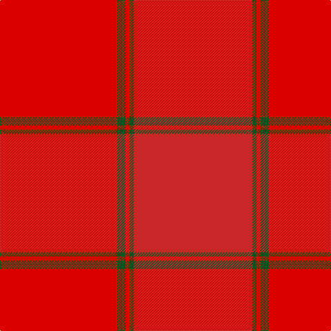

**Bands:** [RGRGR](/stripes/rgrgr/) · **Stripes:** [R DG R DG R](/stripes/stripes5/) R DG R DG R

This was sourced from register-of-tartans.  It is a [5 band tartan](/bands/bands5/).

Original link https://www.tartanregister.gov.uk/tartanDetails.aspx?ref=2667

## Register references

External register numbers recorded for this tartan.

- Scottish Register of Tartans: [2667](https://www.tartanregister.gov.uk/tartanDetails.aspx?ref=2667)
- Scottish Tartans World Register: 1503

## Variants

Other setts woven to the same stripe pattern.

- [KaDeWe (Corporate)](/setts/s5/r100dg4r8dg18r3~x2/)

## Thread count
R/170 G12 R6 G6 Ra/172

## Palette
Each colour and its ΔE from the base-6 reference it is a variant of.

| Colour | Shade | Base | ΔE (OKLab) |
|---|---|---|---|
| G | <code style="background-color:#005020;">#005020</code> `#005020` | G <code style="background-color:#006100;">#006100</code> | 0.07 |
| R | <code style="background-color:#DC0000;">#DC0000</code> `#DC0000` | R <code style="background-color:#CC0000;">#CC0000</code> | 0.03 |
| Ra | <code style="background-color:#C82828;">#C82828</code> `#C82828` | R <code style="background-color:#CC0000;">#CC0000</code> | 0.03 |

# Sample pattern

## Nearest tartans

The nearest existing variants by ΔTartan distance.

1. [MacNab 2](/setts/s5/r86g3r3g6r85~x2/) — ΔT 1.11
1. [Ferguson Red, George (Architect)](/setts/s12/r8o48r6r48r3r6r6r4r8r2r22r8/) — ΔT 3.57
1. [Loch Garth](/setts/s4/o12o6o2ly1~x4/) — ΔT 4.01
1. [Burns' Birthplace (Commem)](/setts/s7/lo1o3o4o1o1o1o1~x12/) — ΔT 4.26
1. [Weathered Cyclist (Corporate)](/setts/s7/o32w2o9ly2o12lo21r1~x2/) — ΔT 4.32
1. [Bryce](/setts/s4/o5r46n35r5~x2/) — ΔT 4.39
1. [Miyuki, House Check Tan, 1004A](/setts/s8/o3o8o3o20o20r3o8r3~x2/) — ΔT 4.41
1. [Harmony, 12](/setts/s6/o6y2o29y29o2y6~x2/) — ΔT 4.48
1. [Lewis (Welsh Name)](/setts/s7/lo56db2lo19db1lo2db1lo2~x2/) — ΔT 4.62
1. [Unnamed Brown (Teddy Bear)](/setts/s5/r1o7o25o7r1~x2/) — ΔT 4.77

## Neighbour map

Every grey dot is one of 14313 variants placed by the first two principal components of the ΔTartan feature space (44% of its variance). Red is this tartan; blue dots are its nearest — click one to open its page.

<svg viewBox="0 0 640 380" role="img" style="max-width:100%;height:auto;border:1px solid #e0e0e0;border-radius:4px;display:block" xmlns="http://www.w3.org/2000/svg"><image href="/nn/cloud.v1.png" width="640" height="380"/><a href="/setts/s5/r86g3r3g6r85~x2/"><circle cx="594.1" cy="272.1" r="4" fill="#3465a4"><title>MacNab 2</title></circle></a><a href="/setts/s12/r8o48r6r48r3r6r6r4r8r2r22r8/"><circle cx="467.4" cy="232.9" r="4" fill="#3465a4"><title>Ferguson Red, George (Architect)</title></circle></a><a href="/setts/s4/o12o6o2ly1~x4/"><circle cx="620.2" cy="354.7" r="4" fill="#3465a4"><title>Loch Garth</title></circle></a><a href="/setts/s7/lo1o3o4o1o1o1o1~x12/"><circle cx="513.6" cy="366.0" r="4" fill="#3465a4"><title>Burns' Birthplace (Commem)</title></circle></a><a href="/setts/s7/o32w2o9ly2o12lo21r1~x2/"><circle cx="610.1" cy="249.2" r="4" fill="#3465a4"><title>Weathered Cyclist (Corporate)</title></circle></a><a href="/setts/s4/o5r46n35r5~x2/"><circle cx="529.5" cy="337.5" r="4" fill="#3465a4"><title>Bryce</title></circle></a><a href="/setts/s8/o3o8o3o20o20r3o8r3~x2/"><circle cx="553.0" cy="366.0" r="4" fill="#3465a4"><title>Miyuki, House Check Tan, 1004A</title></circle></a><a href="/setts/s6/o6y2o29y29o2y6~x2/"><circle cx="626.0" cy="359.7" r="4" fill="#3465a4"><title>Harmony, 12</title></circle></a><a href="/setts/s7/lo56db2lo19db1lo2db1lo2~x2/"><circle cx="626.0" cy="246.0" r="4" fill="#3465a4"><title>Lewis (Welsh Name)</title></circle></a><a href="/setts/s5/r1o7o25o7r1~x2/"><circle cx="626.0" cy="360.4" r="4" fill="#3465a4"><title>Unnamed Brown (Teddy Bear)</title></circle></a><circle cx="609.9" cy="281.1" r="5" fill="#c00000"/></svg>

ID: /setts/s5/r86dg3r3dg6r85~x2/
