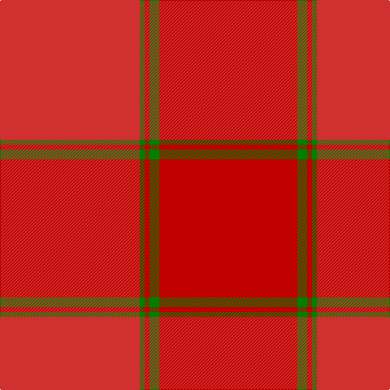

In pattern [RGRGR](/stripes/rgrgr/).

This was sourced from weddslist.  It is a [5 stripe tartan](/stripes/stripes5/).

Original link http://www.weddslist.com/cgi-bin/tartans/pg.pl?source=sts

## Thread count
R/172 G6 Ra6 G12 Ra/170

## Palette
Each colour and the base-6 reference it is a variant of.

| Colour | Shade | Base |
|---|---|---|
| G | <code style="background-color:#008000;">#008000</code> `oklch(52.0% 0.177 142.5)` <small>#008000</small> | G <code style="background-color:#006100;">#006100</code> |
| R | <code style="background-color:#D03030;">#D03030</code> `oklch(56.4% 0.196 26.2)` <small>#D03030</small> | R <code style="background-color:#CC0000;">#CC0000</code> |
| Ra | <code style="background-color:#C00000;">#C00000</code> `oklch(50.7% 0.208 29.2)` <small>#C00000</small> | R <code style="background-color:#CC0000;">#CC0000</code> |

# Sample pattern

## Nearest tartans

The nearest existing variants by ΔTartan distance.

1. [MacNab #4](/setts/s5/r86dg3r3dg6r85~x2/) — ΔT 1.11
1. [Bryce](/setts/s4/r5n35r46o5~x2/) — ΔT 3.52
1. [Ferguson Red, George (Architect)](/setts/s12/r8o48r6r48r3r6r6r4r8r2r22r8/) — ΔT 3.63
1. [Loch Garth](/setts/s4/o12o6o2ly1~x4/) — ΔT 3.72
1. [Hamilton, Red (Fashion?)](/setts/s5/r23o4r23o32r4~x2/) — ΔT 3.96
1. [MacNab (Smith)](/setts/s5/r24g2t1g1m24~x4/) — ΔT 4.01
1. [MacNab 4](/setts/s5/r24g2t1g1r24~x2/) — ΔT 4.06
1. [Weathered Cyclist (Corporate)](/setts/s7/o32w2o9ly2o12lo21r1~x2/) — ΔT 4.06
1. [Glen Clova](/setts/s12/o39o4o6o2o2w2o2o12o6o2o6o2~x2/) — ΔT 4.16
1. [Burns' Birthplace (Commem)](/setts/s7/o1o1o1o1o4o3lo1~x12/) — ΔT 4.22

## Neighbour map

Every grey dot is one of 14299 variants placed by the first two principal components of the ΔTartan feature space (44% of its variance). Red is this tartan; blue dots are its nearest — click one to open its page.

<svg viewBox="0 0 640 380" role="img" style="max-width:100%;height:auto;border:1px solid #e0e0e0;border-radius:4px;display:block" xmlns="http://www.w3.org/2000/svg"><image href="/nn/cloud.v1.png" width="640" height="380"/><a href="/setts/s5/r86dg3r3dg6r85~x2/"><circle cx="609.3" cy="281.5" r="4" fill="#3465a4"><title>MacNab #4</title></circle></a><a href="/setts/s4/r5n35r46o5~x2/"><circle cx="529.3" cy="337.7" r="4" fill="#3465a4"><title>Bryce</title></circle></a><a href="/setts/s12/r8o48r6r48r3r6r6r4r8r2r22r8/"><circle cx="467.0" cy="233.6" r="4" fill="#3465a4"><title>Ferguson Red, George (Architect)</title></circle></a><a href="/setts/s4/o12o6o2ly1~x4/"><circle cx="619.8" cy="354.9" r="4" fill="#3465a4"><title>Loch Garth</title></circle></a><a href="/setts/s5/r23o4r23o32r4~x2/"><circle cx="483.2" cy="328.5" r="4" fill="#3465a4"><title>Hamilton, Red (Fashion?)</title></circle></a><a href="/setts/s5/r24g2t1g1m24~x4/"><circle cx="474.6" cy="218.4" r="4" fill="#3465a4"><title>MacNab (Smith)</title></circle></a><a href="/setts/s5/r24g2t1g1r24~x2/"><circle cx="472.6" cy="220.0" r="4" fill="#3465a4"><title>MacNab 4</title></circle></a><a href="/setts/s7/o32w2o9ly2o12lo21r1~x2/"><circle cx="609.5" cy="249.5" r="4" fill="#3465a4"><title>Weathered Cyclist (Corporate)</title></circle></a><a href="/setts/s12/o39o4o6o2o2w2o2o12o6o2o6o2~x2/"><circle cx="511.5" cy="192.7" r="4" fill="#3465a4"><title>Glen Clova</title></circle></a><a href="/setts/s7/o1o1o1o1o4o3lo1~x12/"><circle cx="513.1" cy="366.0" r="4" fill="#3465a4"><title>Burns' Birthplace (Commem)</title></circle></a><circle cx="593.5" cy="272.4" r="5" fill="#c00000"/></svg>

ID: /setts/s5/r86g3r3g6r85~x2/
