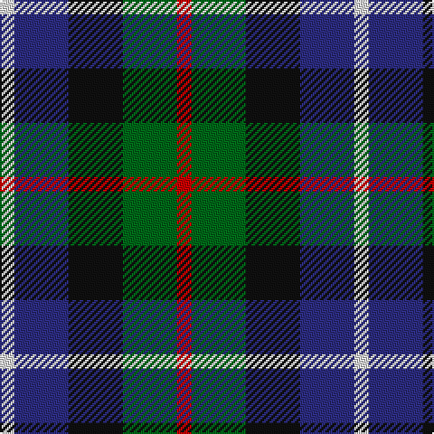

In pattern [RGKBW](/patterns/rgkbw/).

This was sourced from house-of-tartan.  It is a [5 stripes tartan](/stripes/stripes5/).

Original link http://www.house-of-tartan.scotland.net/house/TartanViewjs.asp?colr=Def&tnam=1480

## Thread count
LN/8 DB30 K30 G30 R/8

## Palette
Each colour and its ΔE from the base-6 reference it is a variant of.

| Colour | Shade | Base | ΔE (OKLab) |
|---|---|---|---|
| DB | <code style="background-color:#2C2C80;">#2C2C80</code> `#2C2C80` | B <code style="background-color:#2C4084;">#2C4084</code> | 0.05 |
| G | <code style="background-color:#006818;">#006818</code> `#006818` | G <code style="background-color:#006400;">#006400</code> | 0.02 |
| K | <code style="background-color:#101010;">#101010</code> `#101010` | K <code style="background-color:#000000;">#000000</code> | 0.17 |
| LN | <code style="background-color:#E0E0E0;">#E0E0E0</code> `#E0E0E0` | W <code style="background-color:#F4F4F0;">#F4F4F0</code> | 0.06 |
| R | <code style="background-color:#C80000;">#C80000</code> `#C80000` | R <code style="background-color:#C80000;">#C80000</code> | 0.00 |

# Sample pattern

## Nearest tartans

The nearest existing variants by ΔTartan distance.

1. [Mitchell Family Tartan Tartan Number: 2142. Earliest known date: 1816-20 Named in honour of General Billy Mitchell when it was adopted as the tartan of the United States Air Force pipe band. The sett is also known as Russell, Hunter and Galbraith. The earliest reference to the tartan is in the collection of the Highland Society of London where it is labelled Galbraith. See products available Copyright © Blair Urquhart, Comrie, 2015](/setts/s6/k6g16k16r4b16w4-b2c2c80-g006818-k101010-rc80000-we0e0e0/) — ΔT 0.76
1. [Russell (Clan)](/setts/s6/k6g20k20r6b16w6-b2c2c80-g006818-k101010-rc80000-wfcfcfc/) — ΔT 0.77
1. [Wellington, or Waterloo](/setts/s6/b6g16k18ba14r4ba4-b5480b0-ba304080-g008000-k000000-rc00000/) — ΔT 0.84
1. [Dalmeny](/setts/s5/r8g30k30b30w8-b304080-g008000-k000000-rc00000-we0e0e0/) — ΔT 0.87
1. [Nobiliary Fraternity](/setts/s5/b22ba4k20g20y6-b780078-ba5c8ca8-g006818-k101010-ye8c000/) — ΔT 0.90
1. [Friebe (2014)](/setts/s5/g30ga36b46w8r16-b1c1c50-g649848-ga23321b-rb62531-wf9f5ef/) — ΔT 0.91
1. [Birse Family Tartan Tartan Number: 1087. Earliest known date: 1930-50 This sample comes from the MacGregor-Hastie collection which forms the basis of the cloth archive of the Scottish Tartans Society. Some of the samples, including this one, were unmarked. One can assume that the sample dates between 1930 and 1950. See products available Copyright © Blair Urquhart, Comrie, 2015](/setts/s6/k8g32k28y6b32r8-b2c2c80-g006818-k101010-rc80000-ye8c000/) — ΔT 0.98
1. [Selkirk (Name)](/setts/s5/b22g4k20ga20y4-b780078-g789484-ga006818-k101010-yd09800/) — ΔT 1.04
1. [Gala Water Old](/setts/s5/k19b10ba19g40y10-b3c82af-ba5a008c-g005020-k101010-ye8c000/) — ΔT 1.06
1. [MacCaughan, or MacEachain](/setts/s6/b8g24k8ba24k4r8-b800070-ba304080-g008000-k000000-rc00000/) — ΔT 1.08

## Neighbour map

Every grey dot is one of 15726 variants placed by the first two principal components of the ΔTartan feature space (44% of its variance). Red is this tartan; blue dots are its nearest — click one to open its page.

<svg viewBox="0 0 640 380" role="img" style="max-width:100%;height:auto;border:1px solid #e0e0e0;border-radius:4px;display:block" xmlns="http://www.w3.org/2000/svg"><image href="/nn/cloud.v1.png" width="640" height="380"/><a href="/setts/s6/k6g16k16r4b16w4-b2c2c80-g006818-k101010-rc80000-we0e0e0/"><circle cx="91.9" cy="254.3" r="4" fill="#3465a4"><title>Mitchell Family Tartan Tartan Number: 2142. Earliest known date: 1816-20 Named in honour of General Billy Mitchell when it was adopted as the tartan of the United States Air Force pipe band. The sett is also known as Russell, Hunter and Galbraith. The earliest reference to the tartan is in the collection of the Highland Society of London where it is labelled Galbraith. See products available Copyright © Blair Urquhart, Comrie, 2015</title></circle></a><a href="/setts/s6/k6g20k20r6b16w6-b2c2c80-g006818-k101010-rc80000-wfcfcfc/"><circle cx="64.9" cy="257.0" r="4" fill="#3465a4"><title>Russell (Clan)</title></circle></a><a href="/setts/s6/b6g16k18ba14r4ba4-b5480b0-ba304080-g008000-k000000-rc00000/"><circle cx="53.5" cy="244.1" r="4" fill="#3465a4"><title>Wellington, or Waterloo</title></circle></a><a href="/setts/s5/r8g30k30b30w8-b304080-g008000-k000000-rc00000-we0e0e0/"><circle cx="33.5" cy="258.8" r="4" fill="#3465a4"><title>Dalmeny</title></circle></a><a href="/setts/s5/b22ba4k20g20y6-b780078-ba5c8ca8-g006818-k101010-ye8c000/"><circle cx="85.7" cy="245.2" r="4" fill="#3465a4"><title>Nobiliary Fraternity</title></circle></a><a href="/setts/s5/g30ga36b46w8r16-b1c1c50-g649848-ga23321b-rb62531-wf9f5ef/"><circle cx="88.9" cy="249.1" r="4" fill="#3465a4"><title>Friebe (2014)</title></circle></a><a href="/setts/s6/k8g32k28y6b32r8-b2c2c80-g006818-k101010-rc80000-ye8c000/"><circle cx="104.1" cy="240.1" r="4" fill="#3465a4"><title>Birse Family Tartan Tartan Number: 1087. Earliest known date: 1930-50 This sample comes from the MacGregor-Hastie collection which forms the basis of the cloth archive of the Scottish Tartans Society. Some of the samples, including this one, were unmarked. One can assume that the sample dates between 1930 and 1950. See products available Copyright © Blair Urquhart, Comrie, 2015</title></circle></a><a href="/setts/s5/b22g4k20ga20y4-b780078-g789484-ga006818-k101010-yd09800/"><circle cx="109.3" cy="245.2" r="4" fill="#3465a4"><title>Selkirk (Name)</title></circle></a><a href="/setts/s5/k19b10ba19g40y10-b3c82af-ba5a008c-g005020-k101010-ye8c000/"><circle cx="111.2" cy="259.8" r="4" fill="#3465a4"><title>Gala Water Old</title></circle></a><a href="/setts/s6/b8g24k8ba24k4r8-b800070-ba304080-g008000-k000000-rc00000/"><circle cx="90.9" cy="224.5" r="4" fill="#3465a4"><title>MacCaughan, or MacEachain</title></circle></a><circle cx="56.2" cy="266.7" r="5" fill="#c00000"/></svg>

ID: /setts/s5/r8g30k30b30w8-b2c2c80-g006818-k101010-rc80000-we0e0e0/
