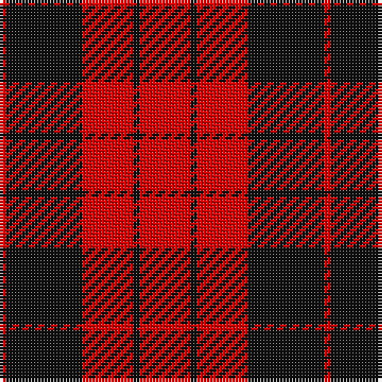

In pattern [RKRKR](/stripes/rkrkr/).

This was sourced from register-of-tartans.  It is a [5 stripe tartan](/stripes/stripes5/).

Original link https://www.tartanregister.gov.uk/tartanDetails.aspx?ref=2633

## Also known as

This cloth is also recorded under:

- MacLeod, Black & Red

## Attestations

This cloth appears in 2 source records; the oldest owns this page.

- undated — MacLeod Black & Red (register-of-tartans, [record](https://www.tartanregister.gov.uk/tartanDetails.aspx?ref=2633))
- undated — MacLeod, Black & Red (weddslist, [record](http://www.weddslist.com/cgi-bin/tartans/pg.pl?source=sts))

## Register references

External register numbers recorded for this tartan.

- Scottish Register of Tartans: [2633](https://www.tartanregister.gov.uk/tartanDetails.aspx?ref=2633)
- Scottish Tartans World Register: 1591

## Thread count
R/16 K2 R16 K24 R/2

## Palette
Each colour and the base-6 reference it is a variant of.

| Colour | Shade | Base |
|---|---|---|
| K | <code style="background-color:#101010;">#101010</code> `oklch(17.3% 0.000 89.9)` <small>#101010</small> | K <code style="background-color:#000000;">#000000</code> |
| R | <code style="background-color:#DC0000;">#DC0000</code> `oklch(56.2% 0.230 29.2)` <small>#DC0000</small> | R <code style="background-color:#CC0000;">#CC0000</code> |

# Sample pattern

## Nearest tartans

The nearest existing variants by ΔTartan distance, with this tartan at the top so the swatches line up against it.

ΔTartan

Tartan

Sett

—

<a href="/ttd/edit/#slug=r8k1r8k12r1~x2">MacLeod Black &amp; Red</a> <a class="nn-out" href="/setts/s5/r8k1r8k12r1~x2/" title="open its dictionary page">↗</a>

0.81

<a href="/ttd/edit/#slug=k31r4k47r47k4r31~x2">Erskine (Paton)</a> <a class="nn-out" href="/setts/s6/k31r4k47r47k4r31~x2/" title="open its dictionary page">↗</a>

0.99

<a href="/ttd/edit/#slug=r4k1r12k12r2~x2">Campbell of Armaddie</a> <a class="nn-out" href="/setts/s5/r4k1r12k12r2~x2/" title="open its dictionary page">↗</a>

1.04

<a href="/ttd/edit/#slug=r4k8r12k1ly1~x2">MacKeane</a> <a class="nn-out" href="/setts/s5/r4k8r12k1ly1~x2/" title="open its dictionary page">↗</a>

1.08

<a href="/ttd/edit/#slug=r41k19r7k9w3~x2">MacGregor, Black (Personal)</a> <a class="nn-out" href="/setts/s5/r41k19r7k9w3~x2/" title="open its dictionary page">↗</a>

1.14

<a href="/ttd/edit/#slug=k13r2k13r19k2~x2">MacLeod of Raasay (Highland Society of London)</a> <a class="nn-out" href="/setts/s5/k13r2k13r19k2~x2/" title="open its dictionary page">↗</a>

1.15

<a href="/ttd/edit/#slug=k12r3k2r16k8r12k2r3~x2">MacLeod #2</a> <a class="nn-out" href="/setts/s8/k12r3k2r16k8r12k2r3~x2/" title="open its dictionary page">↗</a>

1.16

<a href="/setts/s4/k30r17k3~x4/">MacFarlane Red &amp; Black (Artefact)</a>

1.20

<a href="/ttd/edit/#slug=k6r3k28r28k3r6~x2">Erskine, Black &amp; Red (Clan)</a> <a class="nn-out" href="/setts/s6/k6r3k28r28k3r6~x2/" title="open its dictionary page">↗</a>

1.24

<a href="/ttd/edit/#slug=r4k8r4k8r12k1ly1~x2">MacKeane (Clan?)</a> <a class="nn-out" href="/setts/s7/r4k8r4k8r12k1ly1~x2/" title="open its dictionary page">↗</a>

1.31

<a href="/ttd/edit/#slug=r36k18r4k7w2~x2">Hopkins (Name)</a> <a class="nn-out" href="/setts/s5/r36k18r4k7w2~x2/" title="open its dictionary page">↗</a>

## Neighbour map

Every grey dot is one of 14299 variants placed by the first two principal components of the ΔTartan feature space (44% of its variance). Red is this tartan; blue dots are its nearest — click one to open its page.

<svg viewBox="0 0 640 380" role="img" style="max-width:100%;height:auto;border:1px solid #e0e0e0;border-radius:4px;display:block" xmlns="http://www.w3.org/2000/svg"><image href="/nn/cloud.v1.png" width="640" height="380"/><a href="/setts/s6/k31r4k47r47k4r31~x2/"><circle cx="338.6" cy="239.7" r="4" fill="#3465a4"><title>Erskine (Paton)</title></circle></a><a href="/setts/s5/r4k1r12k12r2~x2/"><circle cx="373.8" cy="229.8" r="4" fill="#3465a4"><title>Campbell of Armaddie</title></circle></a><a href="/setts/s5/r4k8r12k1ly1~x2/"><circle cx="384.8" cy="212.9" r="4" fill="#3465a4"><title>MacKeane</title></circle></a><a href="/setts/s5/r41k19r7k9w3~x2/"><circle cx="382.7" cy="201.8" r="4" fill="#3465a4"><title>MacGregor, Black (Personal)</title></circle></a><a href="/setts/s5/k13r2k13r19k2~x2/"><circle cx="373.7" cy="261.7" r="4" fill="#3465a4"><title>MacLeod of Raasay (Highland Society of London)</title></circle></a><a href="/setts/s8/k12r3k2r16k8r12k2r3~x2/"><circle cx="360.0" cy="231.1" r="4" fill="#3465a4"><title>MacLeod #2</title></circle></a><a href="/setts/s4/k30r17k3~x4/"><circle cx="344.1" cy="277.1" r="4" fill="#3465a4"><title>MacFarlane Red &amp; Black (Artefact)</title></circle></a><a href="/setts/s6/k6r3k28r28k3r6~x2/"><circle cx="361.6" cy="231.6" r="4" fill="#3465a4"><title>Erskine, Black &amp; Red (Clan)</title></circle></a><a href="/setts/s7/r4k8r4k8r12k1ly1~x2/"><circle cx="327.8" cy="213.9" r="4" fill="#3465a4"><title>MacKeane (Clan?)</title></circle></a><a href="/setts/s5/r36k18r4k7w2~x2/"><circle cx="399.6" cy="189.5" r="4" fill="#3465a4"><title>Hopkins (Name)</title></circle></a><circle cx="376.2" cy="236.1" r="5" fill="#c00000"/></svg>

ID: /setts/s5/r8k1r8k12r1~x2/
